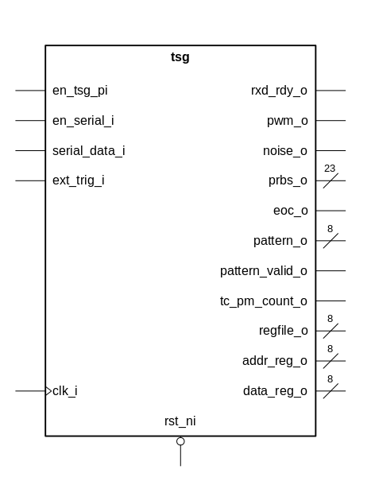
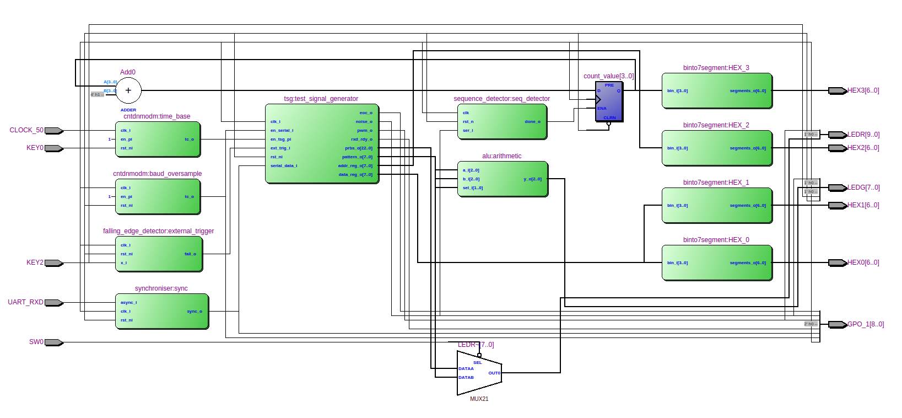

# General Description

{width=40%}

| **Name**        | **Type**              | **Direction** | **Polarity** | **Description** |
|-----------------|-----------------------|:-------------:|:------------:|-----------------|
| clk_i           | std_ulogic            | IN            | HIGH         | clock                |
| rst_ni          | std_ulogic            | IN            | LOW          | asynchronous reset                |
| en_tsg_pi       | std_ulogic            | IN            | HIGH         | tsg enable, used with external time base                |
| en_serial_i     | std_ulogic            | IN            | HIGH         | enable for serial data: oversample of 16 with expected baudrate 9600                |
| serial_data_i   | std_ulogic            | IN            | HIGH         | serial data with baudrate 9600                |
| rxd_rdy_o       | std_ulogic            | OUT           | HIGH         | debugging signal, output of serial_rx if serial data is ready to be read                |
| ext_trig_i      | std_ulogic            | IN            | HIGH         | external trigger for triggering test equipment                |
| pwm_o           | std_ulogic            | OUT           | HIGH         | pulse width modulated signal                |
| noise_o         | std_ulogic            | OUT           | HIGH         | 1 bit pseudo random noise                |
| prbs_o          | std_ulogic_vector[23] | OUT           | HIGH         | pseudo random noise up to 23 bit                |
| eoc_o           | std_ulogic            | OUT           | HIGH         | end of cycle when pseudo random noise repeats                |
| pattern_o       | std_ulogic_vector[8]  | OUT           | HIGH         | configurable changing pattern output                |
| pattern_valid_o | std_ulogic            | OUT           | HIGH         | pattern valid, not currently implemented! (see improvements)                |
| tc_pm_count_o   | std_ulogic            | OUT           | HIGH         | debugging signal, end of cycle for pattern memory upcounter                |
| regfile_o       | std_ulogic_vector[8]  | OUT           | HIGH         | debugging signal, data input of register file                |
| addr_reg_o      | std_ulogic_vector[8]  | OUT           | HIGH         | debugging signal, address output of serial_receiver registers                |
| data_reg_o      | std_ulogic_vector[8]  | OUT           | HIGH         | debugging signal, data output of serial_receiver registers                |

: Test Signal Generator - Description of I/O Signals

The test signal generator with its multiple I/Os can be broken down into 4 distinctive parts:
- serial data handling
- pulse width modulation generator
- pattern generator
- random noise generator

{width=100%}
In the picture above you can recognize that the register file is the central part of the design. 
The register file receives data from the serial communication and writes them into its memory. Depending on the values in the 
memory the output components are controlled. 

The register file has the following memory view.
```
		  					 Bit7  ..         0
------------------------------------------------
Address  	Name 				7 6 5 4 3 2 1 0
------------------------------------------------
0x00 
0x01  		system control 					x x
0x02
0x03
0x04     	pwm pulse width 	x x x x x x x x
0x05 		pwm period 			x x x x x x x x
0x06 		pwm control 					x x
0x07
0x08 		noise prbsg length 	x x x x x x x x
0x09 		noise period 		x x x x x x x x
0x0A
0x0B 		noise control 					x x
0x0C 		pattern length 		x x x x x x x x
0x0D 
0x0E 		pattern period 		x x x x x x x x
0x0F 		pattern control 			  x x x
```

The meaning of the control parts of the registers is explained in the following.
```
system control
---------------------------
Bit 0 Meaning
------------------------
	0 system disable
	1 system enable
---------------------------
Bit 1 Meaning
---------------------------
	1 system clear [synchronous clear](not currently implemented see improvements!)


pwm control
---------------------------
Bit 0 Meaning
--------------------------
	0 pwm off
	1 pwm on
---------------------------
Bit 1 Meaning
---------------------------
	0 internal trigger
	1 external trigger


noise prbsg length
-----------------------------------------
Bit 7 6 5 4 3 2 1 0 Meaning
-----------------------------------------
			  0 0 0 4-bit
			  0 0 1 7-bit 8B/10B-encoded pattern
			  0 1 0 15-bit ITU-T O.150
			  0 1 1 17-bit OIF-CEI-P-02.0
			  1 0 0 20-bit ITU-T O.150
			  1 0 1 23-bit ITU-T O.150

noise control
---------------------------
Bit 0 Meaning
---------------------------
	0 noise off
	1 noise on
---------------------------
Bit 1 Meaning
---------------------------
	0 internal trigger
	1 external trigger

pattern control
---------------------------
Bit 1 0 Meaning
---------------------------
	0 0 stop
	0 1 single burst
	1 0 continous run
	1 1 load data
---------------------------
Bit 2 Meaning
---------------------------
	0 internal trigger
	1 external trigger
```
Now the control part of the register will be explained in further detail. 
The system has an general enable "system control" which must be switched on 
to switch on all individual components (noise, pattern, pwm). All components 
allow for external triggering where you can change the state manually by pressing 
a button. When not specified the components run with the speed of the external time 
base which is further divided by the individual period settings. This will be discussed 
in further detail in the Design Description.

## External time base and external triggering design
{width=100%}
To get the external time base and external triggering to work correctly multiple AND gates and multiplexer are needed.
For the pwm and the noise generator we have the same design. If the noise generator is enabled, depends on 
the following conditions:
- the whole system is enabled
- pwm/noise generator is enabled
- external time base on
- frequency divider enabled
When the external triggering of the noise/pwm generator is enabled it should only be controlled by external triggering
if the system is on and the pwm/noise generator is enabled.

{width=100%}
For the pattern generator a more sophisticated system is needed. We need to differentiate between the four modes of our 
pattern generator:
- 00 stop
- 01 single burst
- 10 continous run
- 11 load

In stop and load mode we do not care about the external triggering and the external time base. When loading the pattern generator the
address upcounter only counts up when the pattern generator state machine gives an signal. The external trigger, external time base 
and frequency divider matters when we are in the two run modes. For the external triggering we need the additional signal pattern valid.
This signal is provided by the pattern generator state machine and is true when the state machine is in a counting state. This is needed 
for the single burst mode to stop counting after one counting cycle.

# Application Note
{width=100%}
The wiring of the DE1 Board can be seen in the picture above. The test signal generator runs with an 50 MHz clock and a time base of 
10 MHz on the enable. An synchroniser is added before the serial input to avoid metavalues because of asynchronous serial communication from the pc.
The outputs of the test signal generator were connected to test components ALU and a 101 sequence detector. On the HEX3 display the
number of 101 sequences detected is shown. Additionally some outputs are connected to the GPIOs
for measurements. For the connections see ```de1_tsg_structure.vhd```.
{width=100%}