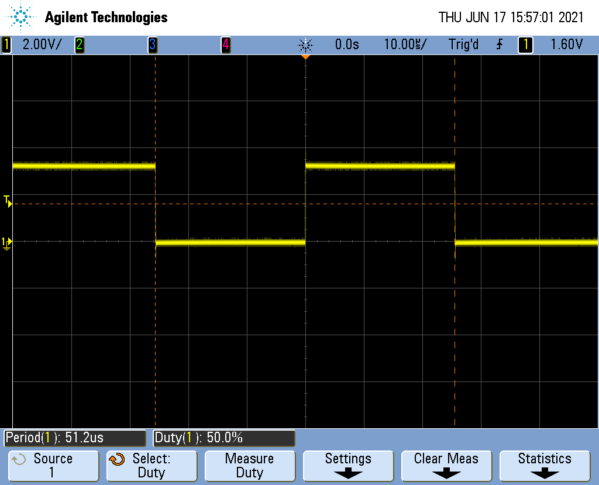

Overview
========

* General Description
* Serial Communication
* Test Components
  * PWM Generator
  * Noise Generator
  * Pattern Generator

General Description
========

Features
---

* Serially configurable
* Single pulse with variable duty cycle and frequency (PWM)
* Digital noise based on pseudo random binary sequences of different length
* Configurable data sequences at selectable speed (pattern generator)
* Internal/External triggering of generators
* External Time Base for selectable base frequency

General Description
========

Component
---

{width=40%}

General Description
========

Component Breakup
---

{width=80%}

General Description
========

Register File
---
```pure
		  					 Bit7  ..         0
------------------------------------------------
Address  	Name 				7 6 5 4 3 2 1 0
------------------------------------------------
0x00 
0x01  		system control 					  x
0x02
0x03
0x04     	pwm pulse width 	x x x x x x x x
0x05 		pwm period 			x x x x x x x x
0x06 		pwm control 					x x
0x07
0x08 		noise prbsg length 	x x x x x x x x
0x09 		noise period 		x x x x x x x x
0x0A
0x0B 		noise control 					x x
0x0C 		pattern length 		x x x x x x x x
0x0D 
0x0E 		pattern period 		x x x x x x x x
0x0F 		pattern control 			  x x x
```

Serial Communication
=================

![UART [1]](images/uart_sample.png){width=90%}


Test Components
======================

PWM Generator
---------

{width=70%}


Test Components
======================

Noise Generator
---------

![4bit LFSR [2]](images/4bit_lfsr_xor.png){width=60%}

```pure
noise prbsg length
-----------------------------------------
Bit 7 6 5 4 3 2 1 0 Meaning
-----------------------------------------
			  0 0 0 4-bit
			  0 0 1 7-bit 8B/10B-encoded pattern
			  0 1 0 15-bit ITU-T O.150
			  0 1 1 17-bit OIF-CEI-P-02.0
			  1 0 0 20-bit ITU-T O.150
			  1 0 1 23-bit ITU-T O.150
```

Test Components
======================

Noise Generator
---------

{width=70%}

Test Components
======================

Pattern Generator
---------


```pure
pattern control
---------------------------
Bit 1 0 Meaning
---------------------------
	0 0 stop
	0 1 single burst
	1 0 continous run
	1 1 load data
```

Questions
=========

Thank you for your attention !

Sources
---
1: [Source - UART Drawing](https://www.digi.com/resources/documentation/Digidocs/90002002/Content/Reference/r_serial_data.htm?TocPath=Operation|UART%20data%20flow|_____1)

2: [Source - LFSR Drawing](https://www.researchgate.net/figure/A-4-bit-linear-feedback-shift-register-circuit_fig8_238687766)

