Introduction
============
Digital test signal generators (TSG) are a type of external measurement equipment that are available from several different vendors. These pieces of equipment produce a range of electrical stimuli signals that can be used to check the operation of other electrical devices. The goal of this module is to produce an on-chip version of this system with the following essential features included in the architecture and design:
- Single pulse with variable duty cycle and frequency.
- Digital noise based on pseudo random binary sequences of different length.
- Arbitrary data bus sequences at selectable speed.
- Internal/External Trigger.
- External Time Base.
Each of these features are necessary for the TSG to produce a data-set that can be used to give an engineer an informative viewpoint on their design so that they can modify it so that it lands within specification.


Features
========
These features are key to the TSG as they are utilised in many commercially available TSGs as such they are included in this TSG. 

### Serial Transmission
Utilizing UART serial transmission allows for a large range of data to be transferred between the TSG and the subject system. It allows for the TSG to be given Parallel inputs and then communicate using serial transmission  which can then be returned to a parallel data type for the target system to utilise.


### Single pulse with variable duty cycle and frequency.
Utilising Pulse width modulation a series of digitally controlled electrical signals can be sent allowing for a spectrum of both peak voltage and high frequency testing within a single module.

### Digital noise based on pseudo random binary sequences of different length.
Ustilsing LFSRs to generate a string of pseudo random binary that is then sent along the UART transmission lines to the subject board. It allows for the subject system's ability to handle junk data as well as other highly variable data types.   

### Arbitrary data bus sequences at selectable speed.
Utilising digital pattern generators to create arbitrary data busses that can then be sent using UART to a subject board. As the output of this system is arbitrary it allows for the clarity of transmissions that are sent to the subject board. 

### Internal/External Trigger.
Internal and external triggers allow for the TSG to be triggered by internally set rules or received data from the test subject system allowing for specific internal rules to be set up. External triggers allow for specific targeted stimulus to be produced by the TSG meaning that any of the above test types can be used with a high level of precision.  

### External Time Base
An external time base allows for the entire TSG to be configured based on the system to be tested by the TSG system. As well as allowing for the TSG to be run at a different clock rate to the tested system.

General Description
===================

# General Description

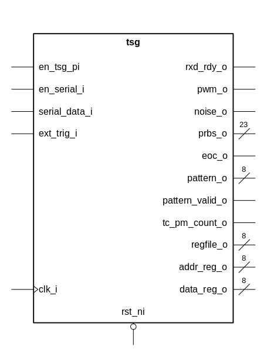{width=40%}

| **Name**        | **Type**              | **Direction** | **Polarity** | **Description** |
|-----------------|-----------------------|:-------------:|:------------:|-----------------|
| clk_i           | std_ulogic            | IN            | HIGH         | clock                |
| rst_ni          | std_ulogic            | IN            | LOW          | asynchronous reset                |
| en_tsg_pi       | std_ulogic            | IN            | HIGH         | tsg enable, used with external time base                |
| en_serial_i     | std_ulogic            | IN            | HIGH         | enable for serial data: oversample of 16 with expected baudrate 9600                |
| serial_data_i   | std_ulogic            | IN            | HIGH         | serial data with baudrate 9600                |
| rxd_rdy_o       | std_ulogic            | OUT           | HIGH         | debugging signal, output of serial_rx if serial data is ready to be read                |
| ext_trig_i      | std_ulogic            | IN            | HIGH         | external trigger for triggering test equipment                |
| pwm_o           | std_ulogic            | OUT           | HIGH         | pulse width modulated signal                |
| noise_o         | std_ulogic            | OUT           | HIGH         | 1 bit pseudo random noise                |
| prbs_o          | std_ulogic_vector[23] | OUT           | HIGH         | pseudo random noise up to 23 bit                |
| eoc_o           | std_ulogic            | OUT           | HIGH         | end of cycle when pseudo random noise repeats                |
| pattern_o       | std_ulogic_vector[8]  | OUT           | HIGH         | configurable changing pattern output                |
| pattern_valid_o | std_ulogic            | OUT           | HIGH         | pattern valid, not currently implemented! (see improvements)                |
| tc_pm_count_o   | std_ulogic            | OUT           | HIGH         | debugging signal, end of cycle for pattern memory upcounter                |
| regfile_o       | std_ulogic_vector[8]  | OUT           | HIGH         | debugging signal, data input of register file                |
| addr_reg_o      | std_ulogic_vector[8]  | OUT           | HIGH         | debugging signal, address output of serial_receiver registers                |
| data_reg_o      | std_ulogic_vector[8]  | OUT           | HIGH         | debugging signal, data output of serial_receiver registers                |

: Test Signal Generator - Description of I/O Signals

The test signal generator with its multiple I/Os can be broken down into 4 distinctive parts:
- serial data handling
- pulse width modulation generator
- pattern generator
- random noise generator

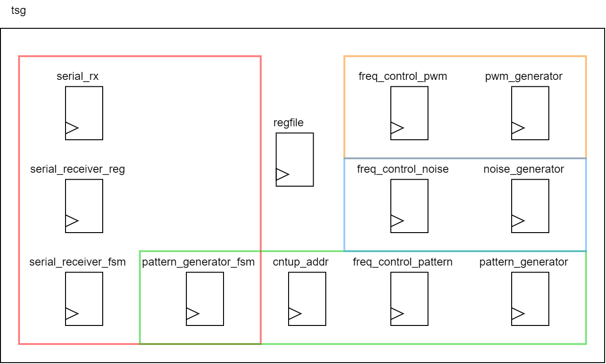{width=100%}
In the picture above you can recognize that the register file is the central part of the design. 
The register file receives data from the serial communication and writes them into its memory. Depending on the values in the 
memory the output components are controlled. 

The register file has the following memory view.
```
		  					 Bit7  ..         0
------------------------------------------------
Address  	Name 				7 6 5 4 3 2 1 0
------------------------------------------------
0x00 
0x01  		system control 					x x
0x02
0x03
0x04     	pwm pulse width 	x x x x x x x x
0x05 		pwm period 			x x x x x x x x
0x06 		pwm control 					x x
0x07
0x08 		noise prbsg length 	x x x x x x x x
0x09 		noise period 		x x x x x x x x
0x0A
0x0B 		noise control 					x x
0x0C 		pattern length 		x x x x x x x x
0x0D 
0x0E 		pattern period 		x x x x x x x x
0x0F 		pattern control 			  x x x
```

The meaning of the control parts of the registers is explained in the following.
```
system control
---------------------------
Bit 0 Meaning
------------------------
	0 system disable
	1 system enable
---------------------------
Bit 1 Meaning
---------------------------
	1 system clear [synchronous clear](not currently implemented see improvements!)


pwm control
---------------------------
Bit 0 Meaning
--------------------------
	0 pwm off
	1 pwm on
---------------------------
Bit 1 Meaning
---------------------------
	0 internal trigger
	1 external trigger


noise prbsg length
-----------------------------------------
Bit 7 6 5 4 3 2 1 0 Meaning
-----------------------------------------
			  0 0 0 4-bit
			  0 0 1 7-bit 8B/10B-encoded pattern
			  0 1 0 15-bit ITU-T O.150
			  0 1 1 17-bit OIF-CEI-P-02.0
			  1 0 0 20-bit ITU-T O.150
			  1 0 1 23-bit ITU-T O.150

noise control
---------------------------
Bit 0 Meaning
---------------------------
	0 noise off
	1 noise on
---------------------------
Bit 1 Meaning
---------------------------
	0 internal trigger
	1 external trigger

pattern control
---------------------------
Bit 1 0 Meaning
---------------------------
	0 0 stop
	0 1 single burst
	1 0 continous run
	1 1 load data
---------------------------
Bit 2 Meaning
---------------------------
	0 internal trigger
	1 external trigger
```
Now the control part of the register will be explained in further detail. 
The system has an general enable "system control" which must be switched on 
to switch on all individual components (noise, pattern, pwm). All components 
allow for external triggering where you can change the state manually by pressing 
a button. When not specified the components run with the speed of the external time 
base which is further divided by the individual period settings. This will be discussed 
in further detail in the Design Description.

Functional Description
======================

- describe what pwm, lfsr and uart is

## Register file
The register file is the component responsible for for making the data and address inputs parameterisable. The register file is centric to the TSG. While it has five different inputs, it receives information from the outputs of the serial receiver, and disperses the information appropriately from there. 
(it would be a good idea to reference the drawing that Leo done with the overall tsg module)

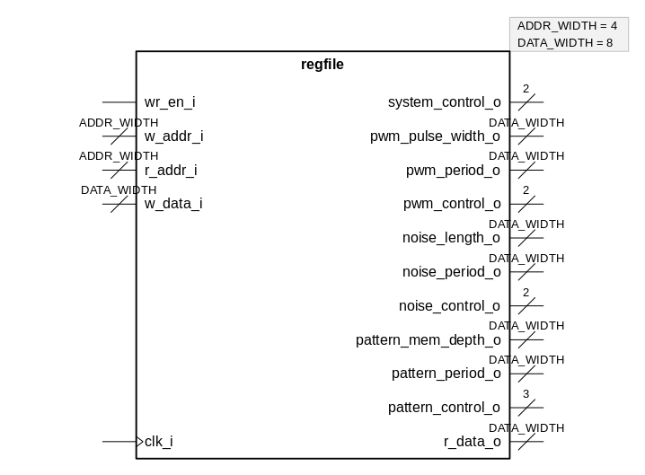{width=80%}

| **Name**            | **Type**                      | **Direction** | **Polarity** | **Description** |
|---------------------|-------------------------------|:-------------:|:------------:|-----------------|
| clk_i               | std_ulogic                    | IN            | HIGH         |                 |
| wr_en_i             | std_ulogic                    | IN            | HIGH         |                 |
| w_addr_i            | std_ulogic_vector[ADDR_WIDTH] | IN            | HIGH         |                 |
| r_addr_i            | std_ulogic_vector[ADDR_WIDTH] | IN            | HIGH         |                 |
| w_data_i            | std_ulogic_vector[DATA_WIDTH] | IN            | HIGH         |                 |
| system_control_o    | std_ulogic_vector[2]          | OUT           | HIGH         |                 |
| pwm_pulse_width_o   | std_ulogic_vector[DATA_WIDTH] | OUT           | HIGH         |                 |
| pwm_period_o        | std_ulogic_vector[DATA_WIDTH] | OUT           | HIGH         |                 |
| pwm_control_o       | std_ulogic_vector[2]          | OUT           | HIGH         |                 |
| noise_length_o      | std_ulogic_vector[DATA_WIDTH] | OUT           | HIGH         |                 |
| noise_period_o      | std_ulogic_vector[DATA_WIDTH] | OUT           | HIGH         |                 |
| noise_control_o     | std_ulogic_vector[2]          | OUT           | HIGH         |                 |
| pattern_mem_depth_o | std_ulogic_vector[DATA_WIDTH] | OUT           | HIGH         |                 |
| pattern_period_o    | std_ulogic_vector[DATA_WIDTH] | OUT           | HIGH         |                 |
| pattern_control_o   | std_ulogic_vector[3]          | OUT           | HIGH         |                 |
| r_data_o            | std_ulogic_vector[DATA_WIDTH] | OUT           | HIGH         |                 |


| **Name**   | **Type** | **Default value** |
|------------|----------|-------------------|
| ADDR_WIDTH | integer  | 4                 |
| DATA_WIDTH | integer  | 8                 |

In the module there is an array that is instantiated for the purpose of writing the data to the correct address/output.

The register file receives the both the address and the data directly from the serial receiver. From here the data and the address information gets 


## UART serial receiver
The serial receiver module is based on a design made using a Moore state machine.
The purpose of the module is to allow for the correct sequencing and addressing of the data. 
The change in states are dependent

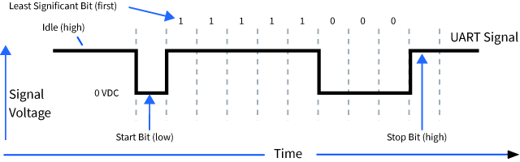{width=80%}

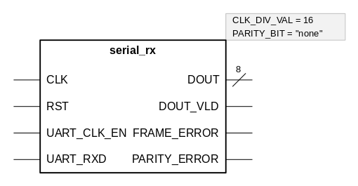{width=80%}

| **Name**     | **Type**             | **Direction** | **Polarity** | **Description** |
|--------------|----------------------|:-------------:|:------------:|-----------------|
| CLK          | std_ulogic           | IN            | HIGH         |                 |
| RST          | std_ulogic           | IN            | HIGH         |                 |
| UART_CLK_EN  | std_ulogic           | IN            | HIGH         |                 |
| UART_RXD     | std_ulogic           | IN            | HIGH         |                 |
| DOUT         | std_ulogic_vector[8] | OUT           | HIGH         |                 |
| DOUT_VLD     | std_ulogic           | OUT           | HIGH         |                 |
| FRAME_ERROR  | std_ulogic           | OUT           | HIGH         |                 |
| PARITY_ERROR |                      | OUT           | HIGH         |                 |


| **Name**    | **Type** | **Default value** |
|-------------|----------|-------------------|
| CLK_DIV_VAL | integer  | 16                |
| PARITY_BIT  | string   | "none"            |

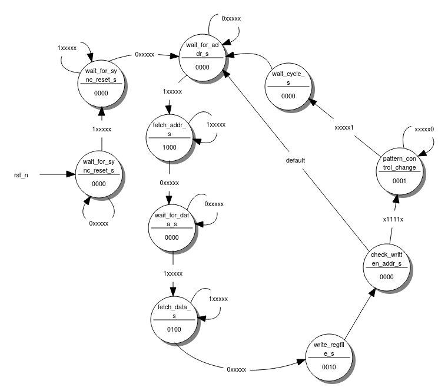{width=80%}

## Pattern generator

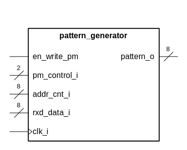{width=80%}

| **Name**     | **Type**             | **Direction** | **Polarity** | **Description** |
|--------------|----------------------|:-------------:|:------------:|-----------------|
| en_write_pm  | std_ulogic           | IN            | HIGH         |                 |
| clk_i        | std_ulogic           | IN            | HIGH         |                 |
| pm_control_i | std_ulogic_vector[2] | IN            | HIGH         |                 |
| addr_cnt_i   | std_ulogic_vector[8] | IN            | HIGH         |                 |
| rxd_data_i   | std_ulogic_vector[8] | IN            | HIGH         |                 |
| pattern_o    | std_ulogic_vector[8] | OUT           | HIGH         |                 |


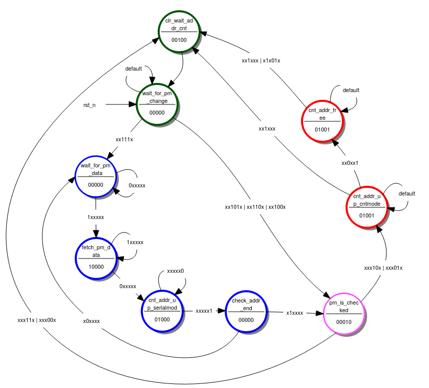{width=80%}


## Pulse-width modulation
The PWM generator module is connected to one of the instantiations of the freq_control module. The output from the Frequency Control module is input to the generator to assign the total width (and thus the frequency) of the PWM. 

{width=80%}


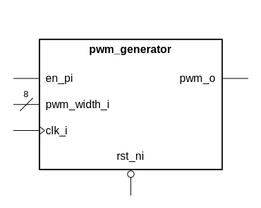{width=80%}

| **Name**    | **Type**             | **Direction** | **Polarity** | **Description** |
|-------------|----------------------|:-------------:|:------------:|-----------------|
| en_pi       | std_ulogic           | IN            | HIGH         |                 |
| rst_ni      | std_ulogic           | IN            | LOW          |                 |
| pwm_width_i | std_ulogic_vector[8] | IN            | HIGH         |                 |
| clk_i       | std_ulogic           | IN            | HIGH         |                 |
| pwm_o       | std_ulogic           | OUT           | HIGH         |                 |


## Pseudo-random number generator (LFSR)

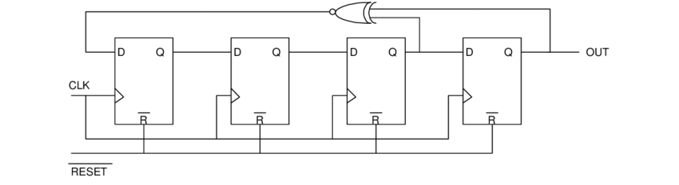{width=80%}


Design Description
==================

- component implementations

## Register file


{width=80%}

| **Name**            | **Type**                      | **Direction** | **Polarity** | **Description** |
|---------------------|-------------------------------|:-------------:|:------------:|-----------------|
| clk_i               | std_ulogic                    | IN            | HIGH         |                 |
| wr_en_i             | std_ulogic                    | IN            | HIGH         |                 |
| w_addr_i            | std_ulogic_vector[ADDR_WIDTH] | IN            | HIGH         |                 |
| r_addr_i            | std_ulogic_vector[ADDR_WIDTH] | IN            | HIGH         |                 |
| w_data_i            | std_ulogic_vector[DATA_WIDTH] | IN            | HIGH         |                 |
| system_control_o    | std_ulogic_vector[2]          | OUT           | HIGH         |                 |
| pwm_pulse_width_o   | std_ulogic_vector[DATA_WIDTH] | OUT           | HIGH         |                 |
| pwm_period_o        | std_ulogic_vector[DATA_WIDTH] | OUT           | HIGH         |                 |
| pwm_control_o       | std_ulogic_vector[2]          | OUT           | HIGH         |                 |
| noise_length_o      | std_ulogic_vector[DATA_WIDTH] | OUT           | HIGH         |                 |
| noise_period_o      | std_ulogic_vector[DATA_WIDTH] | OUT           | HIGH         |                 |
| noise_control_o     | std_ulogic_vector[2]          | OUT           | HIGH         |                 |
| pattern_mem_depth_o | std_ulogic_vector[DATA_WIDTH] | OUT           | HIGH         |                 |
| pattern_period_o    | std_ulogic_vector[DATA_WIDTH] | OUT           | HIGH         |                 |
| pattern_control_o   | std_ulogic_vector[3]          | OUT           | HIGH         |                 |
| r_data_o            | std_ulogic_vector[DATA_WIDTH] | OUT           | HIGH         |                 |


| **Name**   | **Type** | **Default value** |
|------------|----------|-------------------|
| ADDR_WIDTH | integer  | 4                 |
| DATA_WIDTH | integer  | 8                 |

## UART serial receiver

{width=80%} 


| **Name**     | **Type**             | **Direction** | **Polarity** | **Description** |
|--------------|----------------------|:-------------:|:------------:|-----------------|
| CLK          | std_ulogic           | IN            | HIGH         |                 |
| RST          | std_ulogic           | IN            | HIGH         |                 |
| UART_CLK_EN  | std_ulogic           | IN            | HIGH         |                 |
| UART_RXD     | std_ulogic           | IN            | HIGH         |                 |
| DOUT         | std_ulogic_vector[8] | OUT           | HIGH         |                 |
| DOUT_VLD     | std_ulogic           | OUT           | HIGH         |                 |
| FRAME_ERROR  | std_ulogic           | OUT           | HIGH         |                 |
| PARITY_ERROR |                      | OUT           | HIGH         |                 |


| **Name**    | **Type** | **Default value** |
|-------------|----------|-------------------|
| CLK_DIV_VAL | integer  | 16                |
| PARITY_BIT  | string   | "none"            |


## Pattern generator

{width=80%}

| **Name**     | **Type**             | **Direction** | **Polarity** | **Description** |
|--------------|----------------------|:-------------:|:------------:|-----------------|
| en_write_pm  | std_ulogic           | IN            | HIGH         |                 |
| clk_i        | std_ulogic           | IN            | HIGH         |                 |
| pm_control_i | std_ulogic_vector[2] | IN            | HIGH         |                 |
| addr_cnt_i   | std_ulogic_vector[8] | IN            | HIGH         |                 |
| rxd_data_i   | std_ulogic_vector[8] | IN            | HIGH         |                 |
| pattern_o    | std_ulogic_vector[8] | OUT           | HIGH         |                 |


## Pulse-width modulation

{width=80%}

| **Name**    | **Type**             | **Direction** | **Polarity** | **Description** |
|-------------|----------------------|:-------------:|:------------:|-----------------|
| en_pi       | std_ulogic           | IN            | HIGH         |                 |
| rst_ni      | std_ulogic           | IN            | LOW          |                 |
| pwm_width_i | std_ulogic_vector[8] | IN            | HIGH         |                 |
| clk_i       | std_ulogic           | IN            | HIGH         |                 |
| pwm_o       | std_ulogic           | OUT           | HIGH         |                 |


## Pseudo-random number generator (LFSR)

## Enable and external triggering

A conceptional RTL diagram is shown below.

Device Utilization and Performance
==================================
## Test Results
### Noise Generator
Sending serial signals to select the address and the data bit respectively.

```vhdl
LIBRARY ieee;
USE ieee.std_logic_1164.ALL;
USE ieee.numeric_std.ALL;

ENTITY regfile IS
  GENERIC(
    ADDR_WIDTH : integer := 4;
    DATA_WIDTH : integer := 8
    );
  PORT(
    clk_i               : IN  std_ulogic; -- system clock in
    wr_en_i             : IN  std_ulogic; -- write enable in
    w_addr_i            : IN  std_ulogic_vector (ADDR_WIDTH-1 DOWNTO 0);
    r_addr_i            : IN  std_ulogic_vector (ADDR_WIDTH-1 DOWNTO 0);
    w_data_i            : IN  std_ulogic_vector (DATA_WIDTH-1 DOWNTO 0);
    -- system_status_reg_i  : IN  std_ulogic_vector(DATA_WIDTH-1 DOWNTO 0);
    system_control_o    : OUT std_ulogic_vector(1 DOWNTO 0);
    pwm_pulse_width_o   : OUT std_ulogic_vector(DATA_WIDTH-1 DOWNTO 0); 
    pwm_period_o        : OUT std_ulogic_vector(DATA_WIDTH-1 DOWNTO 0);
    pwm_control_o       : OUT std_ulogic_vector(1 DOWNTO 0);
    noise_length_o      : OUT std_ulogic_vector(DATA_WIDTH-1 DOWNTO 0);
    noise_period_o      : OUT std_ulogic_vector(DATA_WIDTH-1 DOWNTO 0);
    noise_control_o     : OUT std_ulogic_vector(1 DOWNTO 0);
    pattern_mem_depth_o : OUT std_ulogic_vector(DATA_WIDTH-1 DOWNTO 0); -- pattern_length
    -- pattern_data_o      : OUT std_ulogic_vector(DATA_WIDTH-1 DOWNTO 0);
    pattern_period_o    : OUT std_ulogic_vector(DATA_WIDTH-1 DOWNTO 0);
    pattern_control_o   : OUT std_ulogic_vector(2 DOWNTO 0);
    r_data_o            : OUT std_ulogic_vector (DATA_WIDTH-1 DOWNTO 0)
    );
END regfile;

ARCHITECTURE rtl OF regfile IS
  TYPE array_2d_t IS ARRAY (0 TO 2**ADDR_WIDTH-1) OF
    std_ulogic_vector(DATA_WIDTH-1 DOWNTO 0);
  SIGNAL array_reg : array_2d_t;
BEGIN
  PROCESS(clk_i)
  BEGIN
    IF rising_edge(clk_i) THEN
      IF wr_en_i = '1' THEN
        array_reg(to_integer(unsigned(w_addr_i))) <= w_data_i;
      END IF;
    END IF;
  END PROCESS;

  system_control_o    <= array_reg(1)(1 DOWNTO 0);
  pwm_pulse_width_o   <= array_reg(4);
  pwm_period_o        <= array_reg(5);
  pwm_control_o       <= array_reg(6)(1 DOWNTO 0);
  noise_length_o      <= array_reg(8);
  noise_period_o      <= array_reg(9);
  noise_control_o     <= array_reg(11)(1 DOWNTO 0);
  pattern_mem_depth_o <= array_reg(12);
  -- pattern_data_o      <= array_reg(13);
  pattern_period_o    <= array_reg(14);
  pattern_control_o   <= array_reg(15)(2 DOWNTO 0);

-- read port
  r_data_o <= array_reg(to_integer(unsigned(r_addr_i)));
END rtl;vhdl
```


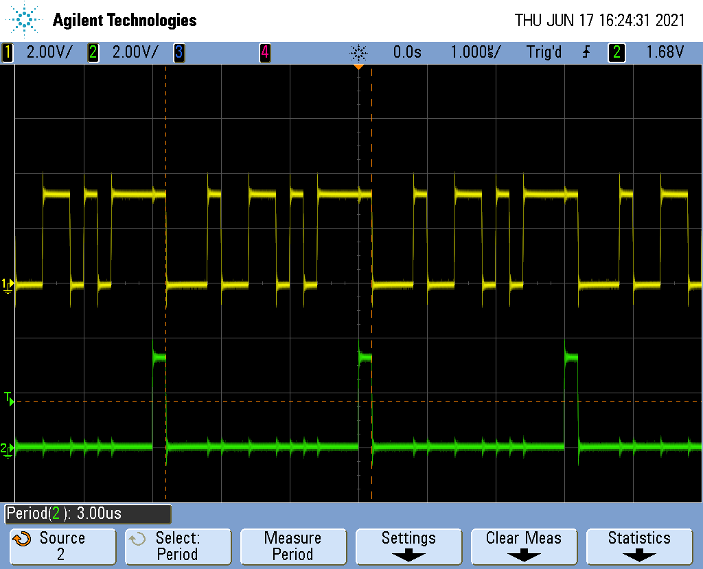{width=80%}

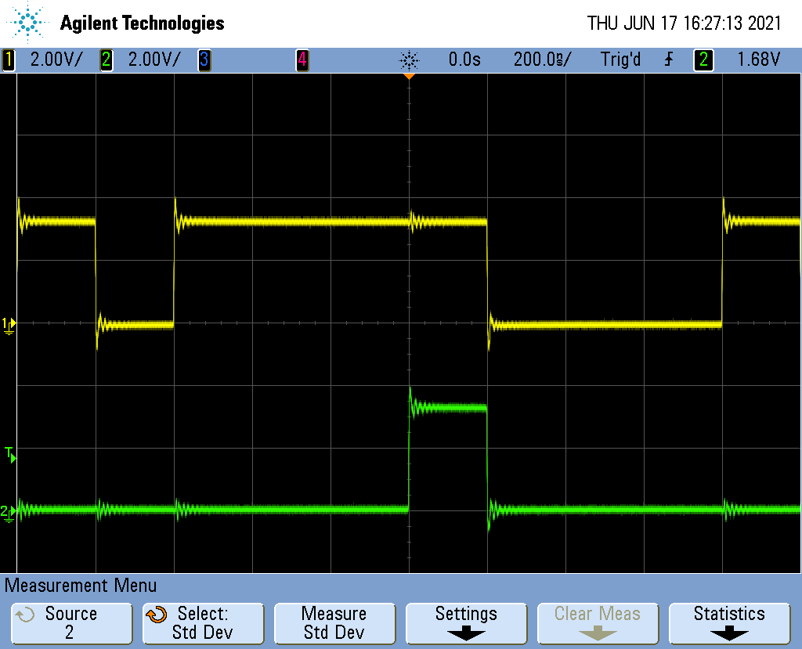{width=80%}

Application Note
================


Appendix
========

References
----------


Project Hierarchy
-----------------

Code
----------------------

### Module Hierarchy for Verification


### Prototype Environment


Revision History
----------------

| **Date**  | **Version**  | **Change Summary**  |
|:----------|:-------------|:--------------------|
| May 2020  | 0.1  | Initial Release  |
| April 2021  | 0.2  | Added parameterisation  |