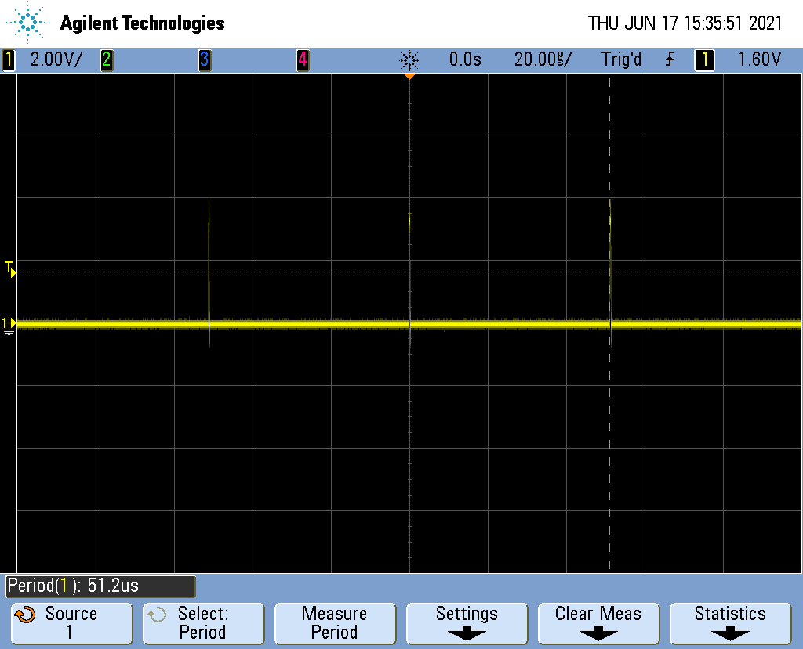
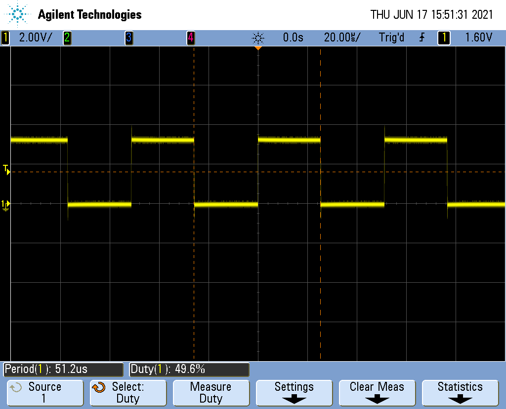

Introduction
============
Digital test signal generators (TSG) are a type of external measurement equipment that are available from several different vendors. These pieces of equipment produce a range of electrical stimuli signals that can be used to check the operation of other electrical devices. The goal of this module is to produce an on-chip version of this system with the following essential features included in the architecture and design:
- Single pulse with variable duty cycle and frequency.
- Digital noise based on pseudo random binary sequences of different length.
- Arbitrary data bus sequences at selectable speed.
- Internal/External Trigger.
- External Time Base.
Each of these features are necessary for the TSG to produce a data-set that can be used to give an engineer an informative viewpoint on their design so that they can modify it so that it lands within specification.


Features
========
These features are key to the TSG as they are utilised in many commercially available TSGs as such they are included in this TSG. 

- Serial Transmission

Utilizing UART serial transmission allows for a large range of data to be transferred between the TSG and the subject system. It allows for the TSG to be given Parallel inputs and then communicate using serial transmission  which can then be returned to a parallel data type for the target system to utilise.


- Single pulse with variable duty cycle and frequency

Utilising Pulse width modulation a series of digitally controlled electrical signals can be sent allowing for a spectrum of both peak voltage and high frequency testing within a single module.

- Digital noise based on pseudo random binary sequences of different length

Ustilsing LFSRs to generate a string of pseudo random binary that is then sent along the UART transmission lines to the subject board. It allows for the subject system's ability to handle junk data as well as other highly variable data types.   

- Arbitrary data bus sequences at selectable speed

Utilising digital pattern generators to create arbitrary data busses that can then be sent using UART to a subject board. As the output of this system is arbitrary it allows for the clarity of transmissions that are sent to the subject board. 

- Internal/External Trigger

Internal and external triggers allow for the TSG to be triggered by internally set rules or received data from the test subject system allowing for specific internal rules to be set up. External triggers allow for specific targeted stimulus to be produced by the TSG meaning that any of the above test types can be used with a high level of precision.  

- External Time Base

An external time base allows for the entire TSG to be configured based on the system to be tested by the TSG system. As well as allowing for the TSG to be run at a different clock rate to the tested system.

Functional Description
======================

## UART serial communication
UART communication is a common form of data communication between electriconic devices. It communicated the data serially in the form of digital signals.

{width=80%}

UART communication has some characteristics that need to be considered for implementation.
The signal begins with start bit (in the form of a high signal), the next in the sequence comes the data bits, the number of data bits is configurable and is dependant on the parameterisation of the serial modules.
After the data sequence is complete, UART protocol then instructs you to send a stop bit, which is again a high signal.


## Digital pattern generator

{width=100%}

Digital Pattern Generators are a common way of creating signal for testing.
Theoretically the Pattern Generator should allow the user to output a configurable pattern.
The pattern can take various shapes, including standard pulses or outputting larger bit patterns depending on the system configuration.

## Pulse-width modulation
Pulse Width Moduation (PWM) is a type of digital signal that has many uses for real world applications. It is a way in which you can digitally control some analog devices.

{width=80%}

PWM funtions by switching between low and high signals to the requested amounts by the user. For each cycle, the signal will be high for the requested percentage. This is known as the Duty Cycle.

$Period=\frac{1}{f}$

$Period=T_{on}+T_{off}$

$DutyCycle=\frac{T_{on}}{T_{on}+T_{off}}\times100$

## Pseudo-random number generator (LFSR)
Linear Feedback Shift Registers is a configuration of registers used in conjunction with an XOR gate to create a function dependant on it's previous state.

{width=80%}

By continually shifting to the right and going through the XOR gate, it generates a series of random numbers.

The number of cycles until the pseudo random number generator repeats himself is:
  $number~of~cycles = 2^{n} -1$

With $n$ as number of bits.

# General Description\label{General Description}

{width=40%}

| **Name**        | **Type**              | **Direction** | **Polarity** | **Description** |
|-----------------|-----------------------|:-------------:|:------------:|-----------------|
| clk_i           | std_ulogic            | IN            | HIGH         | clock                |
| rst_ni          | std_ulogic            | IN            | LOW          | asynchronous reset                |
| en_tsg_pi       | std_ulogic            | IN            | HIGH         | external time base                |
| en_serial_i     | std_ulogic            | IN            | HIGH         | oversample of 16, baudrate 9600                |
| serial_data_i   | std_ulogic            | IN            | HIGH         | serial data, baudrate 9600                |
| rxd_rdy_o       | std_ulogic            | OUT           | HIGH         | serial data ready to read                |
| ext_trig_i      | std_ulogic            | IN            | HIGH         | external trigger                |
| pwm_o           | std_ulogic            | OUT           | HIGH         | pwm signal                |
| noise_o         | std_ulogic            | OUT           | HIGH         | 1 bit pseudo random noise                |
| prbs_o          | std_ulogic_vector[23] | OUT           | HIGH         | pseudo random noise up to 23 bit                |
| eoc_o           | std_ulogic            | OUT           | HIGH         | end of cycle of pseudo random noise               |
| pattern_o       | std_ulogic_vector[8]  | OUT           | HIGH         | pattern output                |
| pattern_valid_o | std_ulogic            | OUT           | HIGH         | pattern valid |
| tc_pm_count_o   | std_ulogic            | OUT           | HIGH         | end of cycle pm upcounter                |
| regfile_o       | std_ulogic_vector[8]  | OUT           | HIGH         | data input register file                |
| addr_reg_o      | std_ulogic_vector[8]  | OUT           | HIGH         | address output serial register
| data_reg_o      | std_ulogic_vector[8]  | OUT           | HIGH         | data output of serial registers                |

: Test Signal Generator - Description of I/O Signals

The test signal generator with its multiple I/Os can be broken down into 4 distinctive parts:
- serial data handling
- pulse width modulation generator
- pattern generator
- random noise generator

{width=100%}
In the picture above you can recognize that the register file is the central part of the design. 
The register file receives data from the serial communication and writes them into its memory. Depending on the values in the 
memory the output components are controlled. 

The register file has the following memory view.
```
		  					 Bit7  ..         0
------------------------------------------------
Address  	Name 				7 6 5 4 3 2 1 0
------------------------------------------------
0x00 
0x01  		system control 					x x
0x02
0x03
0x04     	pwm pulse width 	x x x x x x x x
0x05 		pwm period 			x x x x x x x x
0x06 		pwm control 					x x
0x07
0x08 		noise prbsg length 	x x x x x x x x
0x09 		noise period 		x x x x x x x x
0x0A
0x0B 		noise control 					x x
0x0C 		pattern length 		x x x x x x x x
0x0D 
0x0E 		pattern period 		x x x x x x x x
0x0F 		pattern control 			  x x x
```

The meaning of the control parts of the registers is explained in the following.
```
system control
---------------------------
Bit 0 Meaning
------------------------
	0 system disable
	1 system enable
---------------------------
Bit 1 Meaning
---------------------------
	1 system clear [synchronous clear](not currently implemented see improvements!)


pwm control
---------------------------
Bit 0 Meaning
--------------------------
	0 pwm off
	1 pwm on
---------------------------
Bit 1 Meaning
---------------------------
	0 internal trigger
	1 external trigger


noise prbsg length
-----------------------------------------
Bit 7 6 5 4 3 2 1 0 Meaning
-----------------------------------------
			  0 0 0 4-bit
			  0 0 1 7-bit 8B/10B-encoded pattern
			  0 1 0 15-bit ITU-T O.150
			  0 1 1 17-bit OIF-CEI-P-02.0
			  1 0 0 20-bit ITU-T O.150
			  1 0 1 23-bit ITU-T O.150

noise control
---------------------------
Bit 0 Meaning
---------------------------
	0 noise off
	1 noise on
---------------------------
Bit 1 Meaning
---------------------------
	0 internal trigger
	1 external trigger

pattern control
---------------------------
Bit 1 0 Meaning
---------------------------
	0 0 stop
	0 1 single burst
	1 0 continous run
	1 1 load data
---------------------------
Bit 2 Meaning
---------------------------
	0 internal trigger
	1 external trigger
```
Now the control part of the register will be explained in further detail. 
The system has an general enable "system control" which must be switched on 
to switch on all individual components (noise, pattern, pwm). All components 
allow for external triggering where you can change the state manually by pressing 
a button. When not specified the components run with the speed of the external time 
base which is further divided by the individual period settings. All three components 
have the same frequency divider component. The divided frequency can be calculated by the following formula:

$divided~frequency=\frac{frequency~of~external~time~base}{period~register~value+1}$

## Pwm component

{width=30%}

With the implemented pwm component a duty cycle of 0%-99,6% percent is possible. It
can be computed by $duty~cycle=\frac{pwm~pulse~width}{256}$. One counting cycle is performed 
with the frequency of the divided frequency. This results in a frequency of $\frac{divided~frequency}{256}$.

## Noise component

The noise component has an noise prbsg length and a period setting. The prbsg setting decides how many bits the 
lfsr has. That means it decides over the length of the pseudo random sequence until it repeats itself. They are designed 
after the given standards of pseudo random number generators and have different use cases. For more information about it 
see the standard documentations. One full cycle 
has the frequency of $\frac{divided~frequency}{2^{n}-1}$ with $n$ as the number of bits of the lfsr.

## Pattern component

The pattern generator has four possible control states:
- stop
  - the pattern generator is switched off
- load
  - the pattern generator is ready to receive the data sequence into its memory
  - before sending the number sequence the number of values must be specified in the pattern length register!
    - e.g. pattern length 4 -> pattern load -> pattern sequence 4 5 7 2 -> single burst/continous run
- single burst
  - a single burst puts out the sequence only once
- continous run
  - puts out the sequence forever
  - stops when the pattern control bits change 
One value of a sequence is available for the time of $\frac{1}{divided~frequency}$. A full cycle that includes 
all values has the frequency of $\frac{divided~frequency}{pattern~length}$.


Design Description
==================

## UART serial receiver
The serial receiver module is based on a design made using a Moore state machine and it was provided to the design team by the design manager.
The purpose of the module is to allow for the correct sequencing and addressing of the data. 
The module functions by using a synchronous high active reset.
This state machine directly communicates with the other state machine present on the project directly via the data valid signal, signalling that the data has arrived.

{width=80%}

| **Name**     | **Type**             | **Direction** | **Polarity** | **Description** |
|--------------|----------------------|:-------------:|:------------:|-----------------|
| CLK          | std_ulogic           | IN            | HIGH         |                 |
| RST          | std_ulogic           | IN            | HIGH         |                 |
| UART_CLK_EN  | std_ulogic           | IN            | HIGH         |                 |
| UART_RXD     | std_ulogic           | IN            | HIGH         |                 |
| DOUT         | std_ulogic_vector[8] | OUT           | HIGH         |                 |
| DOUT_VLD     | std_ulogic           | OUT           | HIGH         |                 |
| FRAME_ERROR  | std_ulogic           | OUT           | HIGH         |                 |
| PARITY_ERROR |                      | OUT           | HIGH         |                 |
: I/O Table for the Serial Reciever

| **Name**    | **Type** | **Default value** |
|-------------|----------|-------------------|
| CLK_DIV_VAL | integer  | 16                |
| PARITY_BIT  | string   | "none"            |

{width=80%}

Colours on the state machine represent:

- Blue: This is a workaround to handle the ```rxd_rdy``` signal causing errors in the operation. More information below.
- Red: This aspect of the state machine manages the reciept of the address and data information.
- Green: These states are to check if there is a change in the signal from pattern control. If there is a change, it then goes to the pink state.
- Pink: This single state is responsible for the communication with the Pattern State Machine.

```pure
 Inputs:   rxd_rec   addr[3..0]      pm_checked

 State/Output                    en_addr_reg en_data_reg en_regfile_wr pm_control_changed
 wait_for_addr_s                 0           0           0             0                  
 fetch_addr_s                    1           0           0             0                  
 wait_for_data_s                 0           0           0             0                  
 fetch_data_s                    0           1           0             0                  
 write_regfile_s                 0           0           1             0                  
 check_written_addr_s             0           0           0             0                  
 pattern_control_changed_s       0           0           0             1                  
 wait_cycle_s                    0           0           0             0                  
 wait_for_sync_reset_serialrx_s  0           0           0             0                  
 wait_for_sync_reset_serialrx2_s 0           0           0             0                  
```

This is then directly wired to the ```serial_reciever_reg.vhd``` module. The purpose is this is for the project to work, the register file (```regfile.vhd```) needs to know both the address and the data values similtaneously - meaning that the information must be stored somewhere. This file takes the values in and stores them to registers temporarily and resets every cycle.

### Data received after reset

{width=50%}

The two states at the beginning of the serial receiver state machine are required to work around a problem that the serial rx component 
creates. After a reset the serial rx component puts out a data valid signal for one cycle. This seems to be a design problem (see tsg testbench at the beginning: DIN_VLD). 
Without these states we have the issue that after an reset we would immediately transition to the state were we are waiting for the 
data. We are skipping the address states. For that reason the first two states are added.

## Pattern generator


| **Name**     | **Type**             | **Direction** | **Polarity** | **Description** |
|--------------|----------------------|:-------------:|:------------:|-----------------|
| en_write_pm  | std_ulogic           | IN            | HIGH         |                 |
| clk_i        | std_ulogic           | IN            | HIGH         |                 |
| pm_control_i | std_ulogic_vector[2] | IN            | HIGH         |                 |
| addr_cnt_i   | std_ulogic_vector[8] | IN            | HIGH         |                 |
| rxd_data_i   | std_ulogic_vector[8] | IN            | HIGH         |                 |
| pattern_o    | std_ulogic_vector[8] | OUT           | HIGH         |                 |
: I/O Table for the Pattern Generator


{width=80%}


Colours on the state machine represent:

- Blue: These states deal with the loading of the data and address information.
- Red: This aspect of the state machine manages a workaround related to the ```tc_pm```. 
- Green: These states are to manage the initialisation and the reset of the state machine.
- Pink: This single state is responsible for the communication with the Serial Communication State Machine.


```pure
-- Inputs:   rxd_rec   tc_pm   pm_control_changed   pm_control[1..0]    addr_cnt_enabled

-- State/Output           en_pm en_pm_cnt clr_pm_cnt pm_checked pattern_valid
-- wait_for_pm_change     0     0         0          0          0             
-- clr_wait_addr_cnt      0     0         1          0          0             
-- wait_for_pm_data       0     0         0          0          0             
-- fetch_pm_data          1     0         0          0          0             
-- cnt_addr_up_serialmode 0     1         0          0          0             
-- check_addr_end         0     0         0          0          0             
-- pm_is_checked          0     0         0          1          0             
-- cnt_addr_up_cntmode    0     1         0          0          1             
-- cnt_addr_free          0     1         0          0          1             
```

## Pulse-width modulation
The PWM generator module is connected to one of the instantiations of the freq_control module. The output from the Frequency Control module is input to the generator to assign the total width (and thus the frequency) of the PWM. 


{width=80%}

| **Name**    | **Type**             | **Direction** | **Polarity** | **Description** |
|-------------|----------------------|:-------------:|:------------:|-----------------|
| en_pi       | std_ulogic           | IN            | HIGH         |                 |
| rst_ni      | std_ulogic           | IN            | LOW          |                 |
| pwm_width_i | std_ulogic_vector[8] | IN            | HIGH         |                 |
| clk_i       | std_ulogic           | IN            | HIGH         |                 |
| pwm_o       | std_ulogic           | OUT           | HIGH         |                 |
: I/O Table for the PWM Generator


## Pseudo-random number generator (LFSR)


## External time base and external triggering design

{width=100%}

To get the external time base and external triggering to work correctly multiple AND gates and multiplexer are needed.
For the pwm and the noise generator we have the same design. If the noise generator is enabled depends on 
the following conditions:
- the whole system is enabled
- pwm/noise generator is enabled
- external time base on
- frequency divider enabled
When the external triggering of the noise/pwm generator is enabled it should only be controlled by external triggering
if the system is on and the pwm/noise generator is enabled.

{width=100%}

For the pattern generator a more sophisticated system is needed. We need to differentiate between the four modes of our 
pattern generator:
- 00 stop
- 01 single burst
- 10 continous run
- 11 load

In stop and load mode we do not care about the external triggering and the external time base. When loading the pattern generator the
address upcounter only counts up when the pattern generator state machine gives an signal. Note that the address upcounter decides over the frequency of the pattern output, not the pattern generator (pattern memory) itself. The external trigger, external time base 
and frequency divider matters when we are in the two run modes. For the external triggering we need the additional signal pattern valid.
This signal is provided by the pattern generator state machine and is true when the state machine is in a counting state. This is needed 
for the single burst mode to stop counting after one counting cycle.


Test Results
============

All of the results were calculated using the formulae mentioned above. 

## Noise Generator
Sending serial signals to select the address and the data bit respectively.

{width=80%}

{width=80%}

Expected results are found by implementing the formulae in the \ref{General Description}.

\label{Results from testing the Noise Generator}

| Number of Bits | Period Data | Expected Period(µs) | Actual Period (µs) |
|----------------|-------------|---------------------|--------------------|
| 4              | 1           | 3                   | 3                  |
| 4              | 2           | 4.5                 | 4.5                |
| 7              | 1           | 25.4                | 25.4               |
| 7              | 2           | 38.1                | 38.1               |
: Results from testing the Noise Generator

## PWM Generator


{width=80%}

{width=80%}


| Width Data | Period | Expected Period(µs) | Actual Period (µs) |
|------------|--------|---------------------|--------------------|
| 1          | 1      | 51.2                | 51.2               |
| 1          | 4      | 128                 | 128                |
| 127        | 1      | 51.2                | 51.2               |
| 128        | 1      | 51.2                | 51.2               |
| 255        | 1      | 51.2                | 51.2               |
: Results from testing the PWM Generator

Application Note
================

{width=100%}
The wiring of the DE1 Board can be seen in the picture above. The test signal generator runs with an 50 MHz clock and a time base of 
10 MHz on the enable. An synchroniser is added before the serial input to avoid metavalues because of asynchronous serial communication from the pc.
The outputs of the test signal generator were connected to test components ALU and a 101 sequence detector. On the HEX3 display the
number of 101 sequences detected is shown. Additionally some outputs are connected to the GPIOs
for measurements. For the connections see ```de1_tsg_structure.vhd```.

{width=100%}

Further Improvements
====================

## System control register

In the system control register is a bit included to do an synchronous clear over serial communication. It adds another possibility to 
reset the states of the synchronous components. At the moment only the asynchronous reset is available. To add this functionality 
an synchronous reset needs to be added to every component except the memory components (register file, pattern generator) and the address upcounter (has already one).

## Pwm switch off

When the pwm module is switched off either by the system control or the pwm control the counters in the frequency control and pwm 
generator are kept in their current counting state. This could result in an constant output of a one. To solve this problem it is 
recommended to put in a switch in the pwm generator that puts out zero when the system control AND pwm control is zero. This approach 
is already implemented for the noise generator and can be implemented in the same way (see input en_noise_generator_i).

## Testbench tsg and de1_tsg

With the fix in the serial receiver state machine (states at beginning) that solve the issue of data valid signal after reset a 
different problem occurred. In the real system the fix works but in the simulation this scenario does not happen. We have an 
immediate one after the reset and not a zero and then the pulse of the data like in the real system. A possible fix is to add an 
additional state to the state machine. 

{width=50%}

## More test scenarios

The pattern generator was not evaluated on the oscilloscope. It was only tested manually with the external trigger, were it worked correctly (burst mode and continous run). That means it needs to be tested if the frequency in the automatic mode is correct.


References
==========

Appendix
========


Device Utilization and Performance
----------------------------------

Project Hierarchy
-----------------
```pure
.
--- doc
|   +-- datasheet.yaml
|   +-- images
|   +-- makefile
|   +-- presentation.yaml
|   +-- report.yaml
|   +-- tables
|   +-- test_signal_generator_datasheet.md
|   +-- test_signal_generator_presentation.md
|   +-- test_signal_generator_report.md
|   +-- test_signal_generator_report.pdf
|   +-- uasa_meng_vlsi_template.tex
|   +-- vec.conf
+-- pnr
|   +-- de1_binto7segment
|   +-- de1_cntdnmodm
|   +-- de1_serial_rx
|   +-- de1_tsg
|   +-- makefile
+-- README.md
+-- scripts
|   +-- create_quartus_project_settings.tcl
|   +-- de1_pin_assignments_minimumio.tcl
|   +-- modelsim.ini
|   +-- quartus_project_flow.tcl
|   +-- test_variables.py
|   +-- write_to_ttyUSBx.py
+-- sim
|   +-- binto7segment
|   +-- cntdnmodm
|   +-- cntup_addr
|   +-- de1_tsg
|   +-- makefile
|   +-- noise_generator
|   +-- pattern_generator
|   +-- pwm_generator
|   +-- serial_rx
|   +-- tsg
+-- src
    +-- 101SequenceQfsm.fsm
    +-- a_falling_edge_detector_rtl.vhd
    +-- alu.vhd
    +-- alu.vhd.bak
    +-- a_tsg_structure.vhd
    +-- a_tsg_structure.vhd.bak
    +-- binto7segment_truthtable.vhd
    +-- cntdnmodm_rtl.vhd
    +-- cntup_addr.vhd
    +-- cntup_addr.vhd.bak
    +-- config_noise_generator.vhd
    +-- config_noise_generator.vhd.bak
    +-- de1_serial_rx_structure.vhd
    +-- de1_tsg_structure.vhd
    +-- de1_tsg_structure.vhd.bak
    +-- e_falling_edge_detector.vhd
    +-- e_tsg.vhd
    +-- freq_control.vhd
    +-- noise_generator.vhd
    +-- noise_generator.vhd.bak
    +-- pattern_generator_fsm.vhd
    +-- pattern_generator_qfsm.fsm
    +-- pattern_generator.vhd
    +-- pwm_generator.vhd
    +-- regfile_rtl.vhd
    +-- regfile_rtl.vhd.bak
    +-- sequence_detector.vhd
    +-- serial_receiver_fsm.vhd
    +-- serial_receiver_qfsm.fsm
    +-- serial_receiver_reg.vhd
    +-- serial_receiver_reg.vhd.bak
    +-- serial_rx.vhd
    +-- serial_tx.vhd
    +-- sp_ssram_rtl.vhd
    +-- synchroniser.vhd
    +-- synchroniser.vhd.bak
    +-- t_cntup_addr.vhd
    +-- t_de1_tsg.vhd
    +-- t_noise_generator.vhd
    +-- t_pattern_generator.vhd
    +-- t_pwm_generator.vhd
    +-- t_serial_receiver_fsm.vhd
    +-- t_serial_rx.vhd
    +-- t_tsg.vhd
    +-- uart_clk_div.vhd
    +-- uart_parity.vhd
```
Module Hierarchy
----------------
tsg testbench:
```pure
t_tsg(tbench)
  e_tsg.vhd 
  a_tsg_structure.vhd 
  uart_clk_div.vhd 
  uart_parity.vhd 
  serial_rx.vhd 
  serial_tx.vhd 
  serial_receiver_reg.vhd 
  serial_receiver_fsm.vhd 
  regfile_rtl.vhd 
  freq_control.vhd 
  pwm_generator.vhd 
  noise_generator.vhd 
  config_noise_generator.vhd 
  pattern_generator.vhd 
  pattern_generator_fsm.vhd 
  cntup_addr.vhd 
  sp_ssram_rtl.vhd 
  cntdnmodm_rtl.vhd  

```
de1_tsg:
```pure
de1_tsg(structure)
  binto7segment_truthtable.vhd 
  cntdnmodm_rtl.vhd 
  synchroniser.vhd 
  a_falling_edge_detector_rtl.vhd 
  e_falling_edge_detector.vhd 
  sequence_detector.vhd 
  alu.vhd 
  de1_tsg_structure.vhd 
```
All files in tsg testbench also needed in de1_tsg.

Code
----------------------
Register File:

```vhdl
LIBRARY ieee;
USE ieee.std_logic_1164.ALL;
USE ieee.numeric_std.ALL;

ENTITY regfile IS
  GENERIC(
    ADDR_WIDTH : integer := 4;
    DATA_WIDTH : integer := 8
    );
  PORT(
    clk_i               : IN  std_ulogic; -- system clock in
    wr_en_i             : IN  std_ulogic; -- write enable in
    w_addr_i            : IN  std_ulogic_vector (ADDR_WIDTH-1 DOWNTO 0);
    r_addr_i            : IN  std_ulogic_vector (ADDR_WIDTH-1 DOWNTO 0);
    w_data_i            : IN  std_ulogic_vector (DATA_WIDTH-1 DOWNTO 0);
    -- system_status_reg_i  : IN  std_ulogic_vector(DATA_WIDTH-1 DOWNTO 0);
    system_control_o    : OUT std_ulogic_vector(1 DOWNTO 0);
    pwm_pulse_width_o   : OUT std_ulogic_vector(DATA_WIDTH-1 DOWNTO 0); 
    pwm_period_o        : OUT std_ulogic_vector(DATA_WIDTH-1 DOWNTO 0);
    pwm_control_o       : OUT std_ulogic_vector(1 DOWNTO 0);
    noise_length_o      : OUT std_ulogic_vector(DATA_WIDTH-1 DOWNTO 0);
    noise_period_o      : OUT std_ulogic_vector(DATA_WIDTH-1 DOWNTO 0);
    noise_control_o     : OUT std_ulogic_vector(1 DOWNTO 0);
    pattern_mem_depth_o : OUT std_ulogic_vector(DATA_WIDTH-1 DOWNTO 0); -- pattern_length
    -- pattern_data_o      : OUT std_ulogic_vector(DATA_WIDTH-1 DOWNTO 0);
    pattern_period_o    : OUT std_ulogic_vector(DATA_WIDTH-1 DOWNTO 0);
    pattern_control_o   : OUT std_ulogic_vector(2 DOWNTO 0);
    r_data_o            : OUT std_ulogic_vector (DATA_WIDTH-1 DOWNTO 0)
    );
END regfile;

ARCHITECTURE rtl OF regfile IS
  TYPE array_2d_t IS ARRAY (0 TO 2**ADDR_WIDTH-1) OF
    std_ulogic_vector(DATA_WIDTH-1 DOWNTO 0);
  SIGNAL array_reg : array_2d_t;
BEGIN
  PROCESS(clk_i)
  BEGIN
    IF rising_edge(clk_i) THEN
      IF wr_en_i = '1' THEN
        array_reg(to_integer(unsigned(w_addr_i))) <= w_data_i;
      END IF;
    END IF;
  END PROCESS;

  system_control_o    <= array_reg(1)(1 DOWNTO 0);
  pwm_pulse_width_o   <= array_reg(4);
  pwm_period_o        <= array_reg(5);
  pwm_control_o       <= array_reg(6)(1 DOWNTO 0);
  noise_length_o      <= array_reg(8);
  noise_period_o      <= array_reg(9);
  noise_control_o     <= array_reg(11)(1 DOWNTO 0);
  pattern_mem_depth_o <= array_reg(12);
  -- pattern_data_o      <= array_reg(13);
  pattern_period_o    <= array_reg(14);
  pattern_control_o   <= array_reg(15)(2 DOWNTO 0);

-- read port
  r_data_o <= array_reg(to_integer(unsigned(r_addr_i)));
END rtl;
```

ALU Test Device

```vhdl
LIBRARY IEEE;
USE IEEE.std_logic_1164.ALL;
USE IEEE.numeric_std.ALL;

ENTITY alu IS
  PORT (a_i   : IN  std_ulogic_vector(2 DOWNTO 0);       -- data input a
        b_i   : IN  std_ulogic_vector(2 DOWNTO 0);       -- data input b
        sel_i : IN  std_ulogic_vector(1 DOWNTO 0);       -- select which input is connected to y
 
        y_o   : OUT std_ulogic_vector(2 DOWNTO 0)        -- data output y
        );
END ENTITY alu;

ARCHITECTURE rtl OF alu IS

 SIGNAL y_out  : unsigned(2 DOWNTO 0); -- set as unsigned so it can be written
                                       -- to after the conversion
  
BEGIN

  WITH sel_i SELECT y_out <= -- uses select value to determine the operation below
    (unsigned(a_i) + unsigned(b_i)) WHEN "00", -- converted to unsigned to makelogical arithmetic possible
    (unsigned(a_i) - unsigned(b_i)) WHEN "01", -- WHEN statement
    (unsigned(a_i and b_i)) WHEN "10", -- possible issues with data type
    (unsigned(a_i or b_i)) WHEN "11", -- possible issues with data type
    (OTHERS => '0') WHEN others;

  y_o <= std_ulogic_vector(y_out); -- converting the output to std_ulogic_vect
                                   -- to output

END rtl;
```

Noise Generator Configuration

```vhdl
- Description: Allows for switching between a number of different bits for the lfsr. Choose the bitwidth and where the feedbacks are for the xor.

LIBRARY IEEE;
USE IEEE.std_logic_1164.ALL;
USE IEEE.numeric_std.ALL;

-- https://www.itu.int/rec/T-REC-O.150-199605-I/en
ENTITY config_noise_generator IS
  GENERIC (
    num_of_bits : positive := 4;         -- just a default value
    tap_high    : positive := 4;         -- xor connection 1
    tap_low     : positive := 3          -- xor connection 2
    );
  PORT (
    en_pi   : IN  std_ulogic;
    clk_i   : IN  std_ulogic;
    rst_ni  : IN  std_ulogic;
    prbs_o  : OUT std_ulogic_vector(num_of_bits - 1 DOWNTO 0); -- 
    noise_o : OUT std_ulogic;
    eoc_o   : OUT std_ulogic
    );
END ENTITY config_noise_generator;

ARCHITECTURE rtl OF config_noise_generator IS

  SIGNAL q    : std_ulogic_vector(num_of_bits - 1 DOWNTO 0);  -- current state
  SIGNAL d    : std_ulogic_vector(num_of_bits - 1 DOWNTO 0);  -- next state
  CONSTANT init : std_ulogic_vector(num_of_bits - 1 DOWNTO 0) := (0 => '1', OTHERS => '0');

BEGIN
  -- lfsr with xor feedback; 0 lines are on the right of the shift register, highest on the left
  -- next state logic
  d(num_of_bits - 2 DOWNTO 0) <= q(num_of_bits - 1 DOWNTO 1);
  d(num_of_bits - 1)          <= q(num_of_bits - tap_low) XOR q(num_of_bits - tap_high);  -- feedback

  -- outputs
  noise_o <= q(0);
  prbs_o  <= q;
  eoc_o   <= '1' WHEN q = init ELSE '0';  -- end/start of cycle

  state_register : q <= init WHEN rst_ni = '0' ELSE
                        d WHEN rising_edge(clk_i) AND en_pi = '1';

END ARCHITECTURE rtl;
```

Frequency Controller

```vhdl
-------------------------------------------------------------------------------
-- Module     : noise_freq_control
-------------------------------------------------------------------------------
-- Author     : Leo Hillinger, Ruairí Dillon & David Cunningham
-- Company    : University of Applied Sciences Augsburg
-------------------------------------------------------------------------------
-- Description: This module is to act like the frequency controller for the
-- three generators in the project.
-------------------------------------------------------------------------------
-- Revisions  : see end of file
-------------------------------------------------------------------------------
LIBRARY IEEE;
USE IEEE.std_logic_1164.ALL;
USE IEEE.numeric_std.ALL;

ENTITY freq_control IS


  PORT (clk_i    : IN  std_ulogic;
        rst_ni   : IN  std_ulogic;
        en_pi    : IN  std_ulogic;
        count_o  : OUT std_ulogic_vector(7 DOWNTO 0);
        freq_o   : OUT std_ulogic;
        period_i : IN  std_ulogic_vector(7 DOWNTO 0)
        );
END freq_control;

ARCHITECTURE rtl OF freq_control IS


  SIGNAL next_state, current_state : unsigned(7 DOWNTO 0);

  CONSTANT zero : unsigned(current_state'length-1 DOWNTO 0) := (OTHERS => '0');  -- means vector with only zeros

-- "The constant is like a variable object type, the value of which cannot
-- be changed. A signal object can be of different types; we saw before, for
--example, that a signal object can be of type std logic or of other types
--like integer, custom types, etc. The same applies for variable objects."
  

BEGIN

  -- includes decrementer and modulo logic
  next_state_logic : next_state <= unsigned(period_i) WHEN current_state = 0 ELSE
                                   current_state - 1;

  state_register : current_state <= zero WHEN rst_ni = '0' ELSE
                                    next_state WHEN rising_edge(clk_i) AND (en_pi = '1');

  counter_output : count_o <= std_ulogic_vector(current_state);

  terminal_count : freq_o <= '1' WHEN current_state = 0 ELSE '0';

END rtl;

-------------------------------------------------------------------------------
-- Revisions:
-- ----------
-- $Id:$
-------------------------------------------------------------------------------
```

Pattern Generator

```vhdl
LIBRARY IEEE;
USE IEEE.std_logic_1164.ALL;
-- use IEEE.numeric_std.all;

ENTITY pattern_generator IS
  PORT (
    en_write_pm : IN std_ulogic;
    clk_i  : IN std_ulogic;
    pm_control_i : IN std_ulogic_vector(1 downto 0); -- only the control bits are needed (not bit 2)
    addr_cnt_i : IN std_ulogic_vector(7 downto 0);
    rxd_data_i  : IN std_ulogic_vector(7 DOWNTO 0);  -- uart data
    pattern_o : OUT std_ulogic_vector(7 DOWNTO 0)
    );
END ENTITY pattern_generator;

ARCHITECTURE structure OF pattern_generator IS

  COMPONENT sp_ssram IS
    GENERIC (
      addr_width : positive; -- a number > 0
      data_width : positive);
    PORT (
      clk_i  : IN  std_ulogic;
      we_i   : IN  std_ulogic;
      addr_i : IN  std_ulogic_vector;
      d_i    : IN  std_ulogic_vector;
      q_o    : OUT std_ulogic_vector);
  END COMPONENT sp_ssram;

  CONSTANT addr_width : natural := 8;
  CONSTANT data_width : natural := 8;

  SIGNAL pm_out       : std_ulogic_vector(data_width - 1 DOWNTO 0);
  SIGNAL pattern_temp : std_ulogic_vector(data_width - 1 DOWNTO 0);

BEGIN

  pattern_memory : sp_ssram
    GENERIC MAP (
      addr_width => addr_width,
      data_width => data_width)
    PORT MAP (
      clk_i  => clk_i,
      we_i   => en_write_pm,   
      addr_i => addr_cnt_i,
      d_i    => rxd_data_i,
      q_o    => pm_out);

  WITH pm_control_i SELECT
    pattern_temp <= (OTHERS => '0') WHEN "00",  -- stop
    pm_out                       WHEN "01",  -- single burst
    pm_out                       WHEN "10",  -- continous burst
    (OTHERS              => '0') WHEN "11",  -- load
    (OTHERS              => '0') WHEN OTHERS;

  output_register : pattern_o <= pattern_temp WHEN rising_edge(clk_i);
  
END ARCHITECTURE structure;
```

PWM Generator

```vhdl
-- Leo Hillinger and Ruairí Dillon 28/05/2021

-- Description: Intakes an enable, system clock, reset and a value to set the
-- width (i.e. frequency). The width is the size of the whole signal (high and
-- low). It then outputs a signal which forms the pwm of the set size.


LIBRARY ieee;
USE IEEE.std_logic_1164.ALL;
USE IEEE.numeric_std.ALL;

ENTITY pwm_generator IS

  PORT(
    en_pi     : IN  std_ulogic;         -- enable pin
    rst_ni    : IN  std_ulogic;         -- reset
    pwm_width_i : IN  std_ulogic_vector(7 DOWNTO 0);  -- size of the pwm total signal 
    clk_i     : IN  std_ulogic;         -- clock in
    pwm_o     : OUT std_ulogic);         -- output signal from module

END pwm_generator;

ARCHITECTURE rtl OF pwm_generator IS

  SIGNAL next_state, current_state : unsigned(7 DOWNTO 0);  -- states

  SIGNAL pwm_temp : std_ulogic; -- temporary place holder for state logic below

BEGIN
 -- "just a down counter"
  -- next state is "11111111" current state is equal zero. this is then used to
  -- be compared to the requested width from freq_control
  -- the width is the size of the whole signal (high and
  -- low). It then outputs a signal which forms the pwm of the set size.
  --current state will be equal to "00000000" when the reset is pressed, or
  --else it will be equal to the next_state value when enabled.

  state_register : current_state <= (others => '0') WHEN rst_ni = '0' ELSE
                                    next_state WHEN rising_edge(clk_i) AND (en_pi = '1');

-- sets the output value to pwm temp when current state is lesser than the
-- width, thus making the desired  pulse width proportional to the 8 bits (255).
  counter_output : pwm_temp <= '1' WHEN current_state < unsigned(pwm_width_i) ELSE
                               '0';


-- setting the output to a registed for integration with other modules
  output_register : pwm_o <= '0' WHEN rst_ni = '0' ELSE
                    pwm_temp WHEN rising_edge(clk_i);

END rtl;
```

Register File

```vhdl
-------------------------------------------------------------------------------
-- Module     : regfile
-------------------------------------------------------------------------------
-- Author     :   <johann.faerber@hs-augsburg.de>
-- Company    : University of Applied Sciences Augsburg
-- Copyright (c) 2021   <johann.faerber@hs-augsburg.de>
-------------------------------------------------------------------------------
-- Description: Register File - parameterisable by data width and address width
-------------------------------------------------------------------------------
-- Revisions  : see end of file
-------------------------------------------------------------------------------


LIBRARY ieee;
USE ieee.std_logic_1164.ALL;
USE ieee.numeric_std.ALL;

ENTITY regfile IS
  GENERIC(
    ADDR_WIDTH : integer := 4;
    DATA_WIDTH : integer := 8
    );
  PORT(
    clk_i               : IN  std_ulogic;
    wr_en_i             : IN  std_ulogic;
    w_addr_i            : IN  std_ulogic_vector (ADDR_WIDTH-1 DOWNTO 0);
    r_addr_i            : IN  std_ulogic_vector (ADDR_WIDTH-1 DOWNTO 0);
    w_data_i            : IN  std_ulogic_vector (DATA_WIDTH-1 DOWNTO 0);
    -- system_status_reg_i  : IN  std_ulogic_vector(DATA_WIDTH-1 DOWNTO 0);
    system_control_o    : OUT std_ulogic_vector(1 DOWNTO 0);
    pwm_pulse_width_o   : OUT std_ulogic_vector(DATA_WIDTH-1 DOWNTO 0);
    pwm_period_o        : OUT std_ulogic_vector(DATA_WIDTH-1 DOWNTO 0);
    pwm_control_o       : OUT std_ulogic_vector(1 DOWNTO 0);
    noise_length_o      : OUT std_ulogic_vector(DATA_WIDTH-1 DOWNTO 0);
    noise_period_o      : OUT std_ulogic_vector(DATA_WIDTH-1 DOWNTO 0);
    noise_control_o     : OUT std_ulogic_vector(1 DOWNTO 0);
    pattern_mem_depth_o 

    : OUT std_ulogic_vector(2 DOWNTO 0);
    r_data_o            : OUT std_ulogic_vector (DATA_WIDTH-1 DOWNTO 0)
    );
END regfile;

ARCHITECTURE rtl OF regfile IS
  TYPE array_2d_t IS ARRAY (0 TO 2**ADDR_WIDTH-1) OF -- array = (2^address width)-1
    std_ulogic_vector(DATA_WIDTH-1 DOWNTO 0);
  SIGNAL array_reg : array_2d_t;
BEGIN
  PROCESS(clk_i)
  BEGIN
    IF rising_edge(clk_i) THEN
      IF wr_en_i = '1' THEN -- if the write is enabled
        array_reg(to_integer(unsigned(w_addr_i))) <= w_data_i;  -- then it takes address, turns to integer for use as index of array,
      END IF;                                                   -- then it writes data to the array at the index of address
    END IF;
  END PROCESS;

  system_control_o    <= array_reg(1)(1 DOWNTO 0); -- because system control is two bits
  pwm_pulse_width_o   <= array_reg(4);
  pwm_period_o        <= array_reg(5);
  pwm_control_o       <= array_reg(6)(1 DOWNTO 0);
  noise_length_o      <= array_reg(8);
  noise_period_o      <= array_reg(9);
  noise_control_o     <= array_reg(11)(1 DOWNTO 0);
  pattern_mem_depth_o <= array_reg(12);
  pattern_period_o    <= array_reg(14);
  pattern_control_o   <= array_reg(15)(2 DOWNTO 0); -- because pattern control has three bits to write to

-- read port
  r_data_o <= array_reg(to_integer(unsigned(r_addr_i)));
END rtl;
```

Serial Receiver Register File

```vhdl
-- Description: takes information on the address and the data externally (serial reciever),
-- to then store to registers.
-- In the scope of the project, this then gets sent to the register file to be
-- processed from there.

library IEEE;
use IEEE.std_logic_1164.all;
use IEEE.numeric_std.all;

entity serial_receiver_reg is
    port (
        rst_ni : in std_ulogic;
        clk_i : in std_ulogic;
        en_addr_reg_i : in std_ulogic;
        en_data_reg_i : in std_ulogic;
        rxd_data_i : in std_ulogic_vector(7 downto 0); -- uart data
        regfile_addr_o : out std_ulogic_vector(3 downto 0);
        regfile_data_o : out std_ulogic_vector(7 downto 0)
    );
end entity serial_receiver_reg;

architecture rtl of serial_receiver_reg is
    
begin

  addr_register : regfile_addr_o <= (others => '0') WHEN rst_ni = '0' ELSE
    std_ulogic_vector(resize(unsigned(rxd_data_i), 4)) WHEN rising_edge(clk_i) AND (en_addr_reg_i = '1'); -- slices the four most significant bits off of the address


 data_register : regfile_data_o <= (others => '0') WHEN rst_ni = '0' ELSE
    rxd_data_i WHEN rising_edge(clk_i) AND (en_data_reg_i = '1');

    
end architecture rtl;
```


```vhdl
-- Description: Synchroniser functions by taking in asychronous data, then it
-- goes through two flip flops, the Q of the first flip flop is connected to
-- the D of the other flipflop. The output of this is a signal synchronous with
-- the clock input.
-- Clocks and resets are common for both flipflops.

-- ASK LEO HOW THE FLIP FLOPS ARE ACTUALLY INSTANTIATED


LIBRARY IEEE;
USE IEEE.std_logic_1164.ALL;

entity synchroniser is
    port (
        clk_i : in std_ulogic; -- common clock
        rst_ni : in std_ulogic; -- common reset
        async_i : in std_ulogic; -- the input, asychronous data
        sync_o : out std_ulogic -- the data ouput
    );
end entity synchroniser;

architecture rtl of synchroniser is
    
    signal ff1_i, ff2_i : std_ulogic; -- flip flop one and flip flop two's input
    signal ff1_o, ff2_o : std_ulogic; -- flip flop one and flip flop two's output

BEGIN

  --Sensitivity lists are parameters to a process which lists all the signals that the process is sensitive to. If any
  --of the signals change, the process will wake up, and the code within it is executed. We've already learned to
  --use the wait on and wait until statements for waking up a process when a signal changes.
    
    sync: process(clk_i, rst_ni) -- sensitivity list
    begin
        if rst_ni = '0' then
            ff1_o <= '0';
            ff2_o <= '0';
        elsif rising_edge(clk_i) then
            ff1_o <= ff1_i; -- connects the input of the first flip flop to the
                            -- output of the first
            ff2_o <= ff2_i;
        end if;
    end process sync;
    
    ff1_i <= async_i; -- setting the input as the input of flip flop 1
    ff2_i <= ff1_o; --flip flop two's input being wired to 

    sync_o <= ff2_o; -- then the overall system's output

end architecture rtl;
```
