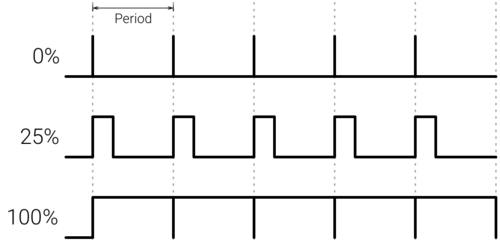

Introduction
============
Digital test signal generators (TSG) are a type of external measurement equipment that are available from several different vendors. These pieces of equipment produce a range of electrical stimuli signals that can be used to check the operation of other electrical devices. The goal of this module is to produce an on-chip version of this system with the following essential features included in the architecture and design:
- Single pulse with variable duty cycle and frequency.
- Digital noise based on pseudo random binary sequences of different length.
- Arbitrary data bus sequences at selectable speed.
- Internal/External Trigger.
- External Time Base.
Each of these features are necessary for the TSG to produce a data-set that can be used to give an engineer an informative viewpoint on their design so that they can modify it so that it lands within specification.


Features
========
These features are key to the TSG as they are utilised in many commercially available TSGs as such they are included in this TSG. 

### Serial Transmission
Utilizing UART serial transmission allows for a large range of data to be transferred between the TSG and the subject system. It allows for the TSG to be given Parallel inputs and then communicate using serial transmission  which can then be returned to a parallel data type for the target system to utilise.


### Single pulse with variable duty cycle and frequency.
Utilising Pulse width modulation a series of digitally controlled electrical signals can be sent allowing for a spectrum of both peak voltage and high frequency testing within a single module.

### Digital noise based on pseudo random binary sequences of different length.
Ustilsing LFSRs to generate a string of pseudo random binary that is then sent along the UART transmission lines to the subject board. It allows for the subject system's ability to handle junk data as well as other highly variable data types.   

### Arbitrary data bus sequences at selectable speed.
Utilising digital pattern generators to create arbitrary data busses that can then be sent using UART to a subject board. As the output of this system is arbitrary it allows for the clarity of transmissions that are sent to the subject board. 

### Internal/External Trigger.
Internal and external triggers allow for the TSG to be triggered by internally set rules or received data from the test subject system allowing for specific internal rules to be set up. External triggers allow for specific targeted stimulus to be produced by the TSG meaning that any of the above test types can be used with a high level of precision.  

### External Time Base
An external time base allows for the entire TSG to be configured based on the system to be tested by the TSG system. As well as allowing for the TSG to be run at a different clock rate to the tested system.

General Description
===================

{width=40%}

ENTER THE TABLE FOR THE TSG

Test Signal Generator - Description of I/O Signals

The test signal generator with its multiple I/Os can be broken down into 4 distinctive parts:
- serial data handling
- pulse width modulation generator
- pattern generator
- random noise generator

{width=100%}
In the picture above you can recognize that the register file is the central part of the design. 
The register file receives data from the serial communication and writes them into its memory. Depending on the values in the 
memory the output components are controlled. 

The register file has the following memory view.
```
		  					 Bit7  ..         0
------------------------------------------------
Address  	Name 				7 6 5 4 3 2 1 0
------------------------------------------------
0x00 
0x01  		system control 					x x
0x02
0x03
0x04     	pwm pulse width 	x x x x x x x x
0x05 		pwm period 			x x x x x x x x
0x06 		pwm control 					x x
0x07
0x08 		noise prbsg length 	x x x x x x x x
0x09 		noise period 		x x x x x x x x
0x0A
0x0B 		noise control 					x x
0x0C 		pattern length 		x x x x x x x x
0x0D 
0x0E 		pattern period 		x x x x x x x x
0x0F 		pattern control 			  x x x
```

The meaning of the control parts of the registers is explained in the following.
```
system control
---------------------------
Bit 0 Meaning
------------------------
	0 system disable
	1 system enable
---------------------------
Bit 1 Meaning
---------------------------
	1 system clear [synchronous clear](not currently implemented see improvements!)


pwm control
---------------------------
Bit 0 Meaning
--------------------------
	0 pwm off
	1 pwm on
---------------------------
Bit 1 Meaning
---------------------------
	0 internal trigger
	1 external trigger


noise prbsg length
-----------------------------------------
Bit 7 6 5 4 3 2 1 0 Meaning
-----------------------------------------
			  0 0 0 4-bit
			  0 0 1 7-bit 8B/10B-encoded pattern
			  0 1 0 15-bit ITU-T O.150
			  0 1 1 17-bit OIF-CEI-P-02.0
			  1 0 0 20-bit ITU-T O.150
			  1 0 1 23-bit ITU-T O.150

noise control
---------------------------
Bit 0 Meaning
---------------------------
	0 noise off
	1 noise on
---------------------------
Bit 1 Meaning
---------------------------
	0 internal trigger
	1 external trigger

pattern control
---------------------------
Bit 1 0 Meaning
---------------------------
	0 0 stop
	0 1 single burst
	1 0 continous run
	1 1 load data
---------------------------
Bit 2 Meaning
---------------------------
	0 internal trigger
	1 external trigger
```
Now the control part of the register will be explained in further detail. 
The system has an general enable "system control" which must be switched on 
to switch on all individual components (noise, pattern, pwm). All components 
allow for external triggering where you can change the state manually by pressing 
a button. When not specified the compents run with the speed of the external time 
base which is further divided by the individual period settings. This will be discussed 
in further detail in the Design Description.


## UART serial receiver
The serial receiver module is based on a design made using a Moore state machine.
The purpose of the module is to allow for the correct sequencing and addressing of the data. 
The change in states are dependent

{width=80%}

{width=80%}

| **Name**     | **Type**             | **Direction** | **Polarity** | **Description** |
|--------------|----------------------|:-------------:|:------------:|-----------------|
| CLK          | std_ulogic           | IN            | HIGH         |                 |
| RST          | std_ulogic           | IN            | HIGH         |                 |
| UART_CLK_EN  | std_ulogic           | IN            | HIGH         |                 |
| UART_RXD     | std_ulogic           | IN            | HIGH         |                 |
| DOUT         | std_ulogic_vector[8] | OUT           | HIGH         |                 |
| DOUT_VLD     | std_ulogic           | OUT           | HIGH         |                 |
| FRAME_ERROR  | std_ulogic           | OUT           | HIGH         |                 |
| PARITY_ERROR |                      | OUT           | HIGH         |                 |


| **Name**    | **Type** | **Default value** |
|-------------|----------|-------------------|
| CLK_DIV_VAL | integer  | 16                |
| PARITY_BIT  | string   | "none"            |

{width=80%}

## Pattern generator

{width=40%}

| **Name**     | **Type**             | **Direction** | **Polarity** | **Description** |
|--------------|----------------------|:-------------:|:------------:|-----------------|
| en_write_pm  | std_ulogic           | IN            | HIGH         |                 |
| clk_i        | std_ulogic           | IN            | HIGH         |                 |
| pm_control_i | std_ulogic_vector[2] | IN            | HIGH         |                 |
| addr_cnt_i   | std_ulogic_vector[8] | IN            | HIGH         |                 |
| rxd_data_i   | std_ulogic_vector[8] | IN            | HIGH         |                 |
| pattern_o    | std_ulogic_vector[8] | OUT           | HIGH         |                 |


{width=80%}


## Pulse-width modulation
The PWM generator module is connected to one of the instantiations of the freq_control module. The output from the Frequency Control module is input to the generator to assign the total width (and thus the frequency) of the PWM. 

{width=80%}


{width=80%}

| **Name**    | **Type**             | **Direction** | **Polarity** | **Description** |
|-------------|----------------------|:-------------:|:------------:|-----------------|
| en_pi       | std_ulogic           | IN            | HIGH         |                 |
| rst_ni      | std_ulogic           | IN            | LOW          |                 |
| pwm_width_i | std_ulogic_vector[8] | IN            | HIGH         |                 |
| clk_i       | std_ulogic           | IN            | HIGH         |                 |
| pwm_o       | std_ulogic           | OUT           | HIGH         |                 |


## Pseudo-random number generator (LFSR)

{width=80%}


Design Description
==================

- component implementations

## Register file

The register file is centric to the operation of the TSG. This acts as the link between all the different grouping of modules shown in FIGURE OF LEOS DIAGRAM.

The Register file operates by intaking

{width=80%}

| **Name**            | **Type**                      | **Direction** | **Polarity** | **Description** |
|---------------------|-------------------------------|:-------------:|:------------:|-----------------|
| clk_i               | std_ulogic                    | IN            | HIGH         |                 |
| wr_en_i             | std_ulogic                    | IN            | HIGH         |                 |
| w_addr_i            | std_ulogic_vector[ADDR_WIDTH] | IN            | HIGH         |                 |
| r_addr_i            | std_ulogic_vector[ADDR_WIDTH] | IN            | HIGH         |                 |
| w_data_i            | std_ulogic_vector[DATA_WIDTH] | IN            | HIGH         |                 |
| system_control_o    | std_ulogic_vector[2]          | OUT           | HIGH         |                 |
| pwm_pulse_width_o   | std_ulogic_vector[DATA_WIDTH] | OUT           | HIGH         |                 |
| pwm_period_o        | std_ulogic_vector[DATA_WIDTH] | OUT           | HIGH         |                 |
| pwm_control_o       | std_ulogic_vector[2]          | OUT           | HIGH         |                 |
| noise_length_o      | std_ulogic_vector[DATA_WIDTH] | OUT           | HIGH         |                 |
| noise_period_o      | std_ulogic_vector[DATA_WIDTH] | OUT           | HIGH         |                 |
| noise_control_o     | std_ulogic_vector[2]          | OUT           | HIGH         |                 |
| pattern_mem_depth_o | std_ulogic_vector[DATA_WIDTH] | OUT           | HIGH         |                 |
| pattern_period_o    | std_ulogic_vector[DATA_WIDTH] | OUT           | HIGH         |                 |
| pattern_control_o   | std_ulogic_vector[3]          | OUT           | HIGH         |                 |
| r_data_o            | std_ulogic_vector[DATA_WIDTH] | OUT           | HIGH         |                 |


| **Name**   | **Type** | **Default value** |
|------------|----------|-------------------|
| ADDR_WIDTH | integer  | 4                 |
| DATA_WIDTH | integer  | 8                 |

## UART serial receiver

{width=80%} 


| **Name**     | **Type**             | **Direction** | **Polarity** | **Description** |
|--------------|----------------------|:-------------:|:------------:|-----------------|
| CLK          | std_ulogic           | IN            | HIGH         |                 |
| RST          | std_ulogic           | IN            | HIGH         |                 |
| UART_CLK_EN  | std_ulogic           | IN            | HIGH         |                 |
| UART_RXD     | std_ulogic           | IN            | HIGH         |                 |
| DOUT         | std_ulogic_vector[8] | OUT           | HIGH         |                 |
| DOUT_VLD     | std_ulogic           | OUT           | HIGH         |                 |
| FRAME_ERROR  | std_ulogic           | OUT           | HIGH         |                 |
| PARITY_ERROR |                      | OUT           | HIGH         |                 |


| **Name**    | **Type** | **Default value** |
|-------------|----------|-------------------|
| CLK_DIV_VAL | integer  | 16                |
| PARITY_BIT  | string   | "none"            |


## Pattern generator

{width=80%}

| **Name**     | **Type**             | **Direction** | **Polarity** | **Description** |
|--------------|----------------------|:-------------:|:------------:|-----------------|
| en_write_pm  | std_ulogic           | IN            | HIGH         |                 |
| clk_i        | std_ulogic           | IN            | HIGH         |                 |
| pm_control_i | std_ulogic_vector[2] | IN            | HIGH         |                 |
| addr_cnt_i   | std_ulogic_vector[8] | IN            | HIGH         |                 |
| rxd_data_i   | std_ulogic_vector[8] | IN            | HIGH         |                 |80
| pattern_o    | std_ulogic_vector[8] | OUT           | HIGH         |                 |


## Pulse-width modulation

{width=80%}

| **Name**    | **Type**             | **Direction** | **Polarity** | **Description** |
|-------------|----------------------|:-------------:|:------------:|-----------------|
| en_pi       | std_ulogic           | IN            | HIGH         |                 |
| rst_ni      | std_ulogic           | IN            | LOW          |                 |
| pwm_width_i | std_ulogic_vector[8] | IN            | HIGH         |                 |
| clk_i       | std_ulogic           | IN            | HIGH         |                 |
| pwm_o       | std_ulogic           | OUT           | HIGH         |                 |


## Pseudo-random number generator (LFSR)

## Enable and external triggering

A conceptional RTL diagram is shown below.

Device Utilization and Performance
==================================
## Test Results


### Noise Generator
Sending serial signals to select the address and the data bit respectively.


{width=80%}

{width=80%}

Expected results are found by:

Noise Period:
$$  
\begin{equation}

	period = 4^(number of bits) -1 \\

\end{equation}
$$

`$z=x + y$`

Application Note
================


Appendix
========

References
----------


Project Hierarchy
-----------------

Code
----------------------
Register File:

```vhdl
LIBRARY ieee;
USE ieee.std_logic_1164.ALL;
USE ieee.numeric_std.ALL;

ENTITY regfile IS
  GENERIC(
    ADDR_WIDTH : integer := 4;
    DATA_WIDTH : integer := 8
    );
  PORT(
    clk_i               : IN  std_ulogic; -- system clock in
    wr_en_i             : IN  std_ulogic; -- write enable in
    w_addr_i            : IN  std_ulogic_vector (ADDR_WIDTH-1 DOWNTO 0);
    r_addr_i            : IN  std_ulogic_vector (ADDR_WIDTH-1 DOWNTO 0);
    w_data_i            : IN  std_ulogic_vector (DATA_WIDTH-1 DOWNTO 0);
    -- system_status_reg_i  : IN  std_ulogic_vector(DATA_WIDTH-1 DOWNTO 0);
    system_control_o    : OUT std_ulogic_vector(1 DOWNTO 0);
    pwm_pulse_width_o   : OUT std_ulogic_vector(DATA_WIDTH-1 DOWNTO 0); 
    pwm_period_o        : OUT std_ulogic_vector(DATA_WIDTH-1 DOWNTO 0);
    pwm_control_o       : OUT std_ulogic_vector(1 DOWNTO 0);
    noise_length_o      : OUT std_ulogic_vector(DATA_WIDTH-1 DOWNTO 0);
    noise_period_o      : OUT std_ulogic_vector(DATA_WIDTH-1 DOWNTO 0);
    noise_control_o     : OUT std_ulogic_vector(1 DOWNTO 0);
    pattern_mem_depth_o : OUT std_ulogic_vector(DATA_WIDTH-1 DOWNTO 0); -- pattern_length
    -- pattern_data_o      : OUT std_ulogic_vector(DATA_WIDTH-1 DOWNTO 0);
    pattern_period_o    : OUT std_ulogic_vector(DATA_WIDTH-1 DOWNTO 0);
    pattern_control_o   : OUT std_ulogic_vector(2 DOWNTO 0);
    r_data_o            : OUT std_ulogic_vector (DATA_WIDTH-1 DOWNTO 0)
    );
END regfile;

ARCHITECTURE rtl OF regfile IS
  TYPE array_2d_t IS ARRAY (0 TO 2**ADDR_WIDTH-1) OF
    std_ulogic_vector(DATA_WIDTH-1 DOWNTO 0);
  SIGNAL array_reg : array_2d_t;
BEGIN
  PROCESS(clk_i)
  BEGIN
    IF rising_edge(clk_i) THEN
      IF wr_en_i = '1' THEN
        array_reg(to_integer(unsigned(w_addr_i))) <= w_data_i;
      END IF;
    END IF;
  END PROCESS;

  system_control_o    <= array_reg(1)(1 DOWNTO 0);
  pwm_pulse_width_o   <= array_reg(4);
  pwm_period_o        <= array_reg(5);
  pwm_control_o       <= array_reg(6)(1 DOWNTO 0);
  noise_length_o      <= array_reg(8);
  noise_period_o      <= array_reg(9);
  noise_control_o     <= array_reg(11)(1 DOWNTO 0);
  pattern_mem_depth_o <= array_reg(12);
  -- pattern_data_o      <= array_reg(13);
  pattern_period_o    <= array_reg(14);
  pattern_control_o   <= array_reg(15)(2 DOWNTO 0);

-- read port
  r_data_o <= array_reg(to_integer(unsigned(r_addr_i)));
END rtl;vhdl
```

ALU Test Device

```vhdl
LIBRARY IEEE;
USE IEEE.std_logic_1164.ALL;
USE IEEE.numeric_std.ALL;

ENTITY alu IS
  PORT (a_i   : IN  std_ulogic_vector(2 DOWNTO 0);       -- data input a
        b_i   : IN  std_ulogic_vector(2 DOWNTO 0);       -- data input b
        sel_i : IN  std_ulogic_vector(1 DOWNTO 0);       -- select which input is connected to y
 
        y_o   : OUT std_ulogic_vector(2 DOWNTO 0)        -- data output y
        );
END ENTITY alu;

ARCHITECTURE rtl OF alu IS

 SIGNAL y_out  : unsigned(2 DOWNTO 0); -- set as unsigned so it can be written
                                       -- to after the conversion
  
BEGIN

  WITH sel_i SELECT y_out <= -- uses select value to determine the operation below
    (unsigned(a_i) + unsigned(b_i)) WHEN "00", -- converted to unsigned to makelogical arithmetic possible
    (unsigned(a_i) - unsigned(b_i)) WHEN "01", -- WHEN statement
    (unsigned(a_i and b_i)) WHEN "10", -- possible issues with data type
    (unsigned(a_i or b_i)) WHEN "11", -- possible issues with data type
    (OTHERS => '0') WHEN others;

  y_o <= std_ulogic_vector(y_out); -- converting the output to std_ulogic_vect
                                   -- to output

END rtl;vhdl
```

Noise Generator Configuration

```vhdl
- Description: Allows for switching between a number of different bits for the lfsr. Choose the bitwidth and where the feedbacks are for the xor.

LIBRARY IEEE;
USE IEEE.std_logic_1164.ALL;
USE IEEE.numeric_std.ALL;

-- https://www.itu.int/rec/T-REC-O.150-199605-I/en
ENTITY config_noise_generator IS
  GENERIC (
    num_of_bits : positive := 4;         -- just a default value
    tap_high    : positive := 4;         -- xor connection 1
    tap_low     : positive := 3          -- xor connection 2
    );
  PORT (
    en_pi   : IN  std_ulogic;
    clk_i   : IN  std_ulogic;
    rst_ni  : IN  std_ulogic;
    prbs_o  : OUT std_ulogic_vector(num_of_bits - 1 DOWNTO 0); -- 
    noise_o : OUT std_ulogic;
    eoc_o   : OUT std_ulogic
    );
END ENTITY config_noise_generator;

ARCHITECTURE rtl OF config_noise_generator IS

  SIGNAL q    : std_ulogic_vector(num_of_bits - 1 DOWNTO 0);  -- current state
  SIGNAL d    : std_ulogic_vector(num_of_bits - 1 DOWNTO 0);  -- next state
  CONSTANT init : std_ulogic_vector(num_of_bits - 1 DOWNTO 0) := (0 => '1', OTHERS => '0');

BEGIN
  -- lfsr with xor feedback; 0 lines are on the right of the shift register, highest on the left
  -- next state logic
  d(num_of_bits - 2 DOWNTO 0) <= q(num_of_bits - 1 DOWNTO 1);
  d(num_of_bits - 1)          <= q(num_of_bits - tap_low) XOR q(num_of_bits - tap_high);  -- feedback

  -- outputs
  noise_o <= q(0);
  prbs_o  <= q;
  eoc_o   <= '1' WHEN q = init ELSE '0';  -- end/start of cycle

  state_register : q <= init WHEN rst_ni = '0' ELSE
                        d WHEN rising_edge(clk_i) AND en_pi = '1';

END ARCHITECTURE rtl;
vhdl
```

Frequency Controller

```vhdl
-------------------------------------------------------------------------------
-- Module     : noise_freq_control
-------------------------------------------------------------------------------
-- Author     : Leo Hillinger, Ruairí Dillon & David Cunningham
-- Company    : University of Applied Sciences Augsburg
-------------------------------------------------------------------------------
-- Description: This module is to act like the frequency controller for the
-- three generators in the project.
-------------------------------------------------------------------------------
-- Revisions  : see end of file
-------------------------------------------------------------------------------
LIBRARY IEEE;
USE IEEE.std_logic_1164.ALL;
USE IEEE.numeric_std.ALL;

ENTITY freq_control IS


  PORT (clk_i    : IN  std_ulogic;
        rst_ni   : IN  std_ulogic;
        en_pi    : IN  std_ulogic;
        count_o  : OUT std_ulogic_vector(7 DOWNTO 0);
        freq_o   : OUT std_ulogic;
        period_i : IN  std_ulogic_vector(7 DOWNTO 0)
        );
END freq_control;

ARCHITECTURE rtl OF freq_control IS


  SIGNAL next_state, current_state : unsigned(7 DOWNTO 0);

  CONSTANT zero : unsigned(current_state'length-1 DOWNTO 0) := (OTHERS => '0');  -- means vector with only zeros

-- "The constant is like a variable object type, the value of which cannot
-- be changed. A signal object can be of different types; we saw before, for
--example, that a signal object can be of type std logic or of other types
--like integer, custom types, etc. The same applies for variable objects."
  

BEGIN

  -- includes decrementer and modulo logic
  next_state_logic : next_state <= unsigned(period_i) WHEN current_state = 0 ELSE
                                   current_state - 1;

  state_register : current_state <= zero WHEN rst_ni = '0' ELSE
                                    next_state WHEN rising_edge(clk_i) AND (en_pi = '1');

  counter_output : count_o <= std_ulogic_vector(current_state);

  terminal_count : freq_o <= '1' WHEN current_state = 0 ELSE '0';

END rtl;

-------------------------------------------------------------------------------
-- Revisions:
-- ----------
-- $Id:$
-------------------------------------------------------------------------------

vhdl
```

Pattern Generator

```vhdl
LIBRARY IEEE;
USE IEEE.std_logic_1164.ALL;
-- use IEEE.numeric_std.all;

ENTITY pattern_generator IS
  PORT (
    en_write_pm : IN std_ulogic;
    clk_i  : IN std_ulogic;
    pm_control_i : IN std_ulogic_vector(1 downto 0); -- only the control bits are needed (not bit 2)
    addr_cnt_i : IN std_ulogic_vector(7 downto 0);
    rxd_data_i  : IN std_ulogic_vector(7 DOWNTO 0);  -- uart data
    pattern_o : OUT std_ulogic_vector(7 DOWNTO 0)
    );
END ENTITY pattern_generator;

ARCHITECTURE structure OF pattern_generator IS

  COMPONENT sp_ssram IS
    GENERIC (
      addr_width : positive; -- a number > 0
      data_width : positive);
    PORT (
      clk_i  : IN  std_ulogic;
      we_i   : IN  std_ulogic;
      addr_i : IN  std_ulogic_vector;
      d_i    : IN  std_ulogic_vector;
      q_o    : OUT std_ulogic_vector);
  END COMPONENT sp_ssram;

  CONSTANT addr_width : natural := 8;
  CONSTANT data_width : natural := 8;

  SIGNAL pm_out       : std_ulogic_vector(data_width - 1 DOWNTO 0);
  SIGNAL pattern_temp : std_ulogic_vector(data_width - 1 DOWNTO 0);

BEGIN

  pattern_memory : sp_ssram
    GENERIC MAP (
      addr_width => addr_width,
      data_width => data_width)
    PORT MAP (
      clk_i  => clk_i,
      we_i   => en_write_pm,   
      addr_i => addr_cnt_i,
      d_i    => rxd_data_i,
      q_o    => pm_out);

  WITH pm_control_i SELECT
    pattern_temp <= (OTHERS => '0') WHEN "00",  -- stop
    pm_out                       WHEN "01",  -- single burst
    pm_out                       WHEN "10",  -- continous burst
    (OTHERS              => '0') WHEN "11",  -- load
    (OTHERS              => '0') WHEN OTHERS;

  output_register : pattern_o <= pattern_temp WHEN rising_edge(clk_i);
  
END ARCHITECTURE structure;
vhdl
```

PWM Generator

```vhdl
-- Leo Hillinger and Ruairí Dillon 28/05/2021

-- Description: Intakes an enable, system clock, reset and a value to set the
-- width (i.e. frequency). The width is the size of the whole signal (high and
-- low). It then outputs a signal which forms the pwm of the set size.


LIBRARY ieee;
USE IEEE.std_logic_1164.ALL;
USE IEEE.numeric_std.ALL;

ENTITY pwm_generator IS

  PORT(
    en_pi     : IN  std_ulogic;         -- enable pin
    rst_ni    : IN  std_ulogic;         -- reset
    pwm_width_i : IN  std_ulogic_vector(7 DOWNTO 0);  -- size of the pwm total signal 
    clk_i     : IN  std_ulogic;         -- clock in
    pwm_o     : OUT std_ulogic);         -- output signal from module

END pwm_generator;

ARCHITECTURE rtl OF pwm_generator IS

  SIGNAL next_state, current_state : unsigned(7 DOWNTO 0);  -- states

  SIGNAL pwm_temp : std_ulogic; -- temporary place holder for state logic below

BEGIN
 -- "just a down counter"
  -- next state is "11111111" current state is equal zero. this is then used to
  -- be compared to the requested width from freq_control
  -- the width is the size of the whole signal (high and
  -- low). It then outputs a signal which forms the pwm of the set size.
  --current state will be equal to "00000000" when the reset is pressed, or
  --else it will be equal to the next_state value when enabled.

  state_register : current_state <= (others => '0') WHEN rst_ni = '0' ELSE
                                    next_state WHEN rising_edge(clk_i) AND (en_pi = '1');

-- sets the output value to pwm temp when current state is lesser than the
-- width, thus making the desired  pulse width proportional to the 8 bits (255).
  counter_output : pwm_temp <= '1' WHEN current_state < unsigned(pwm_width_i) ELSE
                               '0';


-- setting the output to a registed for integration with other modules
  output_register : pwm_o <= '0' WHEN rst_ni = '0' ELSE
                    pwm_temp WHEN rising_edge(clk_i);

END rtl;
vhdl
```

Register File

```vhdl
-------------------------------------------------------------------------------
-- Module     : regfile
-------------------------------------------------------------------------------
-- Author     :   <johann.faerber@hs-augsburg.de>
-- Company    : University of Applied Sciences Augsburg
-- Copyright (c) 2021   <johann.faerber@hs-augsburg.de>
-------------------------------------------------------------------------------
-- Description: Register File - parameterisable by data width and address width
-------------------------------------------------------------------------------
-- Revisions  : see end of file
-------------------------------------------------------------------------------


LIBRARY ieee;
USE ieee.std_logic_1164.ALL;
USE ieee.numeric_std.ALL;

ENTITY regfile IS
  GENERIC(
    ADDR_WIDTH : integer := 4;
    DATA_WIDTH : integer := 8
    );
  PORT(
    clk_i               : IN  std_ulogic;
    wr_en_i             : IN  std_ulogic;
    w_addr_i            : IN  std_ulogic_vector (ADDR_WIDTH-1 DOWNTO 0);
    r_addr_i            : IN  std_ulogic_vector (ADDR_WIDTH-1 DOWNTO 0);
    w_data_i            : IN  std_ulogic_vector (DATA_WIDTH-1 DOWNTO 0);
    -- system_status_reg_i  : IN  std_ulogic_vector(DATA_WIDTH-1 DOWNTO 0);
    system_control_o    : OUT std_ulogic_vector(1 DOWNTO 0);
    pwm_pulse_width_o   : OUT std_ulogic_vector(DATA_WIDTH-1 DOWNTO 0);
    pwm_period_o        : OUT std_ulogic_vector(DATA_WIDTH-1 DOWNTO 0);
    pwm_control_o       : OUT std_ulogic_vector(1 DOWNTO 0);
    noise_length_o      : OUT std_ulogic_vector(DATA_WIDTH-1 DOWNTO 0);
    noise_period_o      : OUT std_ulogic_vector(DATA_WIDTH-1 DOWNTO 0);
    noise_control_o     : OUT std_ulogic_vector(1 DOWNTO 0);
    pattern_mem_depth_o 

    : OUT std_ulogic_vector(2 DOWNTO 0);
    r_data_o            : OUT std_ulogic_vector (DATA_WIDTH-1 DOWNTO 0)
    );
END regfile;

ARCHITECTURE rtl OF regfile IS
  TYPE array_2d_t IS ARRAY (0 TO 2**ADDR_WIDTH-1) OF -- array = (2^address width)-1
    std_ulogic_vector(DATA_WIDTH-1 DOWNTO 0);
  SIGNAL array_reg : array_2d_t;
BEGIN
  PROCESS(clk_i)
  BEGIN
    IF rising_edge(clk_i) THEN
      IF wr_en_i = '1' THEN -- if the write is enabled
        array_reg(to_integer(unsigned(w_addr_i))) <= w_data_i;  -- then it takes address, turns to integer for use as index of array,
      END IF;                                                   -- then it writes data to the array at the index of address
    END IF;
  END PROCESS;

  system_control_o    <= array_reg(1)(1 DOWNTO 0); -- because system control is two bits
  pwm_pulse_width_o   <= array_reg(4);
  pwm_period_o        <= array_reg(5);
  pwm_control_o       <= array_reg(6)(1 DOWNTO 0);
  noise_length_o      <= array_reg(8);
  noise_period_o      <= array_reg(9);
  noise_control_o     <= array_reg(11)(1 DOWNTO 0);
  pattern_mem_depth_o <= array_reg(12);
  pattern_period_o    <= array_reg(14);
  pattern_control_o   <= array_reg(15)(2 DOWNTO 0); -- because pattern control has three bits to write to

-- read port
  r_data_o <= array_reg(to_integer(unsigned(r_addr_i)));
END rtl;
vhdl
```

Serial Receiver Register File

```vhdl
-- Description: takes information on the address and the data externally (serial reciever),
-- to then store to registers.
-- In the scope of the project, this then gets sent to the register file to be
-- processed from there.

library IEEE;
use IEEE.std_logic_1164.all;
use IEEE.numeric_std.all;

entity serial_receiver_reg is
    port (
        rst_ni : in std_ulogic;
        clk_i : in std_ulogic;
        en_addr_reg_i : in std_ulogic;
        en_data_reg_i : in std_ulogic;
        rxd_data_i : in std_ulogic_vector(7 downto 0); -- uart data
        regfile_addr_o : out std_ulogic_vector(3 downto 0);
        regfile_data_o : out std_ulogic_vector(7 downto 0)
    );
end entity serial_receiver_reg;

architecture rtl of serial_receiver_reg is
    
begin

  addr_register : regfile_addr_o <= (others => '0') WHEN rst_ni = '0' ELSE
    std_ulogic_vector(resize(unsigned(rxd_data_i), 4)) WHEN rising_edge(clk_i) AND (en_addr_reg_i = '1'); -- slices the four most significant bits off of the address


 data_register : regfile_data_o <= (others => '0') WHEN rst_ni = '0' ELSE
    rxd_data_i WHEN rising_edge(clk_i) AND (en_data_reg_i = '1');

    
end architecture rtl;
vhdl
```


```vhdl
-- Description: Synchroniser functions by taking in asychronous data, then it
-- goes through two flip flops, the Q of the first flip flop is connected to
-- the D of the other flipflop. The output of this is a signal synchronous with
-- the clock input.
-- Clocks and resets are common for both flipflops.

-- ASK LEO HOW THE FLIP FLOPS ARE ACTUALLY INSTANTIATED


LIBRARY IEEE;
USE IEEE.std_logic_1164.ALL;

entity synchroniser is
    port (
        clk_i : in std_ulogic; -- common clock
        rst_ni : in std_ulogic; -- common reset
        async_i : in std_ulogic; -- the input, asychronous data
        sync_o : out std_ulogic -- the data ouput
    );
end entity synchroniser;

architecture rtl of synchroniser is
    
    signal ff1_i, ff2_i : std_ulogic; -- flip flop one and flip flop two's input
    signal ff1_o, ff2_o : std_ulogic; -- flip flop one and flip flop two's output

BEGIN

  --Sensitivity lists are parameters to a process which lists all the signals that the process is sensitive to. If any
  --of the signals change, the process will wake up, and the code within it is executed. We've already learned to
  --use the wait on and wait until statements for waking up a process when a signal changes.
    
    sync: process(clk_i, rst_ni) -- sensitivity list
    begin
        if rst_ni = '0' then
            ff1_o <= '0';
            ff2_o <= '0';
        elsif rising_edge(clk_i) then
            ff1_o <= ff1_i; -- connects the input of the first flip flop to the
                            -- output of the first
            ff2_o <= ff2_i;
        end if;
    end process sync;
    
    ff1_i <= async_i; -- setting the input as the input of flip flop 1
    ff2_i <= ff1_o; --flip flop two's input being wired to 

    sync_o <= ff2_o; -- then the overall system's output

end architecture rtl;
vhdl
```


### Module Hierarchy for Verification


### Prototype Environment


Revision History
----------------

| **Date**  | **Version**  | **Change Summary**  |
|:----------|:-------------|:--------------------|
| May 2020  | 0.1  | Initial Release  |
| April 2021  | 0.2  | Added parameterisation  |-------------------------------------------------------------------------------
-- Revisions:
-- ----------
-- $Id:$
-------------------------------------------------------------------------------

