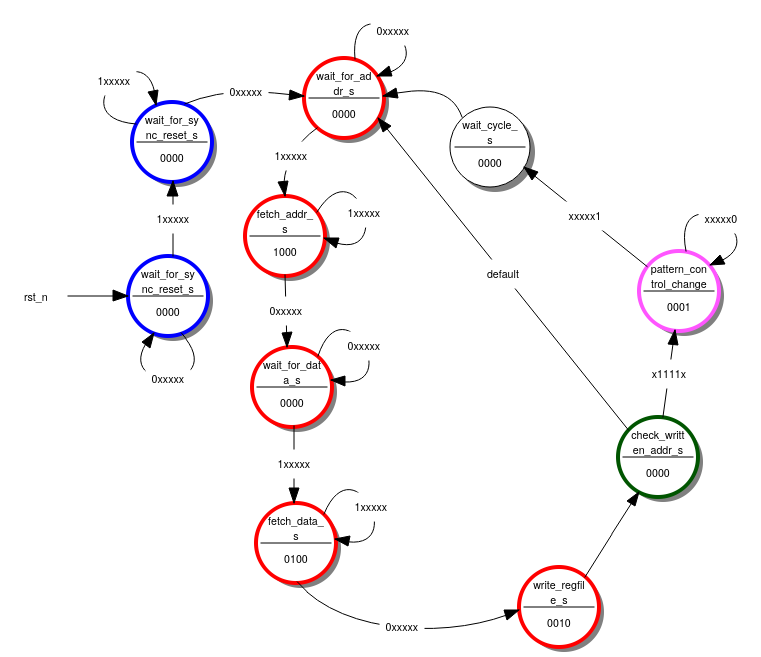

Introduction
============
Digital test signal generators (TSG) are a type of external measurement equipment that are available from several different vendors. These pieces of equipment produce a range of electrical stimuli signals that can be used to check the operation of other electrical devices. The goal of this module is to produce an on-chip version of this system with the following essential features included in the architecture and design:
- Serially configurable
- Single pulse with variable duty cycle and frequency (PWM)
- Digital noise based on pseudo random binary sequences of different length
- Configurable data sequences at selectable speed (pattern generator)
- Internal/External triggering of generators
- External Time Base for selectable base frequency

Functional Description
======================

## UART serial communication
UART communication is a common form of data communication between electronic devices. It communicated the data serially in the form of digital signals.

![UART Example- Schematic [1]](images/uart_sample.png){width=80%}


UART communication has some characteristics that need to be considered for implementation.
The signal begins with a start bit (in the form of a low signal), the next in the sequence comes the data bits, the number of data bits is configurable and is dependant on the parameterisation of the serial modules.
After the data sequence is complete, UART protocol then instructs you to send a stop bit, which is a high signal.

Due to the asynchronous nature of this communication method it requires a baud rate for the transfer to be configured. It is asynchronous because the sending 
and receiving devices work with different clock cycles. The baud rate (speed of
communication) has to be the same on both devices. Typical baud rates are 
9600, 14400 and 19200.


## Digital pattern generator

{width=100%}

Digital Pattern Generators are a common way of creating signal for testing.
The Pattern Generator allows the user to output a configurable pattern.
The pattern can take various shapes, including standard pulses or outputting larger bit patterns depending on the system configuration.

## Pulse-width modulation

Pulse Width Modulation (PWM) is a type of digital signal that has many uses for real world applications. It is a way in which you can digitally control some analog devices.

![PWM Example - Schematic [3]](images/PWM_Explained.png){width=80%}


PWM functions by switching between low and high signals to the requested amounts by the user. For each cycle, the signal will be high for the requested percentage. This is known as the Duty Cycle.

$Period=T_{on}+T_{off}$

$DutyCycle=\frac{T_{on}}{T_{on}+T_{off}}\times100$

A typical use case for PWM is dimming of a led with change of the duty cycle.

## Pseudo-random number generator (LFSR)
Linear Feedback Shift Registers is a configuration of registers used in conjunction with an XOR gate to create a function dependant on it's previous state.

![LFSR Exampled - Schematic [2]](images/4bit_lfsr_xor.png){width=80%}


By continually shifting to the right and going through the XOR gate, it generates a series of pseudo random numbers.

The number of cycles until the pseudo random number generator repeats himself is:
  $number~of~cycles = 2^{n} -1$

With $n$ as number of bits. The polynomial on which the LFSR is based on 
decides on the number of bits and the feedback connection of the XOR gate.

# General Description\label{General Description}

{width=40%}

| **Name**        | **Type**              | **Direction** | **Polarity** | **Description** |
|-----------------|-----------------------|:-------------:|:------------:|-----------------|
| clk_i           | std_ulogic            | IN            | HIGH         | clock                |
| rst_ni          | std_ulogic            | IN            | LOW          | asynchronous reset                |
| en_tsg_pi       | std_ulogic            | IN            | HIGH         | external time base                |
| en_serial_i     | std_ulogic            | IN            | HIGH         | oversample of 16, baudrate 9600                |
| serial_data_i   | std_ulogic            | IN            | HIGH         | serial data, baudrate 9600                |
| rxd_rdy_o       | std_ulogic            | OUT           | HIGH         | serial data ready to read                |
| ext_trig_i      | std_ulogic            | IN            | HIGH         | external trigger                |
| pwm_o           | std_ulogic            | OUT           | HIGH         | pwm signal                |
| noise_o         | std_ulogic            | OUT           | HIGH         | 1 bit pseudo random noise                |
| prbs_o          | std_ulogic_vector[23] | OUT           | HIGH         | pseudo random noise up to 23 bit                |
| eoc_o           | std_ulogic            | OUT           | HIGH         | end of cycle of pseudo random noise               |
| pattern_o       | std_ulogic_vector[8]  | OUT           | HIGH         | pattern output                |
| pattern_valid_o | std_ulogic            | OUT           | HIGH         | pattern valid |
| tc_pm_count_o   | std_ulogic            | OUT           | HIGH         | end of cycle pm upcounter                |
| regfile_o       | std_ulogic_vector[8]  | OUT           | HIGH         | data input register file                |
| addr_reg_o      | std_ulogic_vector[8]  | OUT           | HIGH         | address output serial register
| data_reg_o      | std_ulogic_vector[8]  | OUT           | HIGH         | data output of serial registers                |

: Test Signal Generator - Description of I/O Signals

The test signal generator with its multiple I/Os can be broken down into 4 distinctive parts:

- serial data handling
- pulse width modulation generator
- pattern generator
- random noise generator

{width=100%}

In the picture above you can recognize that the register file is the central part of the design. 
The register file receives data from the serial communication and writes them into its memory. Depending on the values in the 
memory the output components are controlled. 

The register file has the following memory view.
```pure
		  					 Bit7  ..         0
------------------------------------------------
Address  	Name 				7 6 5 4 3 2 1 0
------------------------------------------------
0x00 
0x01  		system control 					x x
0x02
0x03
0x04     	pwm pulse width 	x x x x x x x x
0x05 		pwm period 			x x x x x x x x
0x06 		pwm control 					x x
0x07
0x08 		noise prbsg length 	x x x x x x x x
0x09 		noise period 		x x x x x x x x
0x0A
0x0B 		noise control 					x x
0x0C 		pattern length 		x x x x x x x x
0x0D 
0x0E 		pattern period 		x x x x x x x x
0x0F 		pattern control 			  x x x
```

The meaning of the control parts of the registers is explained in the following.
```pure
system control
---------------------------
Bit 0 Meaning
------------------------
	0 system disable
	1 system enable
---------------------------
Bit 1 Meaning
---------------------------
	1 system clear [synchronous clear](not currently implemented see improvements!)


pwm control
---------------------------
Bit 0 Meaning
--------------------------
	0 pwm off
	1 pwm on
---------------------------
Bit 1 Meaning
---------------------------
	0 internal trigger
	1 external trigger


noise prbsg length
-----------------------------------------
Bit 7 6 5 4 3 2 1 0 Meaning
-----------------------------------------
			  0 0 0 4-bit
			  0 0 1 7-bit 8B/10B-encoded pattern
			  0 1 0 15-bit ITU-T O.150
			  0 1 1 17-bit OIF-CEI-P-02.0
			  1 0 0 20-bit ITU-T O.150
			  1 0 1 23-bit ITU-T O.150

noise control
---------------------------
Bit 0 Meaning
---------------------------
	0 noise off
	1 noise on
---------------------------
Bit 1 Meaning
---------------------------
	0 internal trigger
	1 external trigger

pattern control
---------------------------
Bit 1 0 Meaning
---------------------------
	0 0 stop
	0 1 single burst
	1 0 continous run
	1 1 load data
---------------------------
Bit 2 Meaning
---------------------------
	0 internal trigger
	1 external trigger
```
Now the control part of the register will be explained in further detail. 
The system has an general enable "system control" which must be switched on 
to switch on all individual components (noise, pattern, pwm). All components 
allow for external triggering where you can change the state manually by pressing 
a button. When not specified the components run with the speed of the external time 
base which is further divided by the individual period settings. All three components 
have the same frequency divider component. The divided frequency can be calculated by the following formula:

$divided~frequency=\frac{frequency~of~external~time~base}{period~register~value+1}$

## Mnemonics python script

In the script folder of this project two python scripts are provided. The ```write_to_ttyUSBx.py``` writes the 
serial commands that are written out as text to the device. All serial commands are defined in ```test_variables.py```
as a python dictionary that contains address byte and data byte.

## PWM Component

{width=30%}

With the implemented pwm component a duty cycle of 0%-99,6% percent is possible. It
can be computed by $duty~cycle=\frac{pwm~pulse~width}{256}$. One counting cycle is performed 
with the frequency of the divided frequency. This results in a frequency of $\frac{divided~frequency}{256}$.

## Noise Component

The noise component has an noise prbsg length and a period setting. The prbsg setting decides how many bits the 
lfsr has. That means it decides over the length of the pseudo random sequence until it repeats itself. They are designed 
after the given standards of pseudo random number generators and have different use cases. For more information about it 
see the standard documentations. One full cycle 
has the frequency of $\frac{divided~frequency}{2^{n}-1}$ with $n$ as the number of bits of the lfsr.

## Pattern Component

The pattern generator has four possible control states:

- stop
  - the pattern generator is switched off
- load
  - the pattern generator is ready to receive the data sequence into its memory
  - before sending the number sequence the number of values must be specified in the pattern length register!
    - e.g. pattern length 4 -> pattern load -> pattern sequence 4 5 7 2 -> single burst/continous run
  - supports up to 256 single eight bit values
- single burst
  - a single burst puts out the sequence only once
- continous run
  - puts out the sequence forever
  - stops when the pattern control bits change 

One value of a sequence is available for the time of $\frac{1}{divided~frequency}$. A full cycle that includes 
all values has the frequency of $\frac{divided~frequency}{pattern~length}$.


Design Description
==================

## UART serial receiver

The serial communication contains three main components.
The serial_rx module is based on a design made using a Moore state machine and it was provided to the design team by the design manager.
The purpose of the module is to allow for the correct sequencing and addressing of the data that arrives through serial communication 
The module functions has a synchronous high active reset.
This module directly communicates with the other state machine present on the project directly via the data valid signal, signaling that the address/data has arrived.

{width=40%}

| **Name**     | **Type**             | **Direction** | **Polarity** | **Description** |
|--------------|----------------------|:-------------:|:------------:|-----------------|
| CLK          | std_ulogic           | IN            | HIGH         |                 |
| RST          | std_ulogic           | IN            | HIGH         | synchronous, high active               |
| UART_CLK_EN  | std_ulogic           | IN            | HIGH         | frequency=baudrate*CLK_DIV_VAL                |
| UART_RXD     | std_ulogic           | IN            | HIGH         | serial data in                |
| DOUT         | std_ulogic_vector[8] | OUT           | HIGH         | serial data                |
| DOUT_VLD     | std_ulogic           | OUT           | HIGH         | serial data valid                |
| FRAME_ERROR  | std_ulogic           | OUT           | HIGH         |                 |
| PARITY_ERROR |                      | OUT           | HIGH         |                 |
: I/O Table for the Serial Receiver

| **Name**    | **Type** | **Value** |
|-------------|----------|-------------------|
| CLK_DIV_VAL | integer  | 16                |
| PARITY_BIT  | string   | "none"            |

{width=80%}

Colours on the state machine represent:

- Blue: This is a workaround to handle the ```rxd_rdy``` signal causing errors in the operation. More information below.
- Red: This aspect of the state machine manages the receipt of the address and data information.
- Green: These states are to check if there is a change in the signal from pattern control. If there is a change, it then goes to the pink state.
- Pink: This single state is responsible for the communication with the Pattern State Machine. It sends out the pm_control_changed signal. 
        The other state machine reacts on this signal and when it is finished it sends pm_checked for one cycle. Now this state machine can go back to the wait for address state.

```pure
Inputs:   rxd_rec   addr[3..0]      pm_checked

State/Output                    en_addr_reg en_data_reg en_regfile_wr pm_control_changed
wait_for_addr_s                 0           0           0             0                  
fetch_addr_s                    1           0           0             0                  
wait_for_data_s                 0           0           0             0                  
fetch_data_s                    0           1           0             0                  
write_regfile_s                  0           0           1             0                  
check_written_addr_s            0           0           0             0                  
pattern_control_changed_s       0           0           0             1                  
wait_cycle_s                    0           0           0             0                  
wait_for_sync_reset_serialrx_s  0           0           0             0                  
wait_for_sync_reset_serialrx2_s 0           0           0             0                  
```

This is then directly wired to the ```serial_receiver_reg.vhd``` module. It contains two registers. The purpose for this is that the register file (```regfile.vhd```) needs to know both the address and the data values simultaneously - meaning that the information must be stored somewhere temporarily before it can be written to the register file. 

### Data received after reset

{width=50%}

The two states at the beginning of the serial receiver state machine are required to work around a problem that the serial rx component 
creates. After a reset the serial rx component puts out a data valid signal for one cycle. This seems to be a design problem (see tsg testbench at the beginning: DIN_VLD). 
Without these states we have the issue that after an reset we would immediately transition to the state were we are waiting for the 
data. We are skipping the address states. For that reason the first two states are added.

## Pattern generator

The pattern generator contains a frequency control unit, state machine and an address upcounter for the additional memory that is contained 
in the ```pattern_generator.vhd```. The output of the pattern generator is controlled by the state machine that controls the address upcounter which is responsible for the output of the memory.

| **Name**     | **Type**             | **Direction** | **Polarity** | **Description** |
|--------------|----------------------|:-------------:|:------------:|-----------------|
| en_write_pm  | std_ulogic           | IN            | HIGH         | write memory                |
| clk_i        | std_ulogic           | IN            | HIGH         |                 |
| pm_control_i | std_ulogic_vector[2] | IN            | HIGH         | register file control                |
| addr_cnt_i   | std_ulogic_vector[8] | IN            | HIGH         | upcounted address                |
| rxd_data_i   | std_ulogic_vector[8] | IN            | HIGH         | data from serial_rx                |
| pattern_o    | std_ulogic_vector[8] | OUT           | HIGH         | pattern output                |
: I/O Table for the Pattern Generator


{width=80%}


Colours on the state machine represent:

- Blue: These states deal with the loading of the data and address information.
- Red: This aspect of the state machine is responsible for enabling the address upcounter. The first red state is a workaround for the tc_pm signal put out by the address upcounter. It is one when the counter is at zero. Without the first red state we would immediately transition through the second red state.
- Green: These states are to manage the initialisation and the reset of the state machine.
- Pink: This single state is responsible for the communication with the Serial Communication State Machine.


```pure
Inputs:   rxd_rec   tc_pm   pm_control_changed   pm_control[1..0]    addr_cnt_enable

State/Output           en_pm en_pm_cnt clr_pm_cnt pm_checked pattern_valid
wait_for_pm_change     0     0         0          0          0             
clr_wait_addr_cnt      0     0         1          0          0             
wait_for_pm_data       0     0         0          0          0             
fetch_pm_data          1     0         0          0          0             
cnt_addr_up_serialmode 0     1         0          0          0             
check_addr_end         0     0         0          0          0             
pm_is_checked          0     0         0          1          0             
cnt_addr_up_cntmode    0     1         0          0          1             
cnt_addr_free          0     1         0          0          1             
```

## Pulse-width modulation
The PWM generator module is connected to one of the instantiations of the freq_control module. The output from the Frequency Control module is input to the enable of the PWM generator to assign the total width (and thus the frequency) of the PWM. 


{width=40%}

| **Name**    | **Type**             | **Direction** | **Polarity** | **Description** |
|-------------|----------------------|:-------------:|:------------:|-----------------|
| en_pi       | std_ulogic           | IN            | HIGH         |                 |
| rst_ni      | std_ulogic           | IN            | LOW          |                 |
| pwm_width_i | std_ulogic_vector[8] | IN            | HIGH         | on pulse width of pwm                |
| clk_i       | std_ulogic           | IN            | HIGH         |                 |
| pwm_o       | std_ulogic           | OUT           | HIGH         | pwm output                |
: I/O Table for the PWM Generator


## Pseudo-random number generator (LFSR)

The design of the LFSR was made to be as configurable as possible. The ```config_noise_generator.vhd``` contains a configurable 
noise generator. You can decide the size (number of registers), and the position of the two connections of the feedback XOR. This component is instantiated multiple times in the ```noise_generator.vhd```. The module outputs three different signals, ```prbs_o```, ```noise_o``` and ```eoc_o```. 

- ```prbs_o``` - The full noise signal. Bit size is constant but active bits depend on chosen LFSR. 
- ```noise_o``` - This is the noise signal output, the signal that can be used by a user for testing their device.
- ```eoc_o``` -  Sends a pulse once a all random numbers have been generated, thus completing a cycle.


## External time base and external triggering design

{width=100%}

To get the external time base and external triggering to work correctly multiple AND gates and multiplexer are needed.
For the pwm and the noise generator we have the same design. If the noise generator is enabled depends on 
the following conditions:

- the whole system is enabled
- pwm/noise generator is enabled
- external time base on
- frequency divider enabled

When the external triggering of the noise/pwm generator is enabled it should only be controlled by external triggering
if the system is on and the pwm/noise generator is enabled.

{width=100%}

For the pattern generator a more sophisticated system is needed. We need to differentiate between the four modes of our 
pattern generator:

- 00 stop
- 01 single burst
- 10 continuos run
- 11 load

In stop and load mode we do not care about the external triggering and the external time base. When loading the pattern generator the
address upcounter only counts up when the pattern generator state machine gives an signal. Note that the address upcounter decides over the frequency of the pattern output, not the pattern generator (pattern memory) itself. The external trigger, external time base 
and frequency divider matters when we are in the two run modes. For the external triggering we need the additional signal pattern valid.
This signal is provided by the pattern generator state machine and is true when the state machine is in a counting state. This is needed 
for the single burst mode to stop counting after one counting cycle.


Test Results
============
## Noise Generator

{width=80%}

{width=80%}

Expected results are found by implementing the formulae in section \ref{General Description}.

\label{Results from testing the Noise Generator}

| Number of Bits | Period Data | Expected Period(µs) | Actual Period (µs) |
|----------------|-------------|---------------------|--------------------|
| 4              | 1           | 3                   | 3                  |
| 4              | 2           | 4.5                 | 4.5                |
| 7              | 1           | 25.4                | 25.4               |
| 7              | 2           | 38.1                | 38.1               |
: Results from testing the Noise Generator

The external triggering was tested manually for the 4 and 7 bit noise generator.

## PWM Generator

{width=80%}

{width=80%}


| Width Data | Period | Expected Period(µs) | Actual Period (µs) |
|------------|--------|---------------------|--------------------|
| 1          | 1      | 51.2                | 51.2               |
| 1          | 4      | 128                 | 128                |
| 127        | 1      | 51.2                | 51.2               |
| 128        | 1      | 51.2                | 51.2               |
| 255        | 1      | 51.2                | 51.2               |
: Results from testing the PWM Generator

The external triggering from the PWM generator was tested inside the simulator ```t_tsg.vhd``` because the counting value can be seen.

## Pattern Generator

The pattern generator was tested manually with the external trigger on the board. A test with the oscilloscope is necessary to confirm that 
the variable frequency works as intended.

Application Note
================

{width=100%}
The wiring of the DE1 Board can be seen in the picture above. The test signal generator runs with an 50 MHz clock and a time base of 
10 MHz on the enable. An synchroniser is added before the serial input to avoid metavalues because of asynchronous serial communication from the pc.
The outputs of the test signal generator were connected to test components ALU and a 101 sequence detector. On the HEX3 display the
number of 101 sequences detected is shown. Additionally some outputs are connected to the GPIOs
for measurements. For the connections see ```de1_tsg_structure.vhd```.

{width=100%}

Further Improvements
====================

## System Control Register

In the system control register is a bit included to do an synchronous clear over serial communication. It adds another possibility to 
reset the states of the synchronous components. At the moment only the asynchronous reset is available. To add this functionality 
an synchronous reset needs to be added to every component except the memory components (register file, pattern generator) and the address upcounter (has already one).

## PWM Switch Off

When the PWM module is switched off either by the system control or the pwm control the counters in the frequency control and pwm 
generator are kept in their current counting state. This could result in an constant output of a one. To solve this problem it is 
recommended to put in a switch in the pwm generator that puts out zero when the system control AND pwm control is zero. This approach 
is already implemented for the noise generator and can be implemented in the same way (see input en_noise_generator_i).

## Testbench tsg and de1_tsg

With the fix in the serial receiver state machine (states at beginning) that solve the issue of data valid signal after reset a 
different problem occurred. In the real system the fix works but in the simulation this scenario does not happen. We have an 
immediate one after the reset and not a zero and then the pulse of the data like in the real system. A possible fix is to add an 
additional state to the state machine. 

{width=50%}

## More Test Scenarios

The pattern generator was not evaluated on the oscilloscope. It was only tested manually with the external trigger, were it worked correctly (burst mode and continous run). That means it needs to be tested if the frequency in the automatic mode is correct.


References
==========

1: [www.digi.com - UART Example](https://www.digi.com/resources/documentation/Digidocs/90002002/Content/Reference/r_serial_data.htm?TocPath=Operation|UART%20data%20flow|_____1)

2: [www.researchgate.net - Four Bit Linear Shift Register](https://www.researchgate.net/figure/A-4-bit-linear-feedback-shift-register-circuit_fig8_238687766)

3: [www.wiki.analog.com - PWM Example](https://wiki.analog.com/university/courses/electronics/electronics-lab-pulse-width-modulation)

Appendix
========

Device Utilization and Performance
----------------------------------

The following tables show the device utilization and the timing analysis results.

```pure
+--------------------------------------------------------------------------------------+
; Fitter Summary                                                                       ;
+------------------------------------+-------------------------------------------------+
; Fitter Status                      ; Successful - Tue Jun 22 17:39:17 2021           ;
; Quartus II 32-bit Version          ; 13.0.1 Build 232 06/12/2013 SP 1 SJ Web Edition ;
; Revision Name                      ; de1_tsg                                         ;
; Top-level Entity Name              ; de1_tsg                                         ;
; Family                             ; Cyclone II                                      ;
; Device                             ; EP2C20F484C7                                    ;
; Timing Models                      ; Final                                           ;
; Total logic elements               ; 403 / 18,752 ( 2 % )                            ;
;     Total combinational functions  ; 328 / 18,752 ( 2 % )                            ;
;     Dedicated logic registers      ; 276 / 18,752 ( 1 % )                            ;
; Total registers                    ; 276                                             ;
; Total pins                         ; 60 / 315 ( 19 % )                               ;
; Total virtual pins                 ; 0                                               ;
; Total memory bits                  ; 2,048 / 239,616 ( < 1 % )                       ;
; Embedded Multiplier 9-bit elements ; 0 / 52 ( 0 % )                                  ;
; Total PLLs                         ; 0 / 4 ( 0 % )                                   ;
+------------------------------------+-------------------------------------------------+
```

```pure
+----------------------------------------------------------------------------------------+
; TimeQuest Timing Analyzer Summary                                                      ;
+--------------------+-------------------------------------------------------------------+
; Quartus II Version ; Version 13.0.1 Build 232 06/12/2013 Service Pack 1 SJ Web Edition ;
; Revision Name      ; de1_tsg                                                           ;
; Device Family      ; Cyclone II                                                        ;
; Device Name        ; EP2C20F484C7                                                      ;
; Timing Models      ; Final                                                             ;
; Delay Model        ; Combined                                                          ;
; Rise/Fall Delays   ; Unavailable                                                       ;
+--------------------+-------------------------------------------------------------------+

+-----------------------------------------
; Clocks                                 ; 
+------------+------+--------+-----------+
; Clock Name ; Type ; Period ; Frequency ;
+------------+------+--------+-----------+
; CLOCK_50   ; Base ; 20.000 ; 50.0 MHz  ;
+------------+------+--------+-----------+

+-----------------------------------------------------------------------------+
; Multicorner Timing Analysis Summary                                         ;
+------------------+-------+-------+----------+---------+---------------------+
; Clock            ; Setup ; Hold  ; Recovery ; Removal ; Minimum Pulse Width ;
+------------------+-------+-------+----------+---------+---------------------+
; Worst-case Slack ; 2.201 ; 0.215 ; 12.201   ; 4.354   ; 7.436               ;
;  CLOCK_50        ; 2.201 ; 0.215 ; 12.201   ; 4.354   ; 7.436               ;
; Design-wide TNS  ; 0.0   ; 0.0   ; 0.0      ; 0.0     ; 0.0                 ;
;  CLOCK_50        ; 0.000 ; 0.000 ; 0.000    ; 0.000   ; 0.000               ;
+------------------+-------+-------+----------+---------+---------------------+
```

Project Hierarchy
-----------------
```pure
.
+-- doc
|   +-- datasheet.yaml
|   +-- images
|   +-- makefile
|   +-- presentation.yaml
|   +-- report.yaml
|   +-- tables
|   +-- test_signal_generator_datasheet.md
|   +-- test_signal_generator_presentation.md
|   +-- test_signal_generator_report.md
|   +-- test_signal_generator_report.pdf
|   +-- uasa_meng_vlsi_template.tex
|   +-- vec.conf
+-- pnr
|   +-- de1_binto7segment
|   +-- de1_cntdnmodm
|   +-- de1_serial_rx
|   +-- de1_tsg
|   +-- makefile
+-- README.md
+-- scripts
|   +-- create_quartus_project_settings.tcl
|   +-- de1_pin_assignments_minimumio.tcl
|   +-- modelsim.ini
|   +-- quartus_project_flow.tcl
|   +-- test_variables.py
|   +-- write_to_ttyUSBx.py
+-- sim
|   +-- binto7segment
|   +-- cntdnmodm
|   +-- cntup_addr
|   +-- de1_tsg
|   +-- makefile
|   +-- noise_generator
|   +-- pattern_generator
|   +-- pwm_generator
|   +-- serial_rx
|   +-- tsg
+-- src
    +-- 101SequenceQfsm.fsm
    +-- a_falling_edge_detector_rtl.vhd
    +-- alu.vhd
    +-- alu.vhd.bak
    +-- a_tsg_structure.vhd
    +-- a_tsg_structure.vhd.bak
    +-- binto7segment_truthtable.vhd
    +-- cntdnmodm_rtl.vhd
    +-- cntup_addr.vhd
    +-- cntup_addr.vhd.bak
    +-- config_noise_generator.vhd
    +-- config_noise_generator.vhd.bak
    +-- de1_serial_rx_structure.vhd
    +-- de1_tsg_structure.vhd
    +-- de1_tsg_structure.vhd.bak
    +-- e_falling_edge_detector.vhd
    +-- e_tsg.vhd
    +-- freq_control.vhd
    +-- noise_generator.vhd
    +-- noise_generator.vhd.bak
    +-- pattern_generator_fsm.vhd
    +-- pattern_generator_qfsm.fsm
    +-- pattern_generator.vhd
    +-- pwm_generator.vhd
    +-- regfile_rtl.vhd
    +-- regfile_rtl.vhd.bak
    +-- sequence_detector.vhd
    +-- serial_receiver_fsm.vhd
    +-- serial_receiver_qfsm.fsm
    +-- serial_receiver_reg.vhd
    +-- serial_receiver_reg.vhd.bak
    +-- serial_rx.vhd
    +-- serial_tx.vhd
    +-- sp_ssram_rtl.vhd
    +-- synchroniser.vhd
    +-- synchroniser.vhd.bak
    +-- t_cntup_addr.vhd
    +-- t_de1_tsg.vhd
    +-- t_noise_generator.vhd
    +-- t_pattern_generator.vhd
    +-- t_pwm_generator.vhd
    +-- t_serial_receiver_fsm.vhd
    +-- t_serial_rx.vhd
    +-- t_tsg.vhd
    +-- uart_clk_div.vhd
    +-- uart_parity.vhd
```
Module Hierarchy
----------------
tsg testbench:
```pure
t_tsg(tbench)
  e_tsg.vhd 
  a_tsg_structure.vhd 
  uart_clk_div.vhd 
  uart_parity.vhd 
  serial_rx.vhd 
  serial_tx.vhd 
  serial_receiver_reg.vhd 
  serial_receiver_fsm.vhd 
  regfile_rtl.vhd 
  freq_control.vhd 
  pwm_generator.vhd 
  noise_generator.vhd 
  config_noise_generator.vhd 
  pattern_generator.vhd 
  pattern_generator_fsm.vhd 
  cntup_addr.vhd 
  sp_ssram_rtl.vhd 
  cntdnmodm_rtl.vhd  

```
de1_tsg:
```pure
de1_tsg(structure)
  binto7segment_truthtable.vhd 
  cntdnmodm_rtl.vhd 
  synchroniser.vhd 
  a_falling_edge_detector_rtl.vhd 
  e_falling_edge_detector.vhd 
  sequence_detector.vhd 
  alu.vhd 
  de1_tsg_structure.vhd 
```
All files in tsg testbench also needed in de1_tsg.

Code
----------------------
tsg:
```vhdl
-------------------------------------------------------------------------------
-- Module     : tsg
-------------------------------------------------------------------------------
-- Author     : Johann Faerber
-- Company    : University of Applied Sciences Augsburg
-------------------------------------------------------------------------------
-- Description: Test Signal Generator
-------------------------------------------------------------------------------
-- Revisions  : see end of file
-------------------------------------------------------------------------------

LIBRARY IEEE;
USE IEEE.std_logic_1164.ALL;

ENTITY tsg IS
  PORT (
    clk_i           : IN  std_ulogic;
    rst_ni          : IN  std_ulogic;
    en_tsg_pi       : IN  std_ulogic; -- tsg enable, used with external time base
    en_serial_i     : IN  std_ulogic; -- enable for serial data: oversample of 16 with expected baudrate 9600
    serial_data_i   : IN  std_ulogic; -- serial data with baudrate 9600
    rxd_rdy_o       : OUT std_ulogic; -- debugging signal, output of serial_rx if serial data is ready to be read
    ext_trig_i      : IN  std_ulogic; -- external trigger for triggering test equipment
    pwm_o           : OUT std_ulogic; -- pulse width modulated signal
    noise_o         : OUT std_ulogic; -- 1 bit pseudo random noise
    prbs_o          : OUT std_ulogic_vector(22 DOWNTO 0);  -- pseudo random noise up to 23 bit
    eoc_o           : OUT std_ulogic; -- end of cycle when pseudo random noise repeats
    pattern_o       : OUT std_ulogic_vector(7 DOWNTO 0); -- configurable changing pattern output
    pattern_valid_o : OUT std_ulogic; -- pattern valid, not currently implemented! (see improvements)
    tc_pm_count_o   : OUT std_ulogic; -- debugging signal, end of cycle for pattern memory upcounter
    regfile_o       : OUT std_ulogic_vector(7 DOWNTO 0); -- debugging signal, data input of register file
    addr_reg_o      : OUT std_ulogic_vector(7 DOWNTO 0); -- debugging signal, address output of serial_receiver registers
    data_reg_o      : OUT std_ulogic_vector(7 DOWNTO 0) -- debugging signal, data output of serial_receiver registers
    );
END tsg;

-------------------------------------------------------------------------------
-- Revisions:
-- ----------
-- $Id:$
-------------------------------------------------------------------------------
```
tsg:
```vhdl
-------------------------------------------------------------------------------
-- Module     : structure of tsg
-------------------------------------------------------------------------------
-- Author     : Johann Faerber
-- Company    : University of Applied Sciences Augsburg
-------------------------------------------------------------------------------
-- Description: Test Signal Generator
-------------------------------------------------------------------------------
-- Revisions  : see end of file
-------------------------------------------------------------------------------

LIBRARY IEEE;
USE IEEE.std_logic_1164.ALL;
USE IEEE.numeric_std.ALL;

ARCHITECTURE structure OF tsg IS

  -- components for serial communication
  COMPONENT serial_rx IS
    GENERIC (
      CLK_DIV_VAL : integer;
      PARITY_BIT  : string);
    PORT (
      CLK          : IN  std_ulogic;
      RST          : IN  std_ulogic;
      UART_CLK_EN  : IN  std_ulogic;
      UART_RXD     : IN  std_ulogic;
      DOUT         : OUT std_ulogic_vector(7 DOWNTO 0);
      DOUT_VLD     : OUT std_ulogic;
      FRAME_ERROR  : OUT std_ulogic;
      PARITY_ERROR : OUT std_ulogic);
  END COMPONENT serial_rx;

  COMPONENT serial_receiver_reg IS
    PORT (
      rst_ni         : IN  std_ulogic;
      clk_i          : IN  std_ulogic;
      en_addr_reg_i  : IN  std_ulogic;
      en_data_reg_i  : IN  std_ulogic;
      rxd_data_i     : IN  std_ulogic_vector(7 DOWNTO 0);
      regfile_addr_o : OUT std_ulogic_vector(3 DOWNTO 0);
      regfile_data_o : OUT std_ulogic_vector(7 DOWNTO 0));
  END COMPONENT serial_receiver_reg;

  COMPONENT serial_receiver_fsm IS
    PORT (
      clk                : IN  std_ulogic;
      rst_n              : IN  std_ulogic;
      rxd_rec            : IN  std_ulogic;
      addr               : IN  std_ulogic_vector(3 DOWNTO 0);
      pm_checked         : IN  std_ulogic;
      en_addr_reg        : OUT std_ulogic;
      en_data_reg        : OUT std_ulogic;
      en_regfile_wr      : OUT std_ulogic;
      pm_control_changed : OUT std_ulogic);
  END COMPONENT serial_receiver_fsm;

  COMPONENT regfile IS
    GENERIC (
      ADDR_WIDTH : integer;
      DATA_WIDTH : integer);
    PORT (
      clk_i               : IN  std_ulogic;
      wr_en_i             : IN  std_ulogic;
      w_addr_i            : IN  std_ulogic_vector (ADDR_WIDTH-1 DOWNTO 0);
      r_addr_i            : IN  std_ulogic_vector (ADDR_WIDTH-1 DOWNTO 0);
      w_data_i            : IN  std_ulogic_vector (DATA_WIDTH-1 DOWNTO 0);
      system_control_o    : OUT std_ulogic_vector(1 DOWNTO 0);
      pwm_pulse_width_o   : OUT std_ulogic_vector(DATA_WIDTH-1 DOWNTO 0);
      pwm_period_o        : OUT std_ulogic_vector(DATA_WIDTH-1 DOWNTO 0);
      pwm_control_o       : OUT std_ulogic_vector(1 DOWNTO 0);
      noise_length_o      : OUT std_ulogic_vector(DATA_WIDTH-1 DOWNTO 0);
      noise_period_o      : OUT std_ulogic_vector(DATA_WIDTH-1 DOWNTO 0);
      noise_control_o     : OUT std_ulogic_vector(1 DOWNTO 0);
      pattern_mem_depth_o : OUT std_ulogic_vector(DATA_WIDTH-1 DOWNTO 0);
      pattern_period_o    : OUT std_ulogic_vector(DATA_WIDTH-1 DOWNTO 0);
      pattern_control_o   : OUT std_ulogic_vector(2 DOWNTO 0);
      r_data_o            : OUT std_ulogic_vector (DATA_WIDTH-1 DOWNTO 0));
  END COMPONENT regfile;

  -- for noise, pattern and pwm
  COMPONENT freq_control IS
    PORT (
      clk_i    : IN  std_ulogic;
      rst_ni   : IN  std_ulogic;
      en_pi    : IN  std_ulogic;
      count_o  : OUT std_ulogic_vector(7 DOWNTO 0);
      freq_o   : OUT std_ulogic;
      period_i : IN  std_ulogic_vector(7 DOWNTO 0));
  END COMPONENT freq_control;

  -- for pwm
  COMPONENT pwm_generator IS
    PORT (
      en_pi       : IN  std_ulogic;
      rst_ni      : IN  std_ulogic;
      pwm_width_i : IN  std_ulogic_vector(7 DOWNTO 0);
      clk_i       : IN  std_ulogic;
      pwm_o       : OUT std_ulogic);
  END COMPONENT pwm_generator;

  -- for noise
  COMPONENT noise_generator IS
    PORT (
      clk_i                : IN  std_ulogic;
      rst_ni               : IN  std_ulogic;
      en_pi                : IN  std_ulogic;
      en_noise_generator_i : IN  std_ulogic;
      noise_prbsg_length_i : IN  std_ulogic_vector(7 DOWNTO 0);
      prbs_o               : OUT std_ulogic_vector(22 DOWNTO 0);
      noise_o              : OUT std_ulogic;
      eoc_o                : OUT std_ulogic);
  END COMPONENT noise_generator;

  -- for pattern
  COMPONENT pattern_generator IS
    PORT (
      en_write_pm  : IN  std_ulogic;
      clk_i        : IN  std_ulogic;
      pm_control_i : IN  std_ulogic_vector(1 DOWNTO 0);
      addr_cnt_i   : IN  std_ulogic_vector(7 DOWNTO 0);
      rxd_data_i   : IN  std_ulogic_vector(7 DOWNTO 0);
      pattern_o    : OUT std_ulogic_vector(7 DOWNTO 0));
  END COMPONENT pattern_generator;

  COMPONENT pattern_generator_fsm IS
    PORT (
      clk                : IN  std_ulogic;
      rst_n              : IN  std_ulogic;
      rxd_rec            : IN  std_ulogic;
      tc_pm              : IN  std_ulogic;
      pm_control_changed : IN  std_ulogic;
      pm_control         : IN  std_ulogic_vector(1 DOWNTO 0);
      addr_cnt_enabled   : IN  std_ulogic;
      en_pm              : OUT std_ulogic;
      en_pm_cnt          : OUT std_ulogic;
      clr_pm_cnt         : OUT std_ulogic;
      pm_checked         : OUT std_ulogic;
      pattern_valid      : OUT std_ulogic);
  END COMPONENT pattern_generator_fsm;

  COMPONENT cntup_addr IS
    PORT (
      clk_i  : IN  std_ulogic;
      clr_i  : IN  std_ulogic;
      rst_ni : IN  std_ulogic;
      en_pi  : IN  std_ulogic;
      len_i  : IN  std_ulogic_vector(7 DOWNTO 0);
      q_o    : OUT std_ulogic_vector(7 DOWNTO 0);
      tc_o   : OUT std_ulogic);
  END COMPONENT cntup_addr;

  -- serial components instantiation
  CONSTANT CLK_DIV_VAL        : integer := 16;
  CONSTANT PARITY_BIT         : string  := "none";
  CONSTANT regfile_addr_width : integer := 4;
  CONSTANT regfile_data_width : integer := 8;

  -- basic signals
  SIGNAL clock       : std_ulogic;
  SIGNAL reset       : std_ulogic;
  SIGNAL en_main     : std_ulogic;      -- en_tsg and en_system
  SIGNAL ext_trigger : std_ulogic;

  -- serial signals
  SIGNAL en_serial           : std_ulogic;
  SIGNAL serial_data         : std_ulogic;
  SIGNAL serial_data_o       : std_ulogic_vector(7 DOWNTO 0);
  SIGNAL serial_data_valid_o : std_ulogic;

  SIGNAL regfile_addr_o : std_ulogic_vector(regfile_addr_width - 1 DOWNTO 0);
  SIGNAL regfile_data_o : std_ulogic_vector(regfile_data_width - 1 DOWNTO 0);

  SIGNAL en_addr_reg   : std_ulogic;
  SIGNAL en_data_reg   : std_ulogic;
  SIGNAL en_regfile_wr : std_ulogic;

  -- state machine communication
  SIGNAL pm_checked         : std_ulogic;
  SIGNAL pm_control_changed : std_ulogic;

  -- regfile signals
  SIGNAL system_control_o  : std_ulogic_vector(1 DOWNTO 0);
  SIGNAL pwm_pulse_width_o : std_ulogic_vector(regfile_data_width-1 DOWNTO 0);
  SIGNAL pwm_period_o      : std_ulogic_vector(regfile_data_width-1 DOWNTO 0);
  SIGNAL pwm_control_o     : std_ulogic_vector(1 DOWNTO 0);
  SIGNAL noise_length_o    : std_ulogic_vector(regfile_data_width-1 DOWNTO 0);
  SIGNAL noise_period_o    : std_ulogic_vector(regfile_data_width-1 DOWNTO 0);
  SIGNAL noise_control_o   : std_ulogic_vector(1 DOWNTO 0);
  SIGNAL pattern_length_o  : std_ulogic_vector(regfile_data_width-1 DOWNTO 0);
  SIGNAL pattern_period_o  : std_ulogic_vector(regfile_data_width-1 DOWNTO 0);
  SIGNAL pattern_control_o : std_ulogic_vector(2 DOWNTO 0);

  -- noise signals
  SIGNAL noise_freq_div : std_ulogic;
  SIGNAL en_noise_gen   : std_ulogic;

  -- pwm signals
  SIGNAL pwm_freq_div : std_ulogic;
  SIGNAL en_pwm_gen   : std_ulogic;

  -- pattern signals
  SIGNAL pattern_freq_div        : std_ulogic;
  SIGNAL en_write_pm             : std_ulogic;
  SIGNAL en_cntup_addr           : std_ulogic;
  SIGNAL en_pattern_freq_div     : std_ulogic;
  SIGNAL en_pm_cnt               : std_ulogic;
  SIGNAL en_continous_cntup_addr : std_ulogic;
  SIGNAL clr_cntup_addr          : std_ulogic;
  SIGNAL cntup_addr_o            : std_ulogic_vector(7 DOWNTO 0);
  SIGNAL cntup_addr_tc           : std_ulogic;
  SIGNAL pattern_valid           : std_ulogic;

BEGIN

  serial_rx_uart : serial_rx
    GENERIC MAP (
      CLK_DIV_VAL => CLK_DIV_VAL,
      PARITY_BIT  => PARITY_BIT)
    PORT MAP (
      CLK          => clock,
      RST          => NOT reset,  -- workaround is an synchronous high active reset!
      UART_CLK_EN  => en_serial,
      UART_RXD     => serial_data,
      DOUT         => serial_data_o,
      DOUT_VLD     => serial_data_valid_o,
      FRAME_ERROR  => OPEN,
      PARITY_ERROR => OPEN);

  serial_receiver_registers : serial_receiver_reg
    PORT MAP (
      rst_ni         => reset,
      clk_i          => clock,
      en_addr_reg_i  => en_addr_reg,
      en_data_reg_i  => en_data_reg,
      rxd_data_i     => serial_data_o,
      regfile_addr_o => regfile_addr_o,
      regfile_data_o => regfile_data_o);

  serial_receiver_state_machine : serial_receiver_fsm
    PORT MAP (
      clk                => clock,
      rst_n              => reset,
      rxd_rec            => serial_data_valid_o,
      addr               => regfile_addr_o,
      pm_checked         => pm_checked,
      en_addr_reg        => en_addr_reg,
      en_data_reg        => en_data_reg,
      en_regfile_wr      => en_regfile_wr,
      pm_control_changed => pm_control_changed);

  register_file : regfile
    GENERIC MAP (
      ADDR_WIDTH => regfile_addr_width,
      DATA_WIDTH => regfile_data_width)
    PORT MAP (
      clk_i               => clock,
      wr_en_i             => en_regfile_wr,
      w_addr_i            => regfile_addr_o,
      r_addr_i            => (OTHERS => '0'),  -- not used
      w_data_i            => regfile_data_o,
      system_control_o    => system_control_o,
      pwm_pulse_width_o   => pwm_pulse_width_o,
      pwm_period_o        => pwm_period_o,
      pwm_control_o       => pwm_control_o,
      noise_length_o      => noise_length_o,
      noise_period_o      => noise_period_o,
      noise_control_o     => noise_control_o,
      pattern_mem_depth_o => pattern_length_o,
      pattern_period_o    => pattern_period_o,
      pattern_control_o   => pattern_control_o,
      r_data_o            => OPEN);            -- not used

  -- pwm components
  pwm_freq_control : freq_control
    PORT MAP (
      clk_i    => clock,
      rst_ni   => reset,
      en_pi    => en_main AND pwm_control_o(0),
      count_o  => OPEN,
      freq_o   => pwm_freq_div,
      period_i => pwm_period_o);

  pwm_gen : pwm_generator
    PORT MAP (
      en_pi       => en_pwm_gen,
      rst_ni      => reset,
      pwm_width_i => pwm_pulse_width_o,
      clk_i       => clock,
      pwm_o       => pwm_o);

  -- noise components
  noise_freq_control : freq_control
    PORT MAP (
      clk_i    => clock,
      rst_ni   => reset,
      en_pi    => en_main AND noise_control_o(0),
      count_o  => OPEN,
      freq_o   => noise_freq_div,
      period_i => noise_period_o);

  noise_gen : noise_generator
    PORT MAP (
      clk_i                => clock,
      rst_ni               => reset,
      en_pi                => en_noise_gen,
      en_noise_generator_i => system_control_o(0) AND noise_control_o(0),
      noise_prbsg_length_i => noise_length_o,
      prbs_o               => prbs_o,
      noise_o              => noise_o,
      eoc_o                => eoc_o);

  -- pattern components
  pattern_freq_control : freq_control
    PORT MAP (
      clk_i    => clock,
      rst_ni   => reset,
      en_pi    => en_pattern_freq_div,
      count_o  => OPEN,
      freq_o   => pattern_freq_div,
      period_i => pattern_period_o);

  pattern_gen : pattern_generator
    PORT MAP (
      en_write_pm  => en_write_pm,
      clk_i        => clock,
      pm_control_i => pattern_control_o(1 DOWNTO 0),
      addr_cnt_i   => cntup_addr_o,
      rxd_data_i   => serial_data_o,
      pattern_o    => pattern_o);

  pattern_generator_state_machine : pattern_generator_fsm
    PORT MAP (
      clk                => clock,
      rst_n              => reset,
      rxd_rec            => serial_data_valid_o,
      tc_pm              => cntup_addr_tc,
      pm_control_changed => pm_control_changed,
      pm_control         => pattern_control_o(1 DOWNTO 0),
      addr_cnt_enabled   => en_cntup_addr,
      en_pm              => en_write_pm,
      en_pm_cnt          => en_pm_cnt,
      clr_pm_cnt         => clr_cntup_addr,
      pm_checked         => pm_checked,
      pattern_valid => pattern_valid);

  cntup_address : cntup_addr
    PORT MAP (
      clk_i  => clock,
      clr_i  => clr_cntup_addr,
      rst_ni => reset,
      en_pi  => en_cntup_addr,
      len_i  => pattern_length_o,
      q_o    => cntup_addr_o,
      tc_o   => cntup_addr_tc);

  -- basic signals connections
  clock       <= clk_i;
  reset       <= rst_ni;
  ext_trigger <= ext_trig_i;
  en_main     <= en_tsg_pi AND system_control_o(0);

  -- output signals
  rxd_rdy_o       <= serial_data_valid_o;
  tc_pm_count_o   <= cntup_addr_tc;
  pattern_valid_o <= pattern_valid;
  regfile_o       <= regfile_data_o;    -- write data
  addr_reg_o      <= std_ulogic_vector(resize(unsigned(regfile_addr_o), 8));
  data_reg_o      <= regfile_data_o;

  -- serial data connections
  en_serial   <= en_serial_i;
  serial_data <= serial_data_i;

  -- pwm connections
  en_pwm_gen <= (pwm_freq_div AND en_main AND pwm_control_o(0)) WHEN pwm_control_o(1) = '0'
                ELSE (ext_trigger AND system_control_o(0) AND pwm_control_o(0));

  -- noise connections
  en_noise_gen <= (noise_freq_div AND en_main AND noise_control_o(0)) WHEN noise_control_o(1) = '0'
                  ELSE (ext_trigger AND system_control_o(0) AND noise_control_o(0));

  -- pattern connections
  WITH pattern_control_o(1 DOWNTO 0) SELECT
    en_pattern_freq_div <= en_main WHEN "01" | "10",  -- burst or continous burst
    '0'                            WHEN "00" | "11",  -- stop or load
    '0'                            WHEN OTHERS;

  en_continous_cntup_addr <= (en_main AND en_pm_cnt AND pattern_freq_div) WHEN pattern_control_o(2) = '0'
                             ELSE (ext_trigger AND system_control_o(0) AND pattern_valid);

  WITH pattern_control_o(1 DOWNTO 0) SELECT
    en_cntup_addr <= en_pm_cnt WHEN "11",         -- load, speed of clock 
    en_continous_cntup_addr    WHEN "01" | "10",  -- burst or continous burst;
                                                  -- speed of enable
    '0'                        WHEN "00",         -- stop
    '0'                        WHEN OTHERS;

END structure;

-------------------------------------------------------------------------------
-- Revisions:
-- ----------
-- $Id:$
-------------------------------------------------------------------------------
```
serial:
```vhdl
-------------------------------------------------------------------------------
-- Module     : serial_rx
-------------------------------------------------------------------------------
-- modified by: Johann Faerber
--------------------------------------------------------------------------------
--              modified according to our design rules:
--              using std_ulogic instead of std_logic
--------------------------------------------------------------------------------
-- Original PROJECT: SIMPLE UART FOR FPGA
--------------------------------------------------------------------------------
-- AUTHORS: Jakub Cabal <jakubcabal@gmail.com>
-- LICENSE: The MIT License, please read LICENSE file
-- WEBSITE: https://github.com/jakubcabal/uart-for-fpga
--------------------------------------------------------------------------------

LIBRARY IEEE;
USE IEEE.STD_LOGIC_1164.ALL;
USE IEEE.NUMERIC_STD.ALL;

ENTITY serial_rx IS
  GENERIC (
    CLK_DIV_VAL : integer := 16;
    PARITY_BIT  : string  := "none"  -- type of parity: "none", "even", "odd", "mark", "space"
    ); 
  PORT (
    CLK          : IN  std_ulogic;      -- system clock
    RST          : IN  std_ulogic;      -- high active synchronous reset
    -- UART INTERFACE
    UART_CLK_EN  : IN  std_ulogic;      -- oversampling (16x) UART clock enable
    UART_RXD     : IN  std_ulogic;      -- serial receive data
    -- USER DATA OUTPUT INTERFACE
    DOUT         : OUT std_ulogic_vector(7 DOWNTO 0);  -- output data received via UART
    DOUT_VLD     : OUT std_ulogic;  -- when DOUT_VLD = 1, output data (DOUT) are valid without errors (is assert only for one clock cycle)
    FRAME_ERROR  : OUT std_ulogic;  -- when FRAME_ERROR = 1, stop bit was invalid (is assert only for one clock cycle)
    PARITY_ERROR : OUT std_ulogic  -- when PARITY_ERROR = 1, parity bit was invalid (is assert only for one clock cycle)
    );
END ENTITY;

ARCHITECTURE rtl OF serial_rx IS

  SIGNAL rx_clk_en          : std_ulogic;
  SIGNAL rx_data            : std_ulogic_vector(7 DOWNTO 0);
  SIGNAL rx_bit_count       : unsigned(2 DOWNTO 0);
  SIGNAL rx_parity_bit      : std_ulogic;
  SIGNAL rx_parity_error    : std_ulogic;
  SIGNAL rx_parity_check_en : std_ulogic;
  SIGNAL rx_done            : std_ulogic;
  SIGNAL fsm_idle           : std_ulogic;
  SIGNAL fsm_databits       : std_ulogic;
  SIGNAL fsm_stopbit        : std_ulogic;

  TYPE state IS (idle, startbit, databits, paritybit, stopbit);
  SIGNAL fsm_pstate : state;
  SIGNAL fsm_nstate : state;

BEGIN

  -- -------------------------------------------------------------------------
  -- UART RECEIVER CLOCK DIVIDER AND CLOCK ENABLE FLAG
  -- -------------------------------------------------------------------------

  rx_clk_divider_i : ENTITY work.UART_CLK_DIV
    GENERIC MAP(
      DIV_MAX_VAL  => CLK_DIV_VAL,
      DIV_MARK_POS => 3
      )
    PORT MAP (
      CLK      => CLK,
      RST      => RST,
      CLEAR    => fsm_idle,
      ENABLE   => UART_CLK_EN,
      DIV_MARK => rx_clk_en
      );

  -- -------------------------------------------------------------------------
  -- UART RECEIVER BIT COUNTER
  -- -------------------------------------------------------------------------

  uart_rx_bit_counter_p : PROCESS (CLK)
  BEGIN
    IF (rising_edge(CLK)) THEN
      IF (RST = '1') THEN
        rx_bit_count <= (OTHERS => '0');
      ELSIF (rx_clk_en = '1' AND fsm_databits = '1') THEN
        IF (rx_bit_count = "111") THEN
          rx_bit_count <= (OTHERS => '0');
        ELSE
          rx_bit_count <= rx_bit_count + 1;
        END IF;
      END IF;
    END IF;
  END PROCESS;

  -- -------------------------------------------------------------------------
  -- UART RECEIVER DATA SHIFT REGISTER
  -- -------------------------------------------------------------------------

  uart_rx_data_shift_reg_p : PROCESS (CLK)
  BEGIN
    IF (rising_edge(CLK)) THEN
      IF (rx_clk_en = '1' AND fsm_databits = '1') THEN
        rx_data <= UART_RXD & rx_data(7 DOWNTO 1);
      END IF;
    END IF;
  END PROCESS;

  DOUT <= rx_data;

  -- -------------------------------------------------------------------------
  -- UART RECEIVER PARITY GENERATOR AND CHECK
  -- -------------------------------------------------------------------------

  uart_rx_parity_g : IF (PARITY_BIT /= "none") GENERATE
    uart_rx_parity_gen_i : ENTITY work.UART_PARITY
      GENERIC MAP (
        DATA_WIDTH  => 8,
        PARITY_TYPE => PARITY_BIT
        )
      PORT MAP (
        DATA_IN    => rx_data,
        PARITY_OUT => rx_parity_bit
        );

    uart_rx_parity_check_reg_p : PROCESS (CLK)
    BEGIN
      IF (rising_edge(CLK)) THEN
        IF (rx_clk_en = '1') THEN
          rx_parity_error <= rx_parity_bit XOR UART_RXD;
        END IF;
      END IF;
    END PROCESS;
  END GENERATE;

  uart_rx_noparity_g : IF (PARITY_BIT = "none") GENERATE
    rx_parity_error <= '0';
  END GENERATE;

  -- -------------------------------------------------------------------------
  -- UART RECEIVER OUTPUT REGISTER
  -- -------------------------------------------------------------------------

  rx_done <= rx_clk_en AND fsm_stopbit;

  uart_rx_output_reg_p : PROCESS (CLK)
  BEGIN
    IF (rising_edge(CLK)) THEN
      IF (RST = '1') THEN
        DOUT_VLD     <= '0';
        FRAME_ERROR  <= '0';
        PARITY_ERROR <= '0';
      ELSE
        DOUT_VLD     <= rx_done AND NOT rx_parity_error AND UART_RXD;
        FRAME_ERROR  <= rx_done AND NOT UART_RXD;
        PARITY_ERROR <= rx_done AND rx_parity_error;
      END IF;
    END IF;
  END PROCESS;

  -- -------------------------------------------------------------------------
  -- UART RECEIVER FSM
  -- -------------------------------------------------------------------------

  -- PRESENT STATE REGISTER
  PROCESS (CLK)
  BEGIN
    IF (rising_edge(CLK)) THEN
      IF (RST = '1') THEN
        fsm_pstate <= idle;
      ELSE
        fsm_pstate <= fsm_nstate;
      END IF;
    END IF;
  END PROCESS;

  -- NEXT STATE AND OUTPUTS LOGIC
  PROCESS (fsm_pstate, UART_RXD, rx_clk_en, rx_bit_count)
  BEGIN
    CASE fsm_pstate IS

      WHEN idle =>
        fsm_stopbit  <= '0';
        fsm_databits <= '0';
        fsm_idle     <= '1';

        IF (UART_RXD = '0') THEN
          fsm_nstate <= startbit;
        ELSE
          fsm_nstate <= idle;
        END IF;

      WHEN startbit =>
        fsm_stopbit  <= '0';
        fsm_databits <= '0';
        fsm_idle     <= '0';

        IF (rx_clk_en = '1') THEN
          fsm_nstate <= databits;
        ELSE
          fsm_nstate <= startbit;
        END IF;

      WHEN databits =>
        fsm_stopbit  <= '0';
        fsm_databits <= '1';
        fsm_idle     <= '0';

        IF ((rx_clk_en = '1') AND (rx_bit_count = "111")) THEN
          IF (PARITY_BIT = "none") THEN
            fsm_nstate <= stopbit;
          ELSE
            fsm_nstate <= paritybit;
          END IF;
        ELSE
          fsm_nstate <= databits;
        END IF;

      WHEN paritybit =>
        fsm_stopbit  <= '0';
        fsm_databits <= '0';
        fsm_idle     <= '0';

        IF (rx_clk_en = '1') THEN
          fsm_nstate <= stopbit;
        ELSE
          fsm_nstate <= paritybit;
        END IF;

      WHEN stopbit =>
        fsm_stopbit  <= '1';
        fsm_databits <= '0';
        fsm_idle     <= '0';

        IF (rx_clk_en = '1') THEN
          fsm_nstate <= idle;
        ELSE
          fsm_nstate <= stopbit;
        END IF;

      WHEN OTHERS =>
        fsm_stopbit  <= '0';
        fsm_databits <= '0';
        fsm_idle     <= '0';
        fsm_nstate   <= idle;

    END CASE;
  END PROCESS;

END ARCHITECTURE;
```
serial:
```vhdl
-------------------------------------------------------------------------------
-- Module     : serial_tx
-------------------------------------------------------------------------------
-- modified by: Johann Faerber
--------------------------------------------------------------------------------
--              modified according to our design rules:
--              using std_ulogic instead of std_logic
--------------------------------------------------------------------------------
--------------------------------------------------------------------------------
-- PROJECT: SIMPLE UART FOR FPGA
--------------------------------------------------------------------------------
-- AUTHORS: Jakub Cabal <jakubcabal@gmail.com>
-- LICENSE: The MIT License, please read LICENSE file
-- WEBSITE: https://github.com/jakubcabal/uart-for-fpga
--------------------------------------------------------------------------------

LIBRARY IEEE;
USE IEEE.STD_LOGIC_1164.ALL;
USE IEEE.NUMERIC_STD.ALL;

ENTITY UART_TX IS
  GENERIC (
    CLK_DIV_VAL : integer := 16;
    PARITY_BIT  : string  := "none"  -- type of parity: "none", "even", "odd", "mark", "space"
    );
  PORT (
    CLK         : IN  std_ulogic;       -- system clock
    RST         : IN  std_ulogic;       -- high active synchronous reset
    -- UART INTERFACE
    UART_CLK_EN : IN  std_ulogic;       -- oversampling (16x) UART clock enable
    UART_TXD    : OUT std_ulogic;       -- serial transmit data
    -- USER DATA INPUT INTERFACE
    DIN         : IN  std_ulogic_vector(7 DOWNTO 0);  -- input data to be transmitted over UART
    DIN_VLD     : IN  std_ulogic;  -- when DIN_VLD = 1, input data (DIN) are valid
    DIN_RDY     : OUT std_ulogic  -- when DIN_RDY = 1, transmitter is ready and valid input data will be accepted for transmiting
    );
END ENTITY;

ARCHITECTURE RTL OF UART_TX IS

  SIGNAL tx_clk_en       : std_ulogic;
  SIGNAL tx_clk_div_clr  : std_ulogic;
  SIGNAL tx_data         : std_ulogic_vector(7 DOWNTO 0);
  SIGNAL tx_bit_count    : unsigned(2 DOWNTO 0);
  SIGNAL tx_bit_count_en : std_ulogic;
  SIGNAL tx_ready        : std_ulogic;
  SIGNAL tx_parity_bit   : std_ulogic;
  SIGNAL tx_data_out_sel : std_ulogic_vector(1 DOWNTO 0);

  TYPE state IS (idle, txsync, startbit, databits, paritybit, stopbit);
  SIGNAL tx_pstate : state;
  SIGNAL tx_nstate : state;

BEGIN

  DIN_RDY <= tx_ready;

  -- -------------------------------------------------------------------------
  -- UART TRANSMITTER CLOCK DIVIDER AND CLOCK ENABLE FLAG
  -- -------------------------------------------------------------------------

  tx_clk_divider_i : ENTITY work.UART_CLK_DIV
    GENERIC MAP(
      DIV_MAX_VAL  => CLK_DIV_VAL,
      DIV_MARK_POS => 1
      )
    PORT MAP (
      CLK      => CLK,
      RST      => RST,
      CLEAR    => tx_clk_div_clr,
      ENABLE   => UART_CLK_EN,
      DIV_MARK => tx_clk_en
      );

  -- -------------------------------------------------------------------------
  -- UART TRANSMITTER INPUT DATA REGISTER
  -- -------------------------------------------------------------------------

  uart_tx_input_data_reg_p : PROCESS (CLK)
  BEGIN
    IF (rising_edge(CLK)) THEN
      IF (DIN_VLD = '1' AND tx_ready = '1') THEN
        tx_data <= DIN;
      END IF;
    END IF;
  END PROCESS;

  -- -------------------------------------------------------------------------
  -- UART TRANSMITTER BIT COUNTER
  -- -------------------------------------------------------------------------

  uart_tx_bit_counter_p : PROCESS (CLK)
  BEGIN
    IF (rising_edge(CLK)) THEN
      IF (RST = '1') THEN
        tx_bit_count <= (OTHERS => '0');
      ELSIF (tx_bit_count_en = '1' AND tx_clk_en = '1') THEN
        IF (tx_bit_count = "111") THEN
          tx_bit_count <= (OTHERS => '0');
        ELSE
          tx_bit_count <= tx_bit_count + 1;
        END IF;
      END IF;
    END IF;
  END PROCESS;

  -- -------------------------------------------------------------------------
  -- UART TRANSMITTER PARITY GENERATOR
  -- -------------------------------------------------------------------------

  uart_tx_parity_g : IF (PARITY_BIT /= "none") GENERATE
    uart_tx_parity_gen_i : ENTITY work.UART_PARITY
      GENERIC MAP (
        DATA_WIDTH  => 8,
        PARITY_TYPE => PARITY_BIT
        )
      PORT MAP (
        DATA_IN    => tx_data,
        PARITY_OUT => tx_parity_bit
        );
  END GENERATE;

  uart_tx_noparity_g : IF (PARITY_BIT = "none") GENERATE
    tx_parity_bit <= '0';
  END GENERATE;

  -- -------------------------------------------------------------------------
  -- UART TRANSMITTER OUTPUT DATA REGISTER
  -- -------------------------------------------------------------------------

  uart_tx_output_data_reg_p : PROCESS (CLK)
  BEGIN
    IF (rising_edge(CLK)) THEN
      IF (RST = '1') THEN
        UART_TXD <= '1';
      ELSE
        CASE tx_data_out_sel IS
          WHEN "01" =>                  -- START BIT
            UART_TXD <= '0';
          WHEN "10" =>                  -- DATA BITS
            UART_TXD <= tx_data(to_integer(tx_bit_count));
          WHEN "11" =>                  -- PARITY BIT
            UART_TXD <= tx_parity_bit;
          WHEN OTHERS =>                -- STOP BIT OR IDLE
            UART_TXD <= '1';
        END CASE;
      END IF;
    END IF;
  END PROCESS;

  -- -------------------------------------------------------------------------
  -- UART TRANSMITTER FSM
  -- -------------------------------------------------------------------------

  -- PRESENT STATE REGISTER
  PROCESS (CLK)
  BEGIN
    IF (rising_edge(CLK)) THEN
      IF (RST = '1') THEN
        tx_pstate <= idle;
      ELSE
        tx_pstate <= tx_nstate;
      END IF;
    END IF;
  END PROCESS;

  -- NEXT STATE AND OUTPUTS LOGIC
  PROCESS (tx_pstate, DIN_VLD, tx_clk_en, tx_bit_count)
  BEGIN

    CASE tx_pstate IS

      WHEN idle =>
        tx_ready        <= '1';
        tx_data_out_sel <= "00";
        tx_bit_count_en <= '0';
        tx_clk_div_clr  <= '1';

        IF (DIN_VLD = '1') THEN
          tx_nstate <= txsync;
        ELSE
          tx_nstate <= idle;
        END IF;

      WHEN txsync =>
        tx_ready        <= '0';
        tx_data_out_sel <= "00";
        tx_bit_count_en <= '0';
        tx_clk_div_clr  <= '0';

        IF (tx_clk_en = '1') THEN
          tx_nstate <= startbit;
        ELSE
          tx_nstate <= txsync;
        END IF;

      WHEN startbit =>
        tx_ready        <= '0';
        tx_data_out_sel <= "01";
        tx_bit_count_en <= '0';
        tx_clk_div_clr  <= '0';

        IF (tx_clk_en = '1') THEN
          tx_nstate <= databits;
        ELSE
          tx_nstate <= startbit;
        END IF;

      WHEN databits =>
        tx_ready        <= '0';
        tx_data_out_sel <= "10";
        tx_bit_count_en <= '1';
        tx_clk_div_clr  <= '0';

        IF ((tx_clk_en = '1') AND (tx_bit_count = "111")) THEN
          IF (PARITY_BIT = "none") THEN
            tx_nstate <= stopbit;
          ELSE
            tx_nstate <= paritybit;
          END IF;
        ELSE
          tx_nstate <= databits;
        END IF;

      WHEN paritybit =>
        tx_ready        <= '0';
        tx_data_out_sel <= "11";
        tx_bit_count_en <= '0';
        tx_clk_div_clr  <= '0';

        IF (tx_clk_en = '1') THEN
          tx_nstate <= stopbit;
        ELSE
          tx_nstate <= paritybit;
        END IF;

      WHEN stopbit =>
        tx_ready        <= '1';
        tx_data_out_sel <= "00";
        tx_bit_count_en <= '0';
        tx_clk_div_clr  <= '0';

        IF (DIN_VLD = '1') THEN
          tx_nstate <= txsync;
        ELSIF (tx_clk_en = '1') THEN
          tx_nstate <= idle;
        ELSE
          tx_nstate <= stopbit;
        END IF;

      WHEN OTHERS =>
        tx_ready        <= '0';
        tx_data_out_sel <= "00";
        tx_bit_count_en <= '0';
        tx_clk_div_clr  <= '0';
        tx_nstate       <= idle;

    END CASE;
  END PROCESS;

END ARCHITECTURE;
```
serial:
```vhdl
-------------------------------------------------------------------------------
-- Module     : serial_rx
-------------------------------------------------------------------------------
-- modified by: Johann Faerber
--------------------------------------------------------------------------------
--              modified according to our design rules:
--              using std_ulogic instead of std_logic
--------------------------------------------------------------------------------
--------------------------------------------------------------------------------
-- PROJECT: SIMPLE UART FOR FPGA
--------------------------------------------------------------------------------
-- AUTHORS: Jakub Cabal <jakubcabal@gmail.com>
-- LICENSE: The MIT License, please read LICENSE file
-- WEBSITE: https://github.com/jakubcabal/uart-for-fpga
--------------------------------------------------------------------------------

LIBRARY IEEE;
USE IEEE.STD_LOGIC_1164.ALL;
USE IEEE.NUMERIC_STD.ALL;
USE IEEE.MATH_REAL.ALL;

ENTITY UART_CLK_DIV IS
  GENERIC (
    DIV_MAX_VAL  : integer := 16;
    DIV_MARK_POS : integer := 1
    );
  PORT (
    CLK      : IN  std_ulogic;          -- system clock
    RST      : IN  std_ulogic;          -- high active synchronous reset
    -- USER INTERFACE
    CLEAR    : IN  std_ulogic;          -- clock divider counter clear
    ENABLE   : IN  std_ulogic;          -- clock divider counter enable
    DIV_MARK : OUT std_ulogic   -- output divider mark (divided clock enable)
    );
END ENTITY;

ARCHITECTURE RTL OF UART_CLK_DIV IS

  CONSTANT CLK_DIV_WIDTH : integer := integer(ceil(log2(real(DIV_MAX_VAL))));

  SIGNAL clk_div_cnt      : unsigned(CLK_DIV_WIDTH-1 DOWNTO 0);
  SIGNAL clk_div_cnt_mark : std_ulogic;

BEGIN

  clk_div_cnt_p : PROCESS (CLK)
  BEGIN
    IF (rising_edge(CLK)) THEN
      IF (CLEAR = '1') THEN
        clk_div_cnt <= (OTHERS => '0');
      ELSIF (ENABLE = '1') THEN
        IF (clk_div_cnt = DIV_MAX_VAL-1) THEN
          clk_div_cnt <= (OTHERS => '0');
        ELSE
          clk_div_cnt <= clk_div_cnt + 1;
        END IF;
      END IF;
    END IF;
  END PROCESS;

  clk_div_cnt_mark <= '1' WHEN (clk_div_cnt = DIV_MARK_POS) ELSE '0';

  div_mark_p : PROCESS (CLK)
  BEGIN
    IF (rising_edge(CLK)) THEN
      DIV_MARK <= ENABLE AND clk_div_cnt_mark;
    END IF;
  END PROCESS;

END ARCHITECTURE;
```
serial:
```vhdl
-------------------------------------------------------------------------------
-- Module     : UART_PARITY
-------------------------------------------------------------------------------
-- modified by: Johann Faerber
--------------------------------------------------------------------------------
--              modified according to our design rules:
--              using std_ulogic instead of std_logic
--------------------------------------------------------------------------------
--------------------------------------------------------------------------------
-- PROJECT: SIMPLE UART FOR FPGA
--------------------------------------------------------------------------------
-- AUTHORS: Jakub Cabal <jakubcabal@gmail.com>
-- LICENSE: The MIT License, please read LICENSE file
-- WEBSITE: https://github.com/jakubcabal/uart-for-fpga
--------------------------------------------------------------------------------

LIBRARY IEEE;
USE IEEE.STD_LOGIC_1164.ALL;
USE IEEE.NUMERIC_STD.ALL;

ENTITY UART_PARITY IS
  GENERIC (
    DATA_WIDTH  : integer := 8;
    PARITY_TYPE : string  := "none"  -- legal values: "none", "even", "odd", "mark", "space"
    );
  PORT (
    DATA_IN    : IN  std_ulogic_vector(DATA_WIDTH-1 DOWNTO 0);
    PARITY_OUT : OUT std_ulogic
    );
END ENTITY;

ARCHITECTURE RTL OF UART_PARITY IS

BEGIN

  -- -------------------------------------------------------------------------
  -- PARITY BIT GENERATOR
  -- -------------------------------------------------------------------------

  even_parity_g : IF (PARITY_TYPE = "even") GENERATE
    PROCESS (DATA_IN)
      VARIABLE parity_temp : std_ulogic;
    BEGIN
      parity_temp := '0';
      FOR i IN DATA_IN'range LOOP
        parity_temp := parity_temp XOR DATA_IN(i);
      END LOOP;
      PARITY_OUT <= parity_temp;
    END PROCESS;
  END GENERATE;

  odd_parity_g : IF (PARITY_TYPE = "odd") GENERATE
    PROCESS (DATA_IN)
      VARIABLE parity_temp : std_ulogic;
    BEGIN
      parity_temp := '1';
      FOR i IN DATA_IN'range LOOP
        parity_temp := parity_temp XOR DATA_IN(i);
      END LOOP;
      PARITY_OUT <= parity_temp;
    END PROCESS;
  END GENERATE;

  mark_parity_g : IF (PARITY_TYPE = "mark") GENERATE
    PARITY_OUT <= '1';
  END GENERATE;

  space_parity_g : IF (PARITY_TYPE = "space") GENERATE
    PARITY_OUT <= '0';
  END GENERATE;

END ARCHITECTURE;
```
serial:
```vhdl
-- Description: takes information on the address and the data externally (serial reciever),
-- to then store to registers.
-- In the scope of the project, this then gets sent to the register file to be
-- processed from there.

library IEEE;
use IEEE.std_logic_1164.all;
use IEEE.numeric_std.all;

entity serial_receiver_reg is
    port (
        rst_ni : in std_ulogic;
        clk_i : in std_ulogic;
        en_addr_reg_i : in std_ulogic;
        en_data_reg_i : in std_ulogic;
        rxd_data_i : in std_ulogic_vector(7 downto 0); -- uart data
        regfile_addr_o : out std_ulogic_vector(3 downto 0);
        regfile_data_o : out std_ulogic_vector(7 downto 0)
    );
end entity serial_receiver_reg;

architecture rtl of serial_receiver_reg is
    
begin

  addr_register : regfile_addr_o <= (others => '0') WHEN rst_ni = '0' ELSE
    std_ulogic_vector(resize(unsigned(rxd_data_i), 4)) WHEN rising_edge(clk_i) AND (en_addr_reg_i = '1'); -- slices the four most significant bits off of the address


 data_register : regfile_data_o <= (others => '0') WHEN rst_ni = '0' ELSE
    rxd_data_i WHEN rising_edge(clk_i) AND (en_data_reg_i = '1');

    
end architecture rtl;
```
serial:
```vhdl
-- This file was generated by				
-- Qfsm Version 0.55					
-- (C) Stefan Duffner, Rainer Strobel, Aaron Erhardt			


-- Inputs:   rxd_rec   addr[3]   addr[2]   addr[1]   addr[0]   pm_checked
-- State/Output                    en_addr_reg en_data_reg en_regfile_wr pm_control_changed
-- wait_for_addr_s                 0           0           0             0                  
-- fetch_addr_s                    1           0           0             0                  
-- wait_for_data_s                 0           0           0             0                  
-- fetch_data_s                    0           1           0             0                  
-- write_regfile_s                 0           0           1             0                  
-- check_written_addr_s            0           0           0             0                  
-- pattern_control_changed_s       0           0           0             1                  
-- wait_cycle_s                    0           0           0             0                  
-- wait_for_sync_reset_serialrx_s  0           0           0             0                  
-- wait_for_sync_reset_serialrx2_s 0           0           0             0                  

LIBRARY IEEE;

USE IEEE.std_logic_1164.ALL;

ENTITY serial_receiver_fsm IS
  PORT (clk: IN std_ulogic;
        rst_n: IN std_ulogic;
        rxd_rec: IN std_ulogic;
        addr: IN std_ulogic_vector(3 DOWNTO 0);
        pm_checked: IN std_ulogic;
        en_addr_reg: OUT std_ulogic;
        en_data_reg: OUT std_ulogic;
        en_regfile_wr: OUT std_ulogic;
        pm_control_changed: OUT std_ulogic);
END serial_receiver_fsm;

ARCHITECTURE behave OF serial_receiver_fsm IS

TYPE state_type IS (wait_for_addr_s, fetch_addr_s, wait_for_data_s, fetch_data_s, write_regfile_s, check_written_addr_s, pattern_control_changed_s, wait_cycle_s, wait_for_sync_reset_serialrx_s, wait_for_sync_reset_serialrx2_s);
SIGNAL next_state, current_state : state_type;

BEGIN
  state_register: PROCESS (rst_n, clk)
  BEGIN
    IF rst_n='0' THEN
      current_state <= wait_for_sync_reset_serialrx_s;
    ELSIF rising_edge(clk) THEN
      current_state <= next_state;
    END IF;
  END PROCESS;

  next_state_and_output_logic: PROCESS (current_state, rxd_rec, addr(3 DOWNTO 0), pm_checked)
    VARIABLE temp_input : std_ulogic_vector(5 DOWNTO 0);
    VARIABLE temp_output : std_ulogic_vector(3 DOWNTO 0);
  BEGIN
    temp_input := rxd_rec & addr(3) & addr(2) & addr(1) & addr(0) & pm_checked;
    CASE current_state IS
      WHEN wait_for_addr_s => temp_output := "0000";
        IF temp_input="000000" or temp_input="010000" or temp_input="001000" or temp_input="000100" or temp_input="000010" or temp_input="000001" or temp_input="011000" or temp_input="010100" or temp_input="010010" or temp_input="010001" or temp_input="001100" or temp_input="001010" or temp_input="001001" or temp_input="000110" or temp_input="000101" or temp_input="000011" or temp_input="011100" or temp_input="011010" or temp_input="011001" or temp_input="010110" or temp_input="010101" or temp_input="010011" or temp_input="001110" or temp_input="001101" or temp_input="001011" or temp_input="000111" or temp_input="011110" or temp_input="011101" or temp_input="011011" or temp_input="010111" or temp_input="001111" or temp_input="011111" THEN
          next_state <= wait_for_addr_s;
        ELSIF temp_input="100000" or temp_input="110000" or temp_input="101000" or temp_input="100100" or temp_input="100010" or temp_input="100001" or temp_input="111000" or temp_input="110100" or temp_input="110010" or temp_input="110001" or temp_input="101100" or temp_input="101010" or temp_input="101001" or temp_input="100110" or temp_input="100101" or temp_input="100011" or temp_input="111100" or temp_input="111010" or temp_input="111001" or temp_input="110110" or temp_input="110101" or temp_input="110011" or temp_input="101110" or temp_input="101101" or temp_input="101011" or temp_input="100111" or temp_input="111110" or temp_input="111101" or temp_input="111011" or temp_input="110111" or temp_input="101111" or temp_input="111111" THEN
          next_state <= fetch_addr_s;
        ELSE
          next_state <= current_state;
        END IF;
      WHEN fetch_addr_s => temp_output := "1000";
        IF temp_input="100000" or temp_input="110000" or temp_input="101000" or temp_input="100100" or temp_input="100010" or temp_input="100001" or temp_input="111000" or temp_input="110100" or temp_input="110010" or temp_input="110001" or temp_input="101100" or temp_input="101010" or temp_input="101001" or temp_input="100110" or temp_input="100101" or temp_input="100011" or temp_input="111100" or temp_input="111010" or temp_input="111001" or temp_input="110110" or temp_input="110101" or temp_input="110011" or temp_input="101110" or temp_input="101101" or temp_input="101011" or temp_input="100111" or temp_input="111110" or temp_input="111101" or temp_input="111011" or temp_input="110111" or temp_input="101111" or temp_input="111111" THEN
          next_state <= fetch_addr_s;
        ELSIF temp_input="000000" or temp_input="010000" or temp_input="001000" or temp_input="000100" or temp_input="000010" or temp_input="000001" or temp_input="011000" or temp_input="010100" or temp_input="010010" or temp_input="010001" or temp_input="001100" or temp_input="001010" or temp_input="001001" or temp_input="000110" or temp_input="000101" or temp_input="000011" or temp_input="011100" or temp_input="011010" or temp_input="011001" or temp_input="010110" or temp_input="010101" or temp_input="010011" or temp_input="001110" or temp_input="001101" or temp_input="001011" or temp_input="000111" or temp_input="011110" or temp_input="011101" or temp_input="011011" or temp_input="010111" or temp_input="001111" or temp_input="011111" THEN
          next_state <= wait_for_data_s;
        ELSE
          next_state <= current_state;
        END IF;
      WHEN wait_for_data_s => temp_output := "0000";
        IF temp_input="000000" or temp_input="010000" or temp_input="001000" or temp_input="000100" or temp_input="000010" or temp_input="000001" or temp_input="011000" or temp_input="010100" or temp_input="010010" or temp_input="010001" or temp_input="001100" or temp_input="001010" or temp_input="001001" or temp_input="000110" or temp_input="000101" or temp_input="000011" or temp_input="011100" or temp_input="011010" or temp_input="011001" or temp_input="010110" or temp_input="010101" or temp_input="010011" or temp_input="001110" or temp_input="001101" or temp_input="001011" or temp_input="000111" or temp_input="011110" or temp_input="011101" or temp_input="011011" or temp_input="010111" or temp_input="001111" or temp_input="011111" THEN
          next_state <= wait_for_data_s;
        ELSIF temp_input="100000" or temp_input="110000" or temp_input="101000" or temp_input="100100" or temp_input="100010" or temp_input="100001" or temp_input="111000" or temp_input="110100" or temp_input="110010" or temp_input="110001" or temp_input="101100" or temp_input="101010" or temp_input="101001" or temp_input="100110" or temp_input="100101" or temp_input="100011" or temp_input="111100" or temp_input="111010" or temp_input="111001" or temp_input="110110" or temp_input="110101" or temp_input="110011" or temp_input="101110" or temp_input="101101" or temp_input="101011" or temp_input="100111" or temp_input="111110" or temp_input="111101" or temp_input="111011" or temp_input="110111" or temp_input="101111" or temp_input="111111" THEN
          next_state <= fetch_data_s;
        ELSE
          next_state <= current_state;
        END IF;
      WHEN fetch_data_s => temp_output := "0100";
        IF temp_input="100000" or temp_input="110000" or temp_input="101000" or temp_input="100100" or temp_input="100010" or temp_input="100001" or temp_input="111000" or temp_input="110100" or temp_input="110010" or temp_input="110001" or temp_input="101100" or temp_input="101010" or temp_input="101001" or temp_input="100110" or temp_input="100101" or temp_input="100011" or temp_input="111100" or temp_input="111010" or temp_input="111001" or temp_input="110110" or temp_input="110101" or temp_input="110011" or temp_input="101110" or temp_input="101101" or temp_input="101011" or temp_input="100111" or temp_input="111110" or temp_input="111101" or temp_input="111011" or temp_input="110111" or temp_input="101111" or temp_input="111111" THEN
          next_state <= fetch_data_s;
        ELSIF temp_input="000000" or temp_input="010000" or temp_input="001000" or temp_input="000100" or temp_input="000010" or temp_input="000001" or temp_input="011000" or temp_input="010100" or temp_input="010010" or temp_input="010001" or temp_input="001100" or temp_input="001010" or temp_input="001001" or temp_input="000110" or temp_input="000101" or temp_input="000011" or temp_input="011100" or temp_input="011010" or temp_input="011001" or temp_input="010110" or temp_input="010101" or temp_input="010011" or temp_input="001110" or temp_input="001101" or temp_input="001011" or temp_input="000111" or temp_input="011110" or temp_input="011101" or temp_input="011011" or temp_input="010111" or temp_input="001111" or temp_input="011111" THEN
          next_state <= write_regfile_s;
        ELSE
          next_state <= current_state;
        END IF;
      WHEN write_regfile_s => temp_output := "0010";
          next_state <= check_written_addr_s;
      WHEN check_written_addr_s => temp_output := "0000";
        IF temp_input="011110" or temp_input="111110" or temp_input="011111" or temp_input="111111" THEN
          next_state <= pattern_control_changed_s;
        ELSE           next_state <= wait_for_addr_s;
        END IF;
      WHEN pattern_control_changed_s => temp_output := "0001";
        IF temp_input="000000" or temp_input="100000" or temp_input="010000" or temp_input="001000" or temp_input="000100" or temp_input="000010" or temp_input="110000" or temp_input="101000" or temp_input="100100" or temp_input="100010" or temp_input="011000" or temp_input="010100" or temp_input="010010" or temp_input="001100" or temp_input="001010" or temp_input="000110" or temp_input="111000" or temp_input="110100" or temp_input="110010" or temp_input="101100" or temp_input="101010" or temp_input="100110" or temp_input="011100" or temp_input="011010" or temp_input="010110" or temp_input="001110" or temp_input="111100" or temp_input="111010" or temp_input="110110" or temp_input="101110" or temp_input="011110" or temp_input="111110" THEN
          next_state <= pattern_control_changed_s;
        ELSIF temp_input="000001" or temp_input="100001" or temp_input="010001" or temp_input="001001" or temp_input="000101" or temp_input="000011" or temp_input="110001" or temp_input="101001" or temp_input="100101" or temp_input="100011" or temp_input="011001" or temp_input="010101" or temp_input="010011" or temp_input="001101" or temp_input="001011" or temp_input="000111" or temp_input="111001" or temp_input="110101" or temp_input="110011" or temp_input="101101" or temp_input="101011" or temp_input="100111" or temp_input="011101" or temp_input="011011" or temp_input="010111" or temp_input="001111" or temp_input="111101" or temp_input="111011" or temp_input="110111" or temp_input="101111" or temp_input="011111" or temp_input="111111" THEN
          next_state <= wait_cycle_s;
        ELSE
          next_state <= current_state;
        END IF;
      WHEN wait_cycle_s => temp_output := "0000";
          next_state <= wait_for_addr_s;
      WHEN wait_for_sync_reset_serialrx_s => temp_output := "0000";
        IF temp_input="000000" or temp_input="010000" or temp_input="001000" or temp_input="000100" or temp_input="000010" or temp_input="000001" or temp_input="011000" or temp_input="010100" or temp_input="010010" or temp_input="010001" or temp_input="001100" or temp_input="001010" or temp_input="001001" or temp_input="000110" or temp_input="000101" or temp_input="000011" or temp_input="011100" or temp_input="011010" or temp_input="011001" or temp_input="010110" or temp_input="010101" or temp_input="010011" or temp_input="001110" or temp_input="001101" or temp_input="001011" or temp_input="000111" or temp_input="011110" or temp_input="011101" or temp_input="011011" or temp_input="010111" or temp_input="001111" or temp_input="011111" THEN
          next_state <= wait_for_sync_reset_serialrx_s;
        ELSIF temp_input="100000" or temp_input="110000" or temp_input="101000" or temp_input="100100" or temp_input="100010" or temp_input="100001" or temp_input="111000" or temp_input="110100" or temp_input="110010" or temp_input="110001" or temp_input="101100" or temp_input="101010" or temp_input="101001" or temp_input="100110" or temp_input="100101" or temp_input="100011" or temp_input="111100" or temp_input="111010" or temp_input="111001" or temp_input="110110" or temp_input="110101" or temp_input="110011" or temp_input="101110" or temp_input="101101" or temp_input="101011" or temp_input="100111" or temp_input="111110" or temp_input="111101" or temp_input="111011" or temp_input="110111" or temp_input="101111" or temp_input="111111" THEN
          next_state <= wait_for_sync_reset_serialrx2_s;
        ELSE
          next_state <= current_state;
        END IF;
      WHEN wait_for_sync_reset_serialrx2_s => temp_output := "0000";
        IF temp_input="100000" or temp_input="110000" or temp_input="101000" or temp_input="100100" or temp_input="100010" or temp_input="100001" or temp_input="111000" or temp_input="110100" or temp_input="110010" or temp_input="110001" or temp_input="101100" or temp_input="101010" or temp_input="101001" or temp_input="100110" or temp_input="100101" or temp_input="100011" or temp_input="111100" or temp_input="111010" or temp_input="111001" or temp_input="110110" or temp_input="110101" or temp_input="110011" or temp_input="101110" or temp_input="101101" or temp_input="101011" or temp_input="100111" or temp_input="111110" or temp_input="111101" or temp_input="111011" or temp_input="110111" or temp_input="101111" or temp_input="111111" THEN
          next_state <= wait_for_sync_reset_serialrx2_s;
        ELSIF temp_input="000000" or temp_input="010000" or temp_input="001000" or temp_input="000100" or temp_input="000010" or temp_input="000001" or temp_input="011000" or temp_input="010100" or temp_input="010010" or temp_input="010001" or temp_input="001100" or temp_input="001010" or temp_input="001001" or temp_input="000110" or temp_input="000101" or temp_input="000011" or temp_input="011100" or temp_input="011010" or temp_input="011001" or temp_input="010110" or temp_input="010101" or temp_input="010011" or temp_input="001110" or temp_input="001101" or temp_input="001011" or temp_input="000111" or temp_input="011110" or temp_input="011101" or temp_input="011011" or temp_input="010111" or temp_input="001111" or temp_input="011111" THEN
          next_state <= wait_for_addr_s;
        ELSE
          next_state <= current_state;
        END IF;
      WHEN OTHERS => temp_output := (OTHERS =>'X');
      next_state <= wait_for_addr_s;
    END CASE;
    en_addr_reg <= temp_output(3);
    en_data_reg <= temp_output(2);
    en_regfile_wr <= temp_output(1);
    pm_control_changed <= temp_output(0);
  END PROCESS;

END behave;
```
pattern:
```vhdl
-- Description: Functions by taking in data from the register file, to then output the data in
-- a serial binary form. 
-- the pattern memory is stored in ssram.
-- takes data in to switch between stop, single burst of the data, continuos stream/repition
-- or to load new data into the pattern generator.

LIBRARY IEEE;
USE IEEE.std_logic_1164.ALL;
-- use IEEE.numeric_std.all;

ENTITY pattern_generator IS
  PORT (
    en_write_pm : IN std_ulogic;
    clk_i  : IN std_ulogic;
    pm_control_i : IN std_ulogic_vector(1 downto 0); -- only the control bits are needed (not bit 2)
    addr_cnt_i : IN std_ulogic_vector(7 downto 0);
    rxd_data_i  : IN std_ulogic_vector(7 DOWNTO 0);  -- uart data
    pattern_o : OUT std_ulogic_vector(7 DOWNTO 0)
    );
END ENTITY pattern_generator;

ARCHITECTURE structure OF pattern_generator IS

  COMPONENT sp_ssram IS
    GENERIC (
      addr_width : positive; -- a number > 0
      data_width : positive);
    PORT (
      clk_i  : IN  std_ulogic;
      we_i   : IN  std_ulogic;
      addr_i : IN  std_ulogic_vector;
      d_i    : IN  std_ulogic_vector;
      q_o    : OUT std_ulogic_vector);
  END COMPONENT sp_ssram;

  CONSTANT addr_width : natural := 8;
  CONSTANT data_width : natural := 8;

  SIGNAL pm_out       : std_ulogic_vector(data_width - 1 DOWNTO 0);
  SIGNAL pattern_temp : std_ulogic_vector(data_width - 1 DOWNTO 0);

BEGIN

  pattern_memory : sp_ssram
    GENERIC MAP (
      addr_width => addr_width,
      data_width => data_width)
    PORT MAP (
      clk_i  => clk_i,
      we_i   => en_write_pm,   
      addr_i => addr_cnt_i,
      d_i    => rxd_data_i,
      q_o    => pm_out);

  WITH pm_control_i SELECT
    pattern_temp <= (OTHERS => '0') WHEN "00",  -- stop
    pm_out                       WHEN "01",  -- single burst
    pm_out                       WHEN "10",  -- continous burst
    (OTHERS              => '0') WHEN "11",  -- load
    (OTHERS              => '0') WHEN OTHERS;

  output_register : pattern_o <= pattern_temp WHEN rising_edge(clk_i);
  
END ARCHITECTURE structure;
```
pattern:
```vhdl
-------------------------------------------------------------------------------
-- Module     : sp_ssram
-------------------------------------------------------------------------------
-- Author     : Johann Faerber
-- Company    : University of Applied Sciences Augsburg
-------------------------------------------------------------------------------
-- Description: Synchronous Single-Port SRAM
--              
--
-------------------------------------------------------------------------------
-- Revisions  : see end of file
-------------------------------------------------------------------------------


LIBRARY ieee;
USE ieee.std_logic_1164.ALL;
USE ieee.numeric_std.ALL;


ENTITY sp_ssram IS
  GENERIC (
    addr_width : positive := 8;
    data_width : positive := 8);
  PORT (
    clk_i  : IN  std_ulogic;
    we_i   : IN  std_ulogic;
    addr_i : IN  std_ulogic_vector;
    d_i    : IN  std_ulogic_vector;
    q_o    : OUT std_ulogic_vector
    );
END;

ARCHITECTURE rtl OF sp_ssram IS
  TYPE ram_t IS ARRAY(0 TO 2 ** addr_width - 1) OF std_ulogic_vector(data_width-1 DOWNTO 0);
  SIGNAL ram : ram_t;
BEGIN

  mem_p : PROCESS(clk_i)
  BEGIN
    IF rising_edge(clk_i) THEN
      IF we_i = '1' THEN
        ram(to_integer(unsigned(addr_i))) <= d_i;
      END IF;
      q_o <= ram(to_integer(unsigned(addr_i)));
    END IF;
  END PROCESS mem_p;

END;
```
pattern:
```vhdl
-- This file was generated by				
-- Qfsm Version 0.55					
-- (C) Stefan Duffner, Rainer Strobel, Aaron Erhardt			


-- Inputs:   rxd_rec   tc_pm   pm_control_changed   pm_control[1]   pm_control[0]   addr_cnt_enabled
-- State/Output           en_pm en_pm_cnt clr_pm_cnt pm_checked pattern_valid
-- wait_for_pm_change     0     0         0          0          0             
-- clr_wait_addr_cnt      0     0         1          0          0             
-- wait_for_pm_data       0     0         0          0          0             
-- fetch_pm_data          1     0         0          0          0             
-- cnt_addr_up_serialmode 0     1         0          0          0             
-- check_addr_end         0     0         0          0          0             
-- pm_is_checked          0     0         0          1          0             
-- cnt_addr_up_cntmode    0     1         0          0          1             
-- cnt_addr_free          0     1         0          0          1             

LIBRARY IEEE;

USE IEEE.std_logic_1164.ALL;

ENTITY pattern_generator_fsm IS
  PORT (clk: IN std_ulogic;
        rst_n: IN std_ulogic;
        rxd_rec: IN std_ulogic;
        tc_pm: IN std_ulogic;
        pm_control_changed: IN std_ulogic;
        pm_control: IN std_ulogic_vector(1 DOWNTO 0);
        addr_cnt_enabled: IN std_ulogic;
        en_pm: OUT std_ulogic;
        en_pm_cnt: OUT std_ulogic;
        clr_pm_cnt: OUT std_ulogic;
        pm_checked: OUT std_ulogic;
        pattern_valid: OUT std_ulogic);
END pattern_generator_fsm;

ARCHITECTURE behave OF pattern_generator_fsm IS

TYPE state_type IS (wait_for_pm_change, clr_wait_addr_cnt, wait_for_pm_data, fetch_pm_data, cnt_addr_up_serialmode, check_addr_end, pm_is_checked, cnt_addr_up_cntmode, cnt_addr_free);
SIGNAL next_state, current_state : state_type;

BEGIN
  state_register: PROCESS (rst_n, clk)
  BEGIN
    IF rst_n='0' THEN
      current_state <= wait_for_pm_change;
    ELSIF rising_edge(clk) THEN
      current_state <= next_state;
    END IF;
  END PROCESS;

  next_state_and_output_logic: PROCESS (current_state, rxd_rec, tc_pm, pm_control_changed, pm_control(1 DOWNTO 0), addr_cnt_enabled)
    VARIABLE temp_input : std_ulogic_vector(5 DOWNTO 0);
    VARIABLE temp_output : std_ulogic_vector(4 DOWNTO 0);
  BEGIN
    temp_input := rxd_rec & tc_pm & pm_control_changed & pm_control(1) & pm_control(0) & addr_cnt_enabled;
    CASE current_state IS
      WHEN wait_for_pm_change => temp_output := "00000";
        IF temp_input="001110" or temp_input="101110" or temp_input="011110" or temp_input="001111" or temp_input="111110" or temp_input="101111" or temp_input="011111" or temp_input="111111" THEN
          next_state <= wait_for_pm_data;
        ELSIF temp_input="001010" or temp_input="101010" or temp_input="011010" or temp_input="001011" or temp_input="111010" or temp_input="101011" or temp_input="011011" or temp_input="111011" or temp_input="001100" or temp_input="101100" or temp_input="011100" or temp_input="001101" or temp_input="111100" or temp_input="101101" or temp_input="011101" or temp_input="111101" or temp_input="001000" or temp_input="101000" or temp_input="011000" or temp_input="001001" or temp_input="111000" or temp_input="101001" or temp_input="011001" or temp_input="111001" THEN
          next_state <= pm_is_checked;
        ELSE           next_state <= wait_for_pm_change;
        END IF;
      WHEN clr_wait_addr_cnt => temp_output := "00100";
          next_state <= wait_for_pm_change;
      WHEN wait_for_pm_data => temp_output := "00000";
        IF temp_input="100000" or temp_input="110000" or temp_input="101000" or temp_input="100100" or temp_input="100010" or temp_input="100001" or temp_input="111000" or temp_input="110100" or temp_input="110010" or temp_input="110001" or temp_input="101100" or temp_input="101010" or temp_input="101001" or temp_input="100110" or temp_input="100101" or temp_input="100011" or temp_input="111100" or temp_input="111010" or temp_input="111001" or temp_input="110110" or temp_input="110101" or temp_input="110011" or temp_input="101110" or temp_input="101101" or temp_input="101011" or temp_input="100111" or temp_input="111110" or temp_input="111101" or temp_input="111011" or temp_input="110111" or temp_input="101111" or temp_input="111111" THEN
          next_state <= fetch_pm_data;
        ELSIF temp_input="000000" or temp_input="010000" or temp_input="001000" or temp_input="000100" or temp_input="000010" or temp_input="000001" or temp_input="011000" or temp_input="010100" or temp_input="010010" or temp_input="010001" or temp_input="001100" or temp_input="001010" or temp_input="001001" or temp_input="000110" or temp_input="000101" or temp_input="000011" or temp_input="011100" or temp_input="011010" or temp_input="011001" or temp_input="010110" or temp_input="010101" or temp_input="010011" or temp_input="001110" or temp_input="001101" or temp_input="001011" or temp_input="000111" or temp_input="011110" or temp_input="011101" or temp_input="011011" or temp_input="010111" or temp_input="001111" or temp_input="011111" THEN
          next_state <= wait_for_pm_data;
        ELSE
          next_state <= current_state;
        END IF;
      WHEN fetch_pm_data => temp_output := "10000";
        IF temp_input="000000" or temp_input="010000" or temp_input="001000" or temp_input="000100" or temp_input="000010" or temp_input="000001" or temp_input="011000" or temp_input="010100" or temp_input="010010" or temp_input="010001" or temp_input="001100" or temp_input="001010" or temp_input="001001" or temp_input="000110" or temp_input="000101" or temp_input="000011" or temp_input="011100" or temp_input="011010" or temp_input="011001" or temp_input="010110" or temp_input="010101" or temp_input="010011" or temp_input="001110" or temp_input="001101" or temp_input="001011" or temp_input="000111" or temp_input="011110" or temp_input="011101" or temp_input="011011" or temp_input="010111" or temp_input="001111" or temp_input="011111" THEN
          next_state <= cnt_addr_up_serialmode;
        ELSIF temp_input="100000" or temp_input="110000" or temp_input="101000" or temp_input="100100" or temp_input="100010" or temp_input="100001" or temp_input="111000" or temp_input="110100" or temp_input="110010" or temp_input="110001" or temp_input="101100" or temp_input="101010" or temp_input="101001" or temp_input="100110" or temp_input="100101" or temp_input="100011" or temp_input="111100" or temp_input="111010" or temp_input="111001" or temp_input="110110" or temp_input="110101" or temp_input="110011" or temp_input="101110" or temp_input="101101" or temp_input="101011" or temp_input="100111" or temp_input="111110" or temp_input="111101" or temp_input="111011" or temp_input="110111" or temp_input="101111" or temp_input="111111" THEN
          next_state <= fetch_pm_data;
        ELSE
          next_state <= current_state;
        END IF;
      WHEN cnt_addr_up_serialmode => temp_output := "01000";
        IF temp_input="000001" or temp_input="100001" or temp_input="010001" or temp_input="001001" or temp_input="000101" or temp_input="000011" or temp_input="110001" or temp_input="101001" or temp_input="100101" or temp_input="100011" or temp_input="011001" or temp_input="010101" or temp_input="010011" or temp_input="001101" or temp_input="001011" or temp_input="000111" or temp_input="111001" or temp_input="110101" or temp_input="110011" or temp_input="101101" or temp_input="101011" or temp_input="100111" or temp_input="011101" or temp_input="011011" or temp_input="010111" or temp_input="001111" or temp_input="111101" or temp_input="111011" or temp_input="110111" or temp_input="101111" or temp_input="011111" or temp_input="111111" THEN
          next_state <= check_addr_end;
        ELSIF temp_input="000000" or temp_input="100000" or temp_input="010000" or temp_input="001000" or temp_input="000100" or temp_input="000010" or temp_input="110000" or temp_input="101000" or temp_input="100100" or temp_input="100010" or temp_input="011000" or temp_input="010100" or temp_input="010010" or temp_input="001100" or temp_input="001010" or temp_input="000110" or temp_input="111000" or temp_input="110100" or temp_input="110010" or temp_input="101100" or temp_input="101010" or temp_input="100110" or temp_input="011100" or temp_input="011010" or temp_input="010110" or temp_input="001110" or temp_input="111100" or temp_input="111010" or temp_input="110110" or temp_input="101110" or temp_input="011110" or temp_input="111110" THEN
          next_state <= cnt_addr_up_serialmode;
        ELSE
          next_state <= current_state;
        END IF;
      WHEN check_addr_end => temp_output := "00000";
        IF temp_input="010000" or temp_input="110000" or temp_input="011000" or temp_input="010100" or temp_input="010010" or temp_input="010001" or temp_input="111000" or temp_input="110100" or temp_input="110010" or temp_input="110001" or temp_input="011100" or temp_input="011010" or temp_input="011001" or temp_input="010110" or temp_input="010101" or temp_input="010011" or temp_input="111100" or temp_input="111010" or temp_input="111001" or temp_input="110110" or temp_input="110101" or temp_input="110011" or temp_input="011110" or temp_input="011101" or temp_input="011011" or temp_input="010111" or temp_input="111110" or temp_input="111101" or temp_input="111011" or temp_input="110111" or temp_input="011111" or temp_input="111111" THEN
          next_state <= pm_is_checked;
        ELSIF temp_input="000000" or temp_input="100000" or temp_input="001000" or temp_input="000100" or temp_input="000010" or temp_input="000001" or temp_input="101000" or temp_input="100100" or temp_input="100010" or temp_input="100001" or temp_input="001100" or temp_input="001010" or temp_input="001001" or temp_input="000110" or temp_input="000101" or temp_input="000011" or temp_input="101100" or temp_input="101010" or temp_input="101001" or temp_input="100110" or temp_input="100101" or temp_input="100011" or temp_input="001110" or temp_input="001101" or temp_input="001011" or temp_input="000111" or temp_input="101110" or temp_input="101101" or temp_input="101011" or temp_input="100111" or temp_input="001111" or temp_input="101111" THEN
          next_state <= wait_for_pm_data;
        ELSE
          next_state <= current_state;
        END IF;
      WHEN pm_is_checked => temp_output := "00010";
        IF temp_input="000110" or temp_input="100110" or temp_input="010110" or temp_input="001110" or temp_input="000111" or temp_input="110110" or temp_input="101110" or temp_input="100111" or temp_input="011110" or temp_input="010111" or temp_input="001111" or temp_input="111110" or temp_input="110111" or temp_input="101111" or temp_input="011111" or temp_input="111111" or temp_input="000000" or temp_input="100000" or temp_input="010000" or temp_input="001000" or temp_input="000001" or temp_input="110000" or temp_input="101000" or temp_input="100001" or temp_input="011000" or temp_input="010001" or temp_input="001001" or temp_input="111000" or temp_input="110001" or temp_input="101001" or temp_input="011001" or temp_input="111001" THEN
          next_state <= clr_wait_addr_cnt;
        ELSIF temp_input="000100" or temp_input="100100" or temp_input="010100" or temp_input="001100" or temp_input="000101" or temp_input="110100" or temp_input="101100" or temp_input="100101" or temp_input="011100" or temp_input="010101" or temp_input="001101" or temp_input="111100" or temp_input="110101" or temp_input="101101" or temp_input="011101" or temp_input="111101" or temp_input="000010" or temp_input="100010" or temp_input="010010" or temp_input="001010" or temp_input="000011" or temp_input="110010" or temp_input="101010" or temp_input="100011" or temp_input="011010" or temp_input="010011" or temp_input="001011" or temp_input="111010" or temp_input="110011" or temp_input="101011" or temp_input="011011" or temp_input="111011" THEN
          next_state <= cnt_addr_up_cntmode;
        ELSE
          next_state <= current_state;
        END IF;
      WHEN cnt_addr_up_cntmode => temp_output := "01001";
        IF temp_input="000001" or temp_input="100001" or temp_input="010001" or temp_input="000101" or temp_input="000011" or temp_input="110001" or temp_input="100101" or temp_input="100011" or temp_input="010101" or temp_input="010011" or temp_input="000111" or temp_input="110101" or temp_input="110011" or temp_input="100111" or temp_input="010111" or temp_input="110111" THEN
          next_state <= cnt_addr_free;
        ELSIF temp_input="001000" or temp_input="101000" or temp_input="011000" or temp_input="001100" or temp_input="001010" or temp_input="001001" or temp_input="111000" or temp_input="101100" or temp_input="101010" or temp_input="101001" or temp_input="011100" or temp_input="011010" or temp_input="011001" or temp_input="001110" or temp_input="001101" or temp_input="001011" or temp_input="111100" or temp_input="111010" or temp_input="111001" or temp_input="101110" or temp_input="101101" or temp_input="101011" or temp_input="011110" or temp_input="011101" or temp_input="011011" or temp_input="001111" or temp_input="111110" or temp_input="111101" or temp_input="111011" or temp_input="101111" or temp_input="011111" or temp_input="111111" THEN
          next_state <= clr_wait_addr_cnt;
        ELSE           next_state <= cnt_addr_up_cntmode;
        END IF;
      WHEN cnt_addr_free => temp_output := "01001";
        IF temp_input="001000" or temp_input="101000" or temp_input="011000" or temp_input="001100" or temp_input="001010" or temp_input="001001" or temp_input="111000" or temp_input="101100" or temp_input="101010" or temp_input="101001" or temp_input="011100" or temp_input="011010" or temp_input="011001" or temp_input="001110" or temp_input="001101" or temp_input="001011" or temp_input="111100" or temp_input="111010" or temp_input="111001" or temp_input="101110" or temp_input="101101" or temp_input="101011" or temp_input="011110" or temp_input="011101" or temp_input="011011" or temp_input="001111" or temp_input="111110" or temp_input="111101" or temp_input="111011" or temp_input="101111" or temp_input="011111" or temp_input="111111" or temp_input="010010" or temp_input="110010" or temp_input="010011" or temp_input="110011" THEN
          next_state <= clr_wait_addr_cnt;
        ELSE           next_state <= cnt_addr_free;
        END IF;
      WHEN OTHERS => temp_output := (OTHERS =>'X');
      next_state <= wait_for_pm_change;
    END CASE;
    en_pm <= temp_output(4);
    en_pm_cnt <= temp_output(3);
    clr_pm_cnt <= temp_output(2);
    pm_checked <= temp_output(1);
    pattern_valid <= temp_output(0);
  END PROCESS;

END behave;
```
pattern:
```vhdl
LIBRARY ieee;
USE ieee.std_logic_1164.all;
USE ieee.numeric_std.all;

entity cntup_addr is
    port (
        clk_i : in std_ulogic;
        clr_i : in std_ulogic; -- synchronous clear
        rst_ni : in std_ulogic; -- asynchronous reset
        en_pi : in std_ulogic;
        len_i : in std_ulogic_vector(7 downto 0);
        q_o : out std_ulogic_vector(7 downto 0);
        tc_o : out std_ulogic -- one at end of cycle 
    );
end entity cntup_addr;

architecture rtl of cntup_addr is
    
    signal current_state : unsigned(7 downto 0);

begin
    
    cntup: process(clk_i, rst_ni, clr_i, en_pi)
    begin
        if rst_ni = '0' then
            current_state <= (others => '0');
        elsif rising_edge(clk_i) and en_pi = '1' then
            if current_state = unsigned(len_i) - 1 or clr_i = '1' then
                current_state <= (others => '0');
            else
                current_state <= current_state + 1;
            end if;
        end if;
    end process cntup;
   
    q_o <= std_ulogic_vector(current_state);
    tc_o <= '1' when current_state = 0 else '0';

end architecture rtl;
```
noise generator:
```vhdl
-- Description: Allows for switching between a number of different bits for the lfsr. Choose the bitwidth and where the feedbacks are for the xor.

LIBRARY IEEE;
USE IEEE.std_logic_1164.ALL;
USE IEEE.numeric_std.ALL;

-- https://www.itu.int/rec/T-REC-O.150-199605-I/en
ENTITY config_noise_generator IS
  GENERIC (
    num_of_bits : positive := 4;         -- just a default value
    tap_high    : positive := 4;         -- xor connection 1
    tap_low     : positive := 3          -- xor connection 2
    );
  PORT (
    en_pi   : IN  std_ulogic;
    clk_i   : IN  std_ulogic;
    rst_ni  : IN  std_ulogic;
    prbs_o  : OUT std_ulogic_vector(num_of_bits - 1 DOWNTO 0); -- 
    noise_o : OUT std_ulogic;
    eoc_o   : OUT std_ulogic
    );
END ENTITY config_noise_generator;

ARCHITECTURE rtl OF config_noise_generator IS

  SIGNAL q    : std_ulogic_vector(num_of_bits - 1 DOWNTO 0);  -- current state
  SIGNAL d    : std_ulogic_vector(num_of_bits - 1 DOWNTO 0);  -- next state
  CONSTANT init : std_ulogic_vector(num_of_bits - 1 DOWNTO 0) := (0 => '1', OTHERS => '0');

BEGIN
  -- lfsr with xor feedback; 0 lines are on the right of the shift register, highest on the left
  -- next state logic
  d(num_of_bits - 2 DOWNTO 0) <= q(num_of_bits - 1 DOWNTO 1);
  d(num_of_bits - 1)          <= q(num_of_bits - tap_low) XOR q(num_of_bits - tap_high);  -- feedback

  -- outputs
  noise_o <= q(0);
  prbs_o  <= q;
  eoc_o   <= '1' WHEN q = init ELSE '0';  -- end/start of cycle

  state_register : q <= init WHEN rst_ni = '0' ELSE
                        d WHEN rising_edge(clk_i) AND en_pi = '1';

END ARCHITECTURE rtl;
```
noise generator:
```vhdl
LIBRARY IEEE;
USE IEEE.std_logic_1164.ALL;
USE IEEE.numeric_std.ALL;

ENTITY noise_generator IS
  PORT (
    clk_i                : IN  std_ulogic;
    rst_ni               : IN  std_ulogic;
    en_pi                : IN  std_ulogic; -- enable for frequency controlled output of noise (pulsed enable)
    en_noise_generator_i : IN  std_ulogic; -- enable noise generator outputs else zero (continous enable)
    noise_prbsg_length_i : IN  std_ulogic_vector(7 DOWNTO 0);
    prbs_o               : OUT std_ulogic_vector(22 DOWNTO 0);
    noise_o              : OUT std_ulogic;
    eoc_o                : OUT std_ulogic
    );
END ENTITY noise_generator;

ARCHITECTURE structure OF noise_generator IS

  COMPONENT config_noise_generator IS
    GENERIC (
      num_of_bits : positive;
      tap_high    : positive;
      tap_low     : positive);
    PORT (
      en_pi   : IN  std_ulogic;
      clk_i   : IN  std_ulogic;
      rst_ni  : IN  std_ulogic;
      prbs_o  : OUT std_ulogic_vector(num_of_bits - 1 DOWNTO 0);
      noise_o : OUT std_ulogic;
      eoc_o   : OUT std_ulogic);
  END COMPONENT config_noise_generator;

  CONSTANT idx_4bit  : natural := 0;
  CONSTANT idx_7bit  : natural := 1;
  CONSTANT idx_15bit : natural := 2;
  CONSTANT idx_17bit : natural := 3;
  CONSTANT idx_20bit : natural := 4;
  CONSTANT idx_23bit : natural := 5;

  SIGNAL en  : std_ulogic;
  SIGNAL ens : std_ulogic_vector(5 DOWNTO 0);
  SIGNAL clk : std_ulogic;
  SIGNAL rst : std_ulogic;

  SIGNAL prbs4_o  : std_ulogic_vector(3 DOWNTO 0);
  SIGNAL prbs7_o  : std_ulogic_vector(6 DOWNTO 0);
  SIGNAL prbs15_o : std_ulogic_vector(14 DOWNTO 0);
  SIGNAL prbs17_o : std_ulogic_vector(16 DOWNTO 0);
  SIGNAL prbs20_o : std_ulogic_vector(19 DOWNTO 0);
  SIGNAL prbs23_o : std_ulogic_vector(22 DOWNTO 0);
  SIGNAL prbs_us  : unsigned(22 DOWNTO 0);  -- for resize to work temporary signal
  SIGNAL prbs_us_switch : unsigned(22 DOWNTO 0);

  SIGNAL noises : std_ulogic_vector (5 DOWNTO 0);
  SIGNAL noise  : std_ulogic;
  SIGNAL noise_switch : std_ulogic;

  SIGNAL eocs : std_ulogic_vector(5 DOWNTO 0);
  SIGNAL eoc  : std_ulogic;
  SIGNAL eoc_switch : std_ulogic;

BEGIN

  noise_generator_4 : config_noise_generator
    GENERIC MAP (
      num_of_bits => 4,
      tap_high    => 4,
      tap_low     => 3)
    PORT MAP (
      en_pi   => ens(idx_4bit),
      clk_i   => clk,
      rst_ni  => rst,
      prbs_o  => prbs4_o,
      noise_o => noises(idx_4bit),
      eoc_o   => eocs(idx_4bit));

  noise_generator_7 : config_noise_generator
    GENERIC MAP (
      num_of_bits => 7,
      tap_high    => 7,
      tap_low     => 6)
    PORT MAP (
      en_pi   => ens(idx_7bit),
      clk_i   => clk,
      rst_ni  => rst,
      prbs_o  => prbs7_o,
      noise_o => noises(idx_7bit),
      eoc_o   => eocs(idx_7bit));

  noise_generator_15 : config_noise_generator
    GENERIC MAP (
      num_of_bits => 15,
      tap_high    => 15,
      tap_low     => 14)
    PORT MAP (
      en_pi   => ens(idx_15bit),
      clk_i   => clk,
      rst_ni  => rst,
      prbs_o  => prbs15_o,
      noise_o => noises(idx_15bit),
      eoc_o   => eocs(idx_15bit));

  noise_generator_17 : config_noise_generator
    GENERIC MAP (
      num_of_bits => 17,
      tap_high    => 17,
      tap_low     => 14)
    PORT MAP (
      en_pi   => ens(idx_17bit),
      clk_i   => clk,
      rst_ni  => rst,
      prbs_o  => prbs17_o,
      noise_o => noises(idx_17bit),
      eoc_o   => eocs(idx_17bit));

  noise_generator_20 : config_noise_generator
    GENERIC MAP (
      num_of_bits => 20,
      tap_high    => 20,
      tap_low     => 17)                -- also available with 3
    PORT MAP (
      en_pi   => ens(idx_20bit),
      clk_i   => clk,
      rst_ni  => rst,
      prbs_o  => prbs20_o,
      noise_o => noises(idx_20bit),
      eoc_o   => eocs(idx_20bit));

  noise_generator_23 : config_noise_generator
    GENERIC MAP (
      num_of_bits => 23,
      tap_high    => 23,
      tap_low     => 18)
    PORT MAP (
      en_pi   => ens(idx_23bit),
      clk_i   => clk,
      rst_ni  => rst,
      prbs_o  => prbs23_o,
      noise_o => noises(idx_23bit),
      eoc_o   => eocs(idx_23bit));

  -- every time there is a change in signals in the process sensitivity list, all
  -- of the sequential statements in the process are re-evaluated
  switch : PROCESS(noise_prbsg_length_i, en, eocs, noises,
                   prbs4_o, prbs7_o, prbs15_o, prbs17_o, prbs20_o, prbs23_o)
  BEGIN
    CASE noise_prbsg_length_i IS
      WHEN "00000000" =>
        prbs_us <= resize(unsigned(prbs4_o), prbs_o'length);
        noise   <= noises(idx_4bit);
        eoc     <= eocs(idx_4bit);
        ens     <= (idx_4bit => en, OTHERS => '0');
      WHEN "00000001" =>
        prbs_us <= resize(unsigned(prbs7_o), prbs_o'length);
        noise   <= noises(idx_7bit);
        eoc     <= eocs(idx_7bit);
        ens     <= (idx_7bit => en, OTHERS => '0');
      WHEN "00000010" =>
        prbs_us <= resize(unsigned(prbs15_o), prbs_o'length);
        noise   <= noises(idx_15bit);
        eoc     <= eocs(idx_15bit);
        ens     <= (idx_15bit => en, OTHERS => '0');
      WHEN "00000011" =>
        prbs_us <= resize(unsigned(prbs17_o), prbs_o'length);
        noise   <= noises(idx_17bit);
        eoc     <= eocs(idx_17bit);
        ens     <= (idx_17bit => en, OTHERS => '0');
      WHEN "00000100" =>
        prbs_us <= resize(unsigned(prbs20_o), prbs_o'length);
        noise   <= noises(idx_20bit);
        eoc     <= eocs(idx_20bit);
        ens     <= (idx_20bit => en, OTHERS => '0');
      WHEN "00000101" =>
        prbs_us <= resize(unsigned(prbs23_o), prbs_o'length);
        noise   <= noises(idx_23bit);
        eoc     <= eocs(idx_23bit);
        ens     <= (idx_23bit => en, OTHERS => '0');
      WHEN OTHERS =>
        prbs_us <= (OTHERS => '0');
        noise   <= '0';
        eoc     <= '0';
        ens     <= (OTHERS => '0');
    END CASE;
  END PROCESS switch;

  clk    <= clk_i;
  rst    <= rst_ni;
  en     <= en_pi;

  prbs_us_switch <= prbs_us WHEN en_noise_generator_i = '1' ELSE (OTHERS => '0');
  noise_switch <= noise WHEN  en_noise_generator_i = '1' ELSE '0';
  eoc_switch <= eoc WHEN en_noise_generator_i = '1' ELSE '0';
  
  prbs_o <= (OTHERS => '0') WHEN rst = '0' ELSE
            std_ulogic_vector(prbs_us_switch) WHEN rising_edge(clk);
  noise_o <= '0' WHEN rst = '0' ELSE
             noise_switch WHEN rising_edge(clk);
  eoc_o <= '0' WHEN rst = '0' ELSE
           eoc_switch WHEN rising_edge(clk);

END ARCHITECTURE structure;
```
pwm generator:
```vhdl
-- Leo Hillinger and Ruairí Dillon 28/05/2021

-- Description: Intakes an enable, system clock, reset and a value to set the
-- width (i.e. frequency). The width is the size of the whole signal (high and
-- low). It then outputs a signal which forms the pwm of the set size.


LIBRARY ieee;
USE IEEE.std_logic_1164.ALL;
USE IEEE.numeric_std.ALL;

ENTITY pwm_generator IS

  PORT(
    en_pi     : IN  std_ulogic;         -- enable pin
    rst_ni    : IN  std_ulogic;         -- reset
    pwm_width_i : IN  std_ulogic_vector(7 DOWNTO 0);  -- size of the pwm total signal 
    clk_i     : IN  std_ulogic;         -- clock in
    pwm_o     : OUT std_ulogic);         -- output signal from module

END pwm_generator;

ARCHITECTURE rtl OF pwm_generator IS

  SIGNAL next_state, current_state : unsigned(7 DOWNTO 0);  -- states

  SIGNAL pwm_temp : std_ulogic; -- temporary place holder for state logic below

BEGIN
 -- "just a down counter"
  -- next state is "11111111" current state is equal zero. this is then used to
  -- be compared to the requested width from freq_control
  -- the width is the size of the whole signal (high and
  -- low). It then outputs a signal which forms the pwm of the set size.
  --current state will be equal to "00000000" when the reset is pressed, or
  --else it will be equal to the next_state value when enabled.
  next_state_logic : next_state <= to_unsigned(255, 8) WHEN current_state = 0 ELSE
                                   current_state - 1;


  state_register : current_state <= (others => '0') WHEN rst_ni = '0' ELSE
                                    next_state WHEN rising_edge(clk_i) AND (en_pi = '1');

-- sets the output value to pwm temp when current state is lesser than the
-- width, thus making the desired  pulse width proportional to the 8 bits (255).
  counter_output : pwm_temp <= '1' WHEN current_state < unsigned(pwm_width_i) ELSE
                               '0';


-- setting the output to a registed for integration with other modules
  output_register : pwm_o <= '0' WHEN rst_ni = '0' ELSE
                    pwm_temp WHEN rising_edge(clk_i);

END rtl;
```
frequency control:
```vhdl
-------------------------------------------------------------------------------
-- Module     : noise_freq_control
-------------------------------------------------------------------------------
-- Author     : Leo Hillinger, Ruairí Dillon & David Cunningham
-- Company    : University of Applied Sciences Augsburg
-------------------------------------------------------------------------------
-- Description: This module is to act like the frequency controller for the
-- three generators in the project.
-------------------------------------------------------------------------------
-- Revisions  : see end of file
-------------------------------------------------------------------------------
LIBRARY IEEE;
USE IEEE.std_logic_1164.ALL;
USE IEEE.numeric_std.ALL;

ENTITY freq_control IS


  PORT (clk_i    : IN  std_ulogic;
        rst_ni   : IN  std_ulogic;
        en_pi    : IN  std_ulogic;
        count_o  : OUT std_ulogic_vector(7 DOWNTO 0);
        freq_o   : OUT std_ulogic;
        period_i : IN  std_ulogic_vector(7 DOWNTO 0)
        );
END freq_control;

ARCHITECTURE rtl OF freq_control IS


  SIGNAL next_state, current_state : unsigned(7 DOWNTO 0);

  CONSTANT zero : unsigned(current_state'length-1 DOWNTO 0) := (OTHERS => '0');  -- means vector with only zeros

-- "The constant is like a variable object type, the value of which cannot
-- be changed. A signal object can be of different types; we saw before, for
--example, that a signal object can be of type std logic or of other types
--like integer, custom types, etc. The same applies for variable objects."
  

BEGIN

  -- includes decrementer and modulo logic
  next_state_logic : next_state <= unsigned(period_i) WHEN current_state = 0 ELSE
                                   current_state - 1;

  state_register : current_state <= zero WHEN rst_ni = '0' ELSE
                                    next_state WHEN rising_edge(clk_i) AND (en_pi = '1');

  counter_output : count_o <= std_ulogic_vector(current_state);

  terminal_count : freq_o <= '1' WHEN current_state = 0 ELSE '0';

END rtl;

-------------------------------------------------------------------------------
-- Revisions:
-- ----------
-- $Id:$
-------------------------------------------------------------------------------

```
register file:
```vhdl
-------------------------------------------------------------------------------
-- Module     : regfile
-------------------------------------------------------------------------------
-- Author     :   <johann.faerber@hs-augsburg.de>
-- Company    : University of Applied Sciences Augsburg
-- Copyright (c) 2021   <johann.faerber@hs-augsburg.de>
-------------------------------------------------------------------------------
-- Description: Register File - parameterisable by data width and address width
-------------------------------------------------------------------------------
-- Revisions  : see end of file
-------------------------------------------------------------------------------


LIBRARY ieee;
USE ieee.std_logic_1164.ALL;
USE ieee.numeric_std.ALL;

ENTITY regfile IS
  GENERIC(
    ADDR_WIDTH : integer := 4;
    DATA_WIDTH : integer := 8
    );
  PORT(
    clk_i               : IN  std_ulogic;
    wr_en_i             : IN  std_ulogic;
    w_addr_i            : IN  std_ulogic_vector (ADDR_WIDTH-1 DOWNTO 0);
    r_addr_i            : IN  std_ulogic_vector (ADDR_WIDTH-1 DOWNTO 0);
    w_data_i            : IN  std_ulogic_vector (DATA_WIDTH-1 DOWNTO 0);
	 
    system_control_o    : OUT std_ulogic_vector(1 DOWNTO 0);
    pwm_pulse_width_o   : OUT std_ulogic_vector(DATA_WIDTH-1 DOWNTO 0);
    pwm_period_o        : OUT std_ulogic_vector(DATA_WIDTH-1 DOWNTO 0);
    pwm_control_o       : OUT std_ulogic_vector(1 DOWNTO 0);
    noise_length_o      : OUT std_ulogic_vector(DATA_WIDTH-1 DOWNTO 0);
    noise_period_o      : OUT std_ulogic_vector(DATA_WIDTH-1 DOWNTO 0);
    noise_control_o     : OUT std_ulogic_vector(1 DOWNTO 0);
    pattern_mem_depth_o : OUT std_ulogic_vector(DATA_WIDTH-1 DOWNTO 0);
	 pattern_period_o    : OUT std_ulogic_vector(DATA_WIDTH-1 DOWNTO 0);
	 pattern_control_o   : OUT std_ulogic_vector(2 DOWNTO 0);
    r_data_o            : OUT std_ulogic_vector(DATA_WIDTH-1 DOWNTO 0)
    );
END regfile;

ARCHITECTURE rtl OF regfile IS
  TYPE array_2d_t IS ARRAY (0 TO 2**ADDR_WIDTH-1) OF -- array = (2^address width)-1
    std_ulogic_vector(DATA_WIDTH-1 DOWNTO 0);
  SIGNAL array_reg : array_2d_t;
BEGIN
  PROCESS(clk_i)
  BEGIN
    IF rising_edge(clk_i) THEN
      IF wr_en_i = '1' THEN -- if the write is enabled
        array_reg(to_integer(unsigned(w_addr_i))) <= w_data_i;  -- then it takes address, turns to integer for use as index of array,
      END IF;                                                   -- then it writes data to the array at the index of address
    END IF;
  END PROCESS;

  system_control_o    <= array_reg(1)(1 DOWNTO 0); -- because system control is two bits
  pwm_pulse_width_o   <= array_reg(4);
  pwm_period_o        <= array_reg(5);
  pwm_control_o       <= array_reg(6)(1 DOWNTO 0);
  noise_length_o      <= array_reg(8);
  noise_period_o      <= array_reg(9);
  noise_control_o     <= array_reg(11)(1 DOWNTO 0);
  pattern_mem_depth_o <= array_reg(12);
  pattern_period_o    <= array_reg(14);
  pattern_control_o   <= array_reg(15)(2 DOWNTO 0); -- because pattern control has three bits to write to

-- read port
  r_data_o <= array_reg(to_integer(unsigned(r_addr_i)));
END rtl;
```
de1 tsg:
```vhdl
LIBRARY IEEE;
USE IEEE.std_logic_1164.ALL;
USE IEEE.numeric_std.ALL;

ENTITY de1_tsg IS
  PORT (
    CLOCK_50 : IN std_ulogic;           -- 50 MHz Clock

    KEY0 : IN std_ulogic;               -- KEY[0] = rst_ni

    KEY2 : IN std_ulogic;               -- KEY[2] = ext_trig
    SW0  : IN std_ulogic;               -- SW0=0 pattern_o LEDR[7:0]
    -- SW0=1 prbs_o LEDR[7:0]

    UART_RXD : IN std_ulogic;           -- UART_RXD = rxd_i

    LEDR  : OUT std_ulogic_vector(9 DOWNTO 0);  -- LEDR[9] = pwm_o
    LEDG  : OUT std_ulogic_vector(7 DOWNTO 0);  -- LEDG[7] = noise_o, [5:3]
                                                -- = ALU, [1:0] = KEY
    HEX0  : OUT std_ulogic_vector(6 DOWNTO 0);  -- register data low
    HEX1  : OUT std_ulogic_vector(6 DOWNTO 0);  -- register data high
    HEX2  : OUT std_ulogic_vector(6 DOWNTO 0);  -- register address
    HEX3  : OUT std_ulogic_vector(6 DOWNTO 0);  -- sequence count
    GPO_1 : OUT std_ulogic_vector(8 DOWNTO 0)   -- Output Connector GPO_1
                                                -- GPO_1[0] = clk_i
                                                -- GPO_1[1] = en_serial_i
                                                -- GPO_1[2] = serial_data_i
                                                -- GPO_1[3] = rxd_rdy_o
                                                -- GPO_1[4] = frame_err_o 
                                                -- GPO_1[5] = parity_err_o
                                                -- GPO_1[6] = pwm
                                                -- GPO_1[7] = noise
                                                -- GPO_1[8] = eoc
    );
END ENTITY de1_tsg;

ARCHITECTURE structure OF de1_tsg IS

  COMPONENT tsg IS
    PORT (
      clk_i           : IN  std_ulogic;
      rst_ni          : IN  std_ulogic;
      en_tsg_pi       : IN  std_ulogic;
      en_serial_i     : IN  std_ulogic;
      serial_data_i   : IN  std_ulogic;
      rxd_rdy_o       : OUT std_ulogic;
      ext_trig_i      : IN  std_ulogic;
      pwm_o           : OUT std_ulogic;
      noise_o         : OUT std_ulogic;
      prbs_o          : OUT std_ulogic_vector(22 DOWNTO 0);
      eoc_o           : OUT std_ulogic;
      pattern_o       : OUT std_ulogic_vector(7 DOWNTO 0);
      pattern_valid_o : OUT std_ulogic;
      tc_pm_count_o   : OUT std_ulogic;
      regfile_o       : OUT std_ulogic_vector(7 DOWNTO 0);
      addr_reg_o      : OUT std_ulogic_vector(7 DOWNTO 0);
      data_reg_o      : OUT std_ulogic_vector(7 DOWNTO 0));
  END COMPONENT tsg;

  COMPONENT cntdnmodm IS
    GENERIC (
      n : natural;
      m : natural);
    PORT (
      clk_i   : IN  std_ulogic;
      rst_ni  : IN  std_ulogic;
      en_pi   : IN  std_ulogic;
      count_o : OUT std_ulogic_vector(n-1 DOWNTO 0);
      tc_o    : OUT std_ulogic);
  END COMPONENT cntdnmodm;

  COMPONENT synchroniser IS
    PORT (
      clk_i   : IN  std_ulogic;
      rst_ni  : IN  std_ulogic;
      async_i : IN  std_ulogic;
      sync_o  : OUT std_ulogic);
  END COMPONENT synchroniser;

  COMPONENT falling_edge_detector IS
    PORT (
      clk_i  : IN  std_ulogic;
      rst_ni : IN  std_ulogic;
      x_i    : IN  std_ulogic;
      fall_o : OUT std_ulogic);
  END COMPONENT falling_edge_detector;

  COMPONENT sequence_detector IS
    PORT (
      clk    : IN  std_ulogic;
      rst_n  : IN  std_ulogic;
      ser_i  : IN  std_ulogic;
      done_o : OUT std_ulogic);
  END COMPONENT sequence_detector;

  COMPONENT alu IS
    PORT (
      a_i   : IN  std_ulogic_vector(2 DOWNTO 0);
      b_i   : IN  std_ulogic_vector(2 DOWNTO 0);
      sel_i : IN  std_ulogic_vector(1 DOWNTO 0);
      y_o   : OUT std_ulogic_vector(2 DOWNTO 0));
  END COMPONENT alu;

  COMPONENT binto7segment IS
    PORT (
      bin_i      : IN  std_ulogic_vector(3 DOWNTO 0);
      segments_o : OUT std_ulogic_vector(6 DOWNTO 0));
  END COMPONENT binto7segment;

  -- basic signals
  SIGNAL clk_i         : std_ulogic;
  SIGNAL rst_ni        : std_ulogic;
  SIGNAL en_tsg_pi     : std_ulogic;
  SIGNAL en_serial_i   : std_ulogic;
  SIGNAL serial_data_i : std_ulogic;
  SIGNAL ext_trig_i    : std_ulogic;

  SIGNAL en_seq_cnt  : std_ulogic;
  SIGNAL count_value : unsigned(3 DOWNTO 0);

  SIGNAL pwm      : std_ulogic;
  SIGNAL noise    : std_ulogic;
  SIGNAL prbs     : std_ulogic_vector(22 DOWNTO 0);
  SIGNAL pattern  : std_ulogic_vector(7 DOWNTO 0);
  SIGNAL addr_reg : std_ulogic_vector(7 DOWNTO 0);
  SIGNAL data_reg : std_ulogic_vector(7 DOWNTO 0);

  -----------------------------------------------------------------------------
  -- signals for debugging at GPIO
  -----------------------------------------------------------------------------
  SIGNAL rxd_rdy    : std_ulogic;
  SIGNAL parity_err : std_ulogic;
  SIGNAL frame_err  : std_ulogic;
  SIGNAL eoc        : std_ulogic;
  -----------------------------------------------------------------------------

BEGIN

  test_signal_generator : tsg
    PORT MAP (
      clk_i           => clk_i,
      rst_ni          => rst_ni,
      en_tsg_pi       => en_tsg_pi,
      en_serial_i     => en_serial_i,
      serial_data_i   => serial_data_i,
      rxd_rdy_o       => rxd_rdy,
      ext_trig_i      => ext_trig_i,
      pwm_o           => pwm,
      noise_o         => noise,
      prbs_o          => prbs,
      eoc_o           => eoc,
      pattern_o       => pattern,
      pattern_valid_o => OPEN,
      tc_pm_count_o   => OPEN,
      regfile_o       => OPEN,
      addr_reg_o      => addr_reg,
      data_reg_o      => data_reg);

  time_base : cntdnmodm                 -- 10 MHz
    GENERIC MAP (
      n => 4,
      m => 5)
    PORT MAP (
      clk_i   => clk_i,
      rst_ni  => rst_ni,
      en_pi   => '1',
      count_o => OPEN,
      tc_o    => en_tsg_pi);

  baud_oversample : cntdnmodm           -- baudrate 9600 with 50MHz clock
    GENERIC MAP (
      n => 9,
      m => 326)
    PORT MAP (
      clk_i   => clk_i,
      rst_ni  => rst_ni,
      en_pi   => '1',
      count_o => OPEN,
      tc_o    => en_serial_i);

  sync : synchroniser
    PORT MAP (
      clk_i   => clk_i,
      rst_ni  => rst_ni,
      async_i => UART_RXD,
      sync_o  => serial_data_i);

  external_trigger : falling_edge_detector
    PORT MAP (
      clk_i  => clk_i,
      rst_ni => rst_ni,
      x_i    => KEY2,
      fall_o => ext_trig_i);

  seq_detector : sequence_detector
    PORT MAP (
      clk    => clk_i,
      rst_n  => rst_ni,
      ser_i  => noise,
      done_o => en_seq_cnt);

  arithmetic : alu
    PORT MAP (
      a_i   => pattern(2 DOWNTO 0),
      b_i   => pattern(5 DOWNTO 3),
      sel_i => pattern(7 DOWNTO 6),
      y_o   => LEDG(5 DOWNTO 3));

  HEX_0 : binto7segment                 -- register data low
    PORT MAP (
      bin_i      => data_reg(3 DOWNTO 0),
      segments_o => HEX0);

  HEX_1 : binto7segment                 -- register data high
    PORT MAP (
      bin_i      => data_reg(7 DOWNTO 4),
      segments_o => HEX1);

  HEX_2 : binto7segment                 -- register address
    PORT MAP (
      bin_i      => addr_reg(3 DOWNTO 0),
      segments_o => HEX2);

  HEX_3 : binto7segment                 -- sequence count
    PORT MAP (
      bin_i      => std_ulogic_vector(count_value),
      segments_o => HEX3);

  clk_i            <= CLOCK_50;
  rst_ni           <= KEY0;
  LEDG(1 DOWNTO 0) <= KEY2 & KEY0;

  counter : count_value <= to_unsigned(0, 4) WHEN rst_ni = '0'  -- sequence counter
                           ELSE count_value + 1 WHEN rising_edge(clk_i) AND en_seq_cnt = '1';

  LEDR(9) <= pwm;
  LEDG(7) <= noise;

  LEDR(7 DOWNTO 0) <= pattern(7 DOWNTO 0) WHEN SW0 = '0'
                      ELSE prbs(7 DOWNTO 0);

  LEDR(8) <= '0';
  LEDG(6) <= '0';
  LEDG(2) <= '0';

  -----------------------------------------------------------------------------
  -- debugging
  -----------------------------------------------------------------------------
  -- clk_i routed to output port
  GPO_1(0) <= clk_i;

  -- baud rate oversampling
  GPO_1(1) <= en_serial_i;

  -- serial data input connected to GPIO
  GPO_1(2) <= serial_data_i;

  -- finished transfer cyle
  GPO_1(3) <= rxd_rdy;

  -- frame error
  GPO_1(4) <= frame_err;

  -- parity error
  GPO_1(5) <= parity_err;

  -- pwm
  GPO_1(6) <= pwm;

  -- noise
  GPO_1(7) <= noise;

  -- noise
  GPO_1(8) <= eoc;

END ARCHITECTURE structure;
```
de1 components:
```vhdl
-------------------------------------------------------------------------------
-- Module     : cntdnmodm
-------------------------------------------------------------------------------
-- Author     : Johann Faerber
-- Company    : University of Applied Sciences Augsburg
-------------------------------------------------------------------------------
-- Description: Modulo-m n-Bit Down-Counter
--              including a low-active asynchronous reset input rst_ni
--              and a high-active enable input en_pi
--              additionally, a high_active output signal tc_o is produced,
--              when the counter reaches it's minimum value
-------------------------------------------------------------------------------
-- Revisions  : see end of file
-------------------------------------------------------------------------------
LIBRARY IEEE;
USE IEEE.std_logic_1164.ALL;
USE IEEE.numeric_std.ALL;

ENTITY cntdnmodm IS
  GENERIC (
    n : natural := 4;                   -- counter width
    m : natural := 10);                 -- modulo value
  PORT (clk_i   : IN  std_ulogic;
        rst_ni  : IN  std_ulogic;
        en_pi   : IN  std_ulogic;
        count_o : OUT std_ulogic_vector(n-1 DOWNTO 0);
        tc_o    : OUT std_ulogic
        );
END cntdnmodm;

ARCHITECTURE rtl OF cntdnmodm IS

  SIGNAL next_state, current_state : unsigned(n-1 DOWNTO 0);

  CONSTANT zero: unsigned(current_state'length-1 DOWNTO 0) := (OTHERS => '0'); -- means vector with only zeros

BEGIN

  -- includes decrementer and modulo logic
  next_state_logic : next_state <= to_unsigned(m-1, n) WHEN current_state = 0 ELSE
                                   current_state - 1;

  state_register : current_state <= zero WHEN rst_ni = '0' ELSE
    next_state WHEN rising_edge(clk_i) AND (en_pi = '1');

  counter_output : count_o <= std_ulogic_vector(current_state);

  terminal_count : tc_o <= '1' WHEN current_state = 0 ELSE '0';

END rtl;

-------------------------------------------------------------------------------
-- Revisions:
-- ----------
-- $Id:$
-------------------------------------------------------------------------------

```
de1 components:
```vhdl
-------------------------------------------------------------------------------
-- Module     : falling_edge_detector
-------------------------------------------------------------------------------
-- Author     : Johann Faerber
-- Company    : University of Applied Sciences Augsburg
-------------------------------------------------------------------------------
-- Description: detects a falling edge of input signal x_i
--              and produces a high-active signal for one clock period at
--              output fall_o
--              clk_i  __|--|__|--|__|--|__|--|__|--|__|--|__|--|__|--|__|--|
--                x_i  -----|___________________________________|-----------
--              fall_o ________|-----|______________________________________
-------------------------------------------------------------------------------
-- Revisions  : see end of file
-------------------------------------------------------------------------------
LIBRARY IEEE;
USE IEEE.std_logic_1164.ALL;

ENTITY falling_edge_detector IS
  PORT (
    clk_i  : IN  std_ulogic;
    rst_ni : IN  std_ulogic;
    x_i    : IN  std_ulogic;
    fall_o : OUT std_ulogic
    );
END falling_edge_detector;


-------------------------------------------------------------------------------
-- Revisions:
-- ----------
-- $Id:$
-------------------------------------------------------------------------------

```
de1 components:
```vhdl
-------------------------------------------------------------------------------
-- Module     : rtl
-------------------------------------------------------------------------------
-- Author     : Johann Faerber
-- Company    : University of Applied Sciences Augsburg
-------------------------------------------------------------------------------
-- Description: detects a falling edge of input signal x_i
--              and produces a high-active signal for one clock period at
--              output fall_o
--              clk_i  __|--|__|--|__|--|__|--|__|--|__|--|__|--|__|--|__|--|
--                x_i  -----|___________________________________|-----------
--              fall_o ________|-----|______________________________________
--
--              rtl model based on two flip flops with output logic
-------------------------------------------------------------------------------
-- Revisions  : see end of file
-------------------------------------------------------------------------------
LIBRARY IEEE;
USE IEEE.std_logic_1164.ALL;

ARCHITECTURE rtl OF falling_edge_detector IS

  SIGNAL q0, q1 : std_ulogic;           -- D-Type Flip-Flop outputs
  
BEGIN

  dflipflop_0 : q0 <= '0' WHEN (rst_ni = '0') ELSE
                      x_i WHEN rising_edge(clk_i);
  
  dflipflop_1 : q1 <= '0' WHEN (rst_ni = '0') ELSE
                      q0 WHEN rising_edge(clk_i);
  
  output_logic : fall_o <= NOT q0 AND q1;

END rtl;

-------------------------------------------------------------------------------
-- Revisions:
-- ----------
-- $Id:$
-------------------------------------------------------------------------------

```
de1 components:
```vhdl
-------------------------------------------------------------------------------
-- Module     : binto7segment
-------------------------------------------------------------------------------
-- Author     : Johann Faerber
-- Company    : University of Applied Sciences Augsburg
-------------------------------------------------------------------------------
-- Description: binary-to-7-segment decoder
--              function modelled as a truth table
--              using a selected signal assignment
--              segments get illuminated by a low-active signal
-------------------------------------------------------------------------------
-- Revisions  : see end of file
-------------------------------------------------------------------------------
LIBRARY IEEE;
USE IEEE.std_logic_1164.ALL;

ENTITY binto7segment IS
  PORT (bin_i      : IN  std_ulogic_vector(3 DOWNTO 0);
        segments_o : OUT std_ulogic_vector(6 DOWNTO 0)
        );
END binto7segment;

ARCHITECTURE truthtable OF binto7segment IS

  -- seven-segment positions
  -- 
  -- segment positions    input vector index     segment name
  --      a                      0            =>     a
  --     ---                     1            =>     b
  --  f |   | b                  2            =>     c
  --     ---   <- g              3            =>     d 
  --  e |   | c                  4            =>     e 
  --     ---                     5            =>     f 
  --      d                      6            =>     g

BEGIN
  
  decoder : WITH bin_i SELECT 
    segments_o <=
    -- outputs:   |   inputs:
    --------------------------------------------
    -- index      |             number displayed
    -- 6543210    |
    --------------------------------------------
      "1000000" WHEN "0000",    -- 0
      "1111001" WHEN "0001",    -- 1
      "0100100" WHEN "0010",    -- 2
      "0110000" WHEN "0011",    -- 3
      "0011001" WHEN "0100",    -- 4
      "0010010" WHEN "0101",    -- 5
      "0000010" WHEN "0110",    -- 6
      "1111000" WHEN "0111",    -- 7
      "0000000" WHEN "1000",    -- 8
      "0010000" WHEN "1001",    -- 9
      "0001000" WHEN "1010",    -- A
      "0000011" WHEN "1011",    -- b
      "1000110" WHEN "1100",    -- C
      "0100001" WHEN "1101",    -- d
      "0000100" WHEN "1110",    -- e
      "0001110" WHEN "1111",    -- F
      "0000110" WHEN OTHERS;    -- displays Symbol 'E' for ERROR

END truthtable;
-------------------------------------------------------------------------------
-- Revisions:
-- ----------
-- $Id:$
-------------------------------------------------------------------------------

```
de1 components:
```vhdl
-------------------------------------------------------------------------------
-- Module     : ALU
-------------------------------------------------------------------------------
-- Author     : Hillinger, Dillon & Cunningham
-- Company    : University of Applied Sciences Augsburg
-------------------------------------------------------------------------------
-- Description: This module offers the use the ability to perform logical
-- arithmetic on two three bit signals. It also offers the user the ability to
-- select an operation via the sel_i variable.
-- In the scope of the project, the output is meant to be sent to LEDRs. The
-- pattern generator will be connected (first three wired to a_i, next three to
-- b_i and the final two to be used for the select.
-------------------------------------------------------------------------------
-- Revisions  : see end of file
-------------------------------------------------------------------------------
LIBRARY IEEE;
USE IEEE.std_logic_1164.ALL;
USE IEEE.numeric_std.ALL;

ENTITY alu IS
  PORT (a_i   : IN  std_ulogic_vector(2 DOWNTO 0);       -- data input a
        b_i   : IN  std_ulogic_vector(2 DOWNTO 0);       -- data input b
        sel_i : IN  std_ulogic_vector(1 DOWNTO 0);       -- select which input is connected to y
 
        y_o   : OUT std_ulogic_vector(2 DOWNTO 0)        -- data output y
        );
END ENTITY alu;

ARCHITECTURE rtl OF alu IS

 SIGNAL y_out  : unsigned(2 DOWNTO 0); -- set as unsigned so it can be written
                                       -- to after the conversion
  
BEGIN

  WITH sel_i SELECT y_out <= -- uses select value to determine the operation below
    (unsigned(a_i) + unsigned(b_i)) WHEN "00", -- converted to unsigned to makelogical arithmetic possible
    (unsigned(a_i) - unsigned(b_i)) WHEN "01", -- WHEN statement
    (unsigned(a_i and b_i)) WHEN "10", -- possible issues with data type
    (unsigned(a_i or b_i)) WHEN "11", -- possible issues with data type
    (OTHERS => '0') WHEN others;

  y_o <= std_ulogic_vector(y_out); -- converting the output to std_ulogic_vect
                                   -- to output

END rtl;

-------------------------------------------------------------------------------
-- Revisions:
-- ----------
-- $Id:$
-------------------------------------------------------------------------------

```
de1 components:
```vhdl
-- This file was generated by				
-- Qfsm Version 0.55					
-- (C) Stefan Duffner, Rainer Strobel, Aaron Erhardt			


-- Inputs:   ser_i
-- State/Output done_o
-- State_0      0      
-- State_1      0      
-- State_2      0      
-- State_3      1      

LIBRARY IEEE;

USE IEEE.std_logic_1164.ALL;

ENTITY sequence_detector IS
  PORT (clk: IN std_ulogic;
        rst_n: IN std_ulogic;
        ser_i: IN std_ulogic;
        done_o: OUT std_ulogic);
END sequence_detector;

ARCHITECTURE behave OF sequence_detector IS

TYPE state_type IS (State_0, State_1, State_2, State_3);
SIGNAL next_state, current_state : state_type;

BEGIN
  state_register: PROCESS (rst_n, clk)
  BEGIN
    IF rst_n='0' THEN
      current_state <= State_0;
    ELSIF rising_edge(clk) THEN
      current_state <= next_state;
    END IF;
  END PROCESS;

  next_state_and_output_logic: PROCESS (current_state, ser_i)
    VARIABLE temp_input : std_ulogic_vector(0 DOWNTO 0);
    VARIABLE temp_output : std_ulogic_vector(0 DOWNTO 0);
  BEGIN
    temp_input(0) := ser_i;
    CASE current_state IS
      WHEN State_0 => temp_output := "0";
        IF temp_input="1" THEN
          next_state <= State_1;
        ELSIF temp_input="0" THEN
          next_state <= State_0;
        ELSE
          next_state <= current_state;
        END IF;
      WHEN State_1 => temp_output := "0";
        IF temp_input="0" THEN
          next_state <= State_2;
        ELSIF temp_input="1" THEN
          next_state <= State_1;
        ELSE
          next_state <= current_state;
        END IF;
      WHEN State_2 => temp_output := "0";
        IF temp_input="1" THEN
          next_state <= State_3;
        ELSIF temp_input="0" THEN
          next_state <= State_0;
        ELSE
          next_state <= current_state;
        END IF;
      WHEN State_3 => temp_output := "1";
        IF temp_input="0" THEN
          next_state <= State_0;
        ELSIF temp_input="1" THEN
          next_state <= State_1;
        ELSE
          next_state <= current_state;
        END IF;
      WHEN OTHERS => temp_output := (OTHERS =>'X');
      next_state <= State_0;
    END CASE;
    done_o <= temp_output(0);
  END PROCESS;

END behave;
```
de1 components:
```vhdl
-- Description: Synchroniser functions by taking in asychronous data, then it
-- goes through two flip flops, the Q of the first flip flop is connected to
-- the D of the other flipflop. The output of this is a signal synchronous with
-- the clock input.
-- Clocks and resets are common for both flipflops.

-- ASK LEO HOW THE FLIP FLOPS ARE ACTUALLY INSTANTIATED


LIBRARY IEEE;
USE IEEE.std_logic_1164.ALL;

entity synchroniser is
    port (
        clk_i : in std_ulogic; -- common clock
        rst_ni : in std_ulogic; -- common reset
        async_i : in std_ulogic; -- the input, asychronous data
        sync_o : out std_ulogic -- the data ouput
    );
end entity synchroniser;

architecture rtl of synchroniser is
    
    signal ff1_i, ff2_i : std_ulogic; -- flip flop one and flip flop two's input
    signal ff1_o, ff2_o : std_ulogic; -- flip flop one and flip flop two's output

BEGIN

  --Sensitivity lists are parameters to a process which lists all the signals that the process is sensitive to. If any
  --of the signals change, the process will wake up, and the code within it is executed. We've already learned to
  --use the wait on and wait until statements for waking up a process when a signal changes.
    
    sync: process(clk_i, rst_ni) -- sensitivity list
    begin
        if rst_ni = '0' then
            ff1_o <= '0';
            ff2_o <= '0';
        elsif rising_edge(clk_i) then
            ff1_o <= ff1_i; -- connects the input of the first flip flop to the
                            -- output of the first
            ff2_o <= ff2_i;
        end if;
    end process sync;
    
    ff1_i <= async_i; -- setting the input as the input of flip flop 1
    ff2_i <= ff1_o; --flip flop two's input being wired to 

    sync_o <= ff2_o; -- then the overall system's output

end architecture rtl;
```
